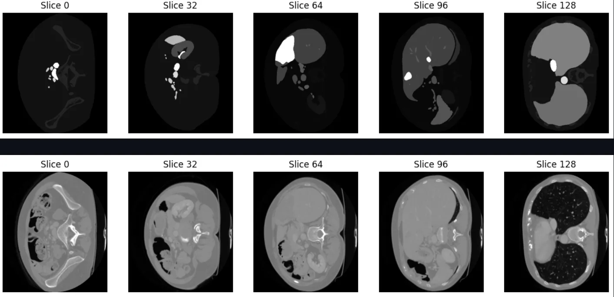
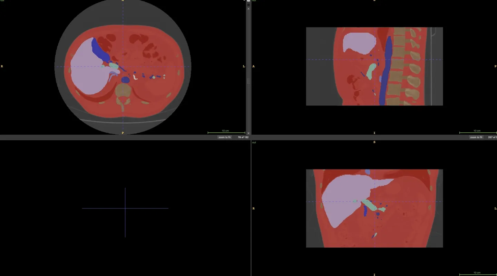
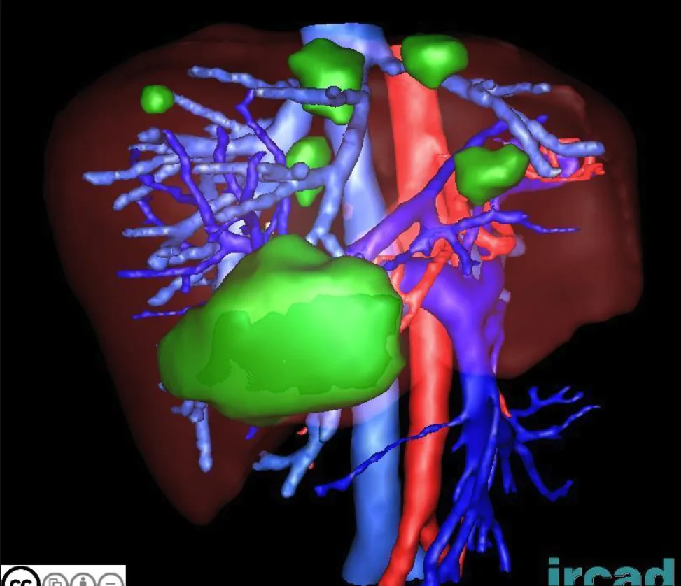

# 3D-IRCADB
<div align="center">
    <a href="https://github.com/openmedlab/"></a>
</div>
<p style="text-align:center;font-size:10px;"><em></em></p>

## Dataset Information

The 3D-ircadb -01 database consists of 3D CT scans from 10 female and 10 male patients with a liver tumor incidence rate of 75%. There are 20 folders corresponding to 20 different patients, which can be downloaded individually or together. The 3D-IRCADb-02 database contains two anonymized 3D CT scan images. These two scans can be downloaded separately or together. The first scan was performed during the arterial phase in inhalation, and the second scan was performed during the portal phase in exhalation. The patient has a hepatic focal nodular hyperplasia in segment VII according to Couinaud’s classification.

The 3D-IRCADb includes multiple sets of anonymized medical images and structures segmented by experts. These 3D medical images and their segmentation structures are provided in DICOM and VTK formats and can be used for preoperative planning, surgical guidance, and medical education. They can be visualized through software such as Osirix, 3D Slicer, or our VR-Render, which support two-dimensional slice viewing, volume rendering, and three-dimensional mesh surface rendering techniques. This work validates a new method of liver anatomical segmentation that corrects topological errors in the current Couinaud segmentation. In the future, the database will be expanded to include more cases, including databases specifically for adrenal adenomas, parathyroid adenomas, and pediatric cases. There are also plans to expand the first two databases by adding new clinical cases.


## Dataset Meta Information

| Dimensions | Modality | Task Type | Anatomical Structures | Anatomical Area | Number of Categories | Data Volume | File Format |
|------------|----------|-----------|-----------------------|-----------------|----------------------|-------------|------------|
| 3D         | CT       | Segmentation | Liver                 | abdomen       | 40                   | 22          | dicom,vtk    |


### Resolution Details

You can also write down the resolution details such as size (x, y, z) and spacing information about the dataset.

For example:

| Dataset Statistics | spacing (mm)    | size            |
|--------------------|-----------------|-----------------|
| min                | (0.56,0.56, 1.0)             | (512, 512, 74)     |
| median             | (0.74, 0.74, 1.6)         | (512, 512, 130) |
| max                | (0.96, 0.96, 4.0)             | (512, 512, 260) |

Number of two-dimensional slices in the data set: 3209.

## Label Information Statistics

| Label                     | Cases | Percentage | Max Volume (cm³) | Min Volume (cm³) | Median Volume (cm³) |
|---------------------------|-------|------------|------------------|------------------|---------------------|
| skin                      | 22    | 100.00%    | 41451.78         | 6377.12          | 11526.3             |
| kidney_left               | 8     | 36.36%     | 216.92           | 112.18           | 147.24              |
| kidney_right              | 8     | 36.36%     | 235.56           | 111.95           | 142.4               |
| lung_left                 | 5     | 22.73%     | 1015.6           | 302.21           | 725.09              |
| lung_right                | 5     | 22.73%     | 1106.99          | 353.87           | 706.65              |
| portal_vein_and_splenic_vein | 22 | 100.00%    | 70.2             | 3.53             | 28.8                |
| artery                    | 13    | 59.09%     | 257.78           | 35.88            | 96.49               |
| spleen                    | 7     | 31.82%     | 323.31           | 118.91           | 95.97               |
| venous_system             | 13    | 59.09%     | 158.2            | 20.25            | 86.36               |
| liver                     | 22    | 100.00%    | 2133.79          | 1150.52          | 1514.46             |
| bone                      | 22    | 100.00%    | 1955.74          | 336.47           | 506.68              |
| liver_cyst                | 3     | 13.64%     | 5.16             | 0.06             | 2.8                 |
| liver_tumor               | 14    | 63.64%     | 425.35           | 1.6              | 13.37               |
| venacava                  | 9     | 40.91%     | 152.67           | 14.98            | 48.82               |
| kidney                    | 1     | 4.55%      | 229.21           | 229.21           | 229.21              |
| biliary_system            | 1     | 4.55%      | 31.36            | 31.36            | 31.36               |
| metal                     | 1     | 4.55%      | 36.26            | 36.26            | 36.26               |
| stones                    | 1     | 4.55%      | 0.03             | 0.03             | 0.03                |
| gallbladder               | 8     | 36.36%     | 40.85            | 10.38            | 17.68               |
| pancreas                  | 4     | 18.18%     | 104.28           | 46.07            | 88.02               |
| stomach             | 3     | 13.64%     | 760.5            | 452.89           | 523.52              |
| colon               | 3     | 13.64%     | 646.03           | 450.34           | 595.04              |
| heart               | 3     | 13.64%     | 668.99           | 345.86           | 575.2               |
| aorta               | 1     | 4.55%      | 127.98           | 127.98           | 127.98              |
| hyperplasie         | 1     | 4.55%      | 8.91             | 8.91             | 8.91                |
| lymph_nodes         | 1     | 4.55%      | 2.37             | 2.37             | 2.37                |
| surrenalgland_left  | 4     | 18.18%     | 9.66             | 4.58             | 7.34                |
| tumor               | 1     | 4.55%      | 668.23           | 668.23           | 668.23              |
| metastasectomy      | 1     | 4.55%      | 27.15            | 27.15            | 27.15               |
| lung                | 2     | 9.09%      | 2283.88          | 1427.38          | 1855.63             |
| bladder             | 1     | 4.55%      | 72.68            | 72.68            | 72.68               |
| surrenalgland       | 1     | 4.55%      | 8.18             | 8.18             | 8.18                |
| small_intestin      | 2     | 9.09%      | 1722.66          | 836.86           | 1279.76             |
| uterus              | 1     | 4.55%      | 88.01            | 88.01            | 88.01               |
| esophagus           | 1     | 4.55%      | 749.0            | 749.0            | 749.0               |
| surrenalgland_right | 3     | 13.64%     | 6.62             | 4.92             | 5.13                |
| duodenum            | 1     | 4.55%      | 75.29            | 75.29            | 75.29               |
| sigmoid             | 1     | 4.55%      | 203.71           | 203.71           | 203.71              |
| leftsurre_tumor     | 1     | 4.55%      | 3.3              | 3.3              | 3.3                 |
| rightsurre_tumor    | 1     | 4.55%      | 2.3              | 2.3              | 2.3                 |


## Visualization

<div align="center">
    <a href="https://github.com/openmedlab/"></a>
</div>
<p style="text-align:center;font-size:10px;"><em> label(upper) image(lower).</em></p>

<div align="center">
    <a href="https://github.com/openmedlab/"></a>
</div>
<p style="text-align:center;font-size:10px;"><em></em></p>

<div align="center">
    <a href="https://github.com/openmedlab/"></a>
</div>
<p style="text-align:center;font-size:10px;"><em></em></p>


## File Structure

Introduce file structure of original dataset folder.

Take representative MSD dataset for example:

``` 
3D-IRCADB/
├── 3Dircadb1.1
│   ├── Creative Commons Attribution.pdf
│   │── Creative Commons Legal Code.pdf
│   │── LABELLED_DICOM.zip
│   │── MASKS_DICOM.zip
│   │── MESHES_VTK.zip
│   │── PATIENT_DICOM.zip
├── ...
├── 3Dircadb1.20
│   ├── Creative Commons Attribution.pdf
│   ├── ...
├── ...
└── 3Dircadb2.2
    ├── ...
```

## Authors and Institutions

Luc Soler (French Academy of Surgery)

Alexandre Hostettler (French Academy of Surgery)

Vincent Agnus (French Academy of Surgery)

Arnaud Charnoz (French Academy of Surgery)

Jean-Baptiste Fasquel (French Academy of Surgery)

Johan Moreau (French Academy of Surgery)

Anne-Blandine Osswald (French Academy of Surgery)

Mourad Bouhadjar (French Academy of Surgery)

Jacques Marescaux (French Academy of Surgery)


## Source Information

Official Website: https://www.ircad.fr/research/data-sets/liver-segmentation-3d-ircadb-01/

Download Link: https://cloud.ircad.fr/index.php/s/JN3z7EynBiwYyjy/download

Article Address: https://www-sop.inria.fr/geometrica/events/wam/abstract-ircad.pdf

Publication Date: 2010

## Citation

``` 
@article{soler20103d,
  title={3D image reconstruction for comparison of algorithm database},
  author={Soler, Luc and Hostettler, Alexandre and Agnus, Vincent and Charnoz, Arnaud and Fasquel, Jean-Baptiste and Moreau, Johan and Osswald, Anne-Blandine and Bouhadjar, Mourad and Marescaux, Jacques},
  journal={URL: https://www. ircad. fr/research/data-sets/liver-segmentation-3d-ircadb-01},
  year={2010}
}
```

Original introduction article is [here](https://zhuanlan.zhihu.com/p/672288657).