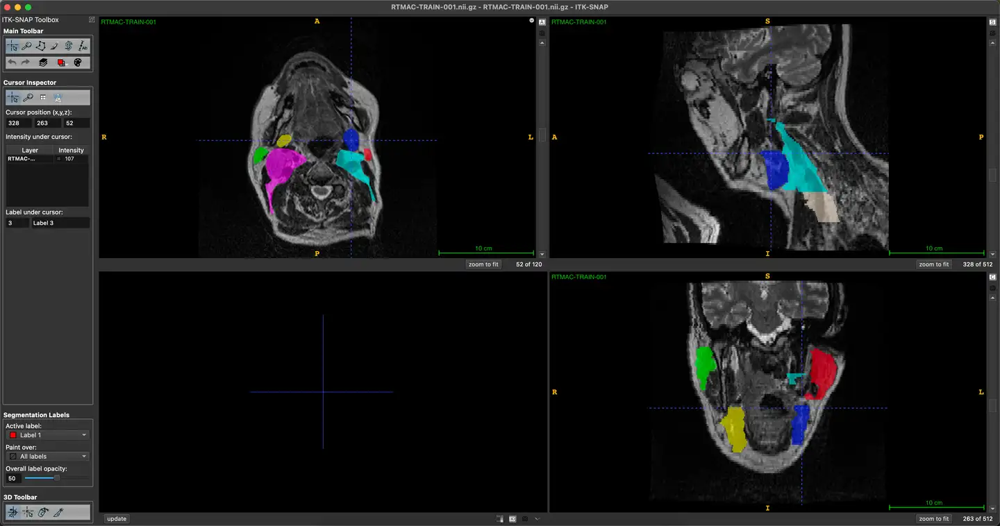
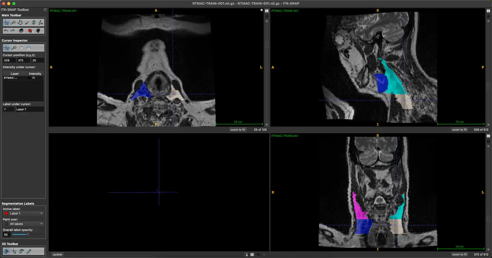

# AAPM-RT-MAC

<div align="center">
    <a href="https://github.com/openmedlab/"></a>
</div>
<p style="text-align:center;font-size:10px;"><em></em></p>

## Dataset Information

The AAPM-RT-MAC dataset is a dataset for segmenting contours of the parotid glands, submandibular glands, and level 2 and level 3 lymph nodes in MR modality. It was part of a challenge at AAPM 2019. The dataset consists of 55 cases in total, with 31 cases for training, 12 cases for validation, and 12 cases for testing. With the advent of MR-Linac and MR-guided radiation therapy, MRI-based radiation therapy planning has become a trend. Contouring is an important task in modern radiation therapy planning and often brings uncertainty due to observer variability. Automatic segmentation has been proven to be an effective method to reduce this uncertainty. The overall goal of this challenge is to provide a platform for comparing various automatic segmentation algorithms in delineating organs at risk (OARs) or tumors from MRI images of head and neck patients. The results will show the performance of various automatic segmentation algorithms and can be used to guide clinical selection of these algorithms.

This challenge dataset includes 55 MRI cases in total, each from a different patient's examination, with each case comprising T2-weighted MRI images stored in DICOM format. The MRI scanning protocol is designed for radiation therapy simulation, with 31 cases provided as training cases with annotated contours of the parotid glands, submandibular glands, and level 2 and level 3 lymph nodes. These images and contour data come from the MD Anderson Cancer Center at the University of Texas.

## Dataset Meta Information

| Dimensions | Modality | Task Type    | Anatomical Structures         | Anatomical Area | Number of Categories | Data Volume | File Format |
|------------|----------|--------------|-------------------------------|-----------------|----------------------|-------------|-------------|
| 3D         | MRI      | Segmentation | Salivary glands, Lymph Nodes  | Head and Neck   | 8                    | 55          | .dcm        |


### Resolution Details

| Dataset Statistics | spacing (mm)     | size             |
|--------------------|------------------|------------------|
| min                | (0.5, 0.5, 2.0)  | (512, 512, 120)  |
| median             | (0.5, 0.5, 2.0)  | (512, 512, 120)  |
| max                | (0.5, 0.5, 2.0)  | (512, 512, 120)  |

Number of 2D slices in the dataset: 3720 (based on 31 training set examples)

## Label Information Statistics

| Label | Anatomical Structure                | Cases | Segmentation Accuracy | Average Volume (cm³) | Min Volume (cm³) | Max Volume (cm³) |
|-------|-------------------------------------|-------|-----------------------|----------------------|------------------|------------------|
| 1     | Left Parotid Gland                  | 31    | 100.00%               | 63.98                | 15.05            | 32.74            |
| 2     | Right Parotid Gland                 | 31    | 100.00%               | 61.89                | 17.03            | 35.94            |
| 3     | Left Submandibular Gland            | 31    | 100.00%               | 14.63                | 4.67             | 8.99             |
| 4     | Right Submandibular Gland           | 31    | 100.00%               | 14.96                | 2.83             | 9.08             |
| 5     | Level 2 Left Lymph Nodes            | 31    | 100.00%               | 63.25                | 17.76            | 33.97            |
| 6     | Level 2 Right Lymph Nodes           | 31    | 100.00%               | 68.79                | 18.88            | 34.16            |
| 7     | Level 3 Left Lymph Nodes            | 31    | 100.00%               | 29.29                | 8.19             | 17.96            |
| 8     | Level 3 Right Lymph Nodes           | 31    | 100.00%               | 29.61                | 5.52             | 17.97            |


## Visualization

<div align="center">
    <a href="https://github.com/openmedlab/"></a>
</div>
<p style="text-align:center;font-size:10px;"><em>In the image, the left parotid gland is marked in red, the right parotid gland in green, the left submandibular gland in blue, the right submandibular gland in yellow, the contours of the level 2 left lymph nodes are in teal, and the level 2 right lymph nodes are in pink.</em></p>

<div align="center">
    <a href="https://github.com/openmedlab/"></a>
</div>
<p style="text-align:center;font-size:10px;"><em>In the image, teal represents the contours of the level 2 left lymph nodes, pink represents the level 2 right lymph nodes, gray represents the level 3 left lymph nodes, and blue represents the level 3 right lymph nodes contours.</em></p>

## File Structure

Each subfolder under the dataset folder is a case. The training set, validation set, and test set are all in this main directory. All data source information is in `metadata.csv`.

``` 
Dataset
│
├── AAPM-RT-MAC
│   ├── RTMAC-LIVE-001 
│   │   ├── 08-26-1998-NA-ResearchHead and neck-48089
│   │   │   ├── 1.000000-RS Unapproved Structure Set-62326 
│   │   │   │   ├── 1-1.dcm 
│   │   │   ├── 3.000000-Ax T2 TSE-90761
│   │   │   │   ├── 1-001.dcm
│   │   │   │   ├── 1-002.dcm
│   │   │   │   ├── 1-003.dcm
│   │   │   │   ├── ...
│   ├── RTMAC-LIVE-002 
│   │   ├── 09-26-1998-NA-Simulation ProtocolsHead  Neck-94350
│   │   │   ├── 1.000000-RS Unapproved Structure Set-10263
│   │   │   │   ├── 1-1.dcm 
│   │   │   ├── 8.000000-T2 TSE-59062
│   │   │   │   ├── 1-001.dcm
│   │   │   │   ├── 1-002.dcm
│   │   │   │   ├── 1-003.dcm
│   │   │   │   ├── ... 
│   ├── ...
│   ├── metadata.csv
```


## Source Information

Official Website: https://www.cancerimagingarchive.net/collection/aapm-rt-mac/

Download Link: https://www.cancerimagingarchive.net/collection/aapm-rt-mac/

Article Address: https://aapm.onlinelibrary.wiley.com/doi/abs/10.1002/mp.13942

Publication Date: 2020-07

## Citation

``` 
@article{cardenas2020head,
  title={Head and neck cancer patient images for determining auto-segmentation accuracy in T2-weighted magnetic resonance imaging through expert manual segmentations},
  author={Cardenas, Carlos E and Mohamed, Abdallah SR and Yang, Jinzhong and Gooding, Mark and Veeraraghavan, Harini and Kalpathy-Cramer, Jayashree and Ng, Sweet Ping and Ding, Yao and Wang, Jihong and Lai, Stephen Y and others},
  journal={Medical physics},
  volume={47},
  number={5},
  pages={2317--2322},
  year={2020},
  publisher={Wiley Online Library}
}
```

Original introduction article is [here](https://zhuanlan.zhihu.com/p/704067365).