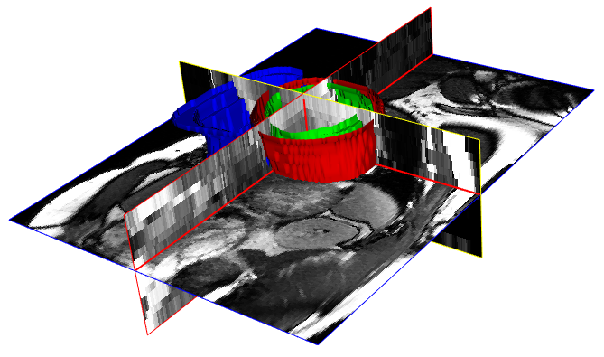
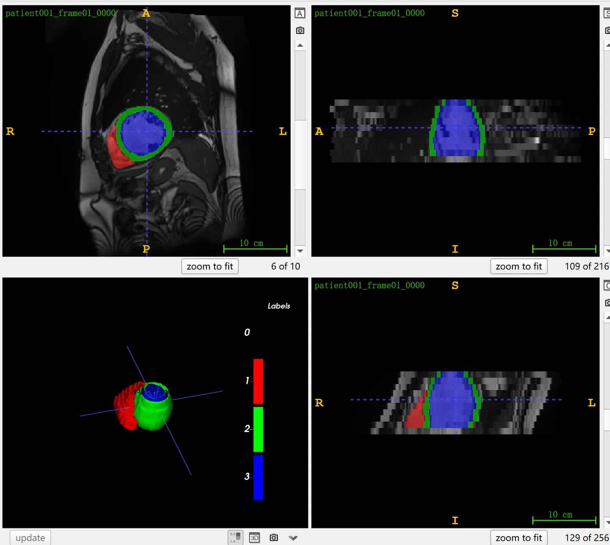

# ACDC

<div align="center">
    <a href="https://github.com/openmedlab/"></a>
</div>
<p style="text-align:center;font-size:10px;"><em></em></p>

## Dataset Information

The **ACDC** (Automatic Cardiac Diagnosis Challenge) was a competition at MICCAI 2017, aimed at segmenting the diastolic (ED) and systolic (ES) frames of left ventricle (LV), right ventricle (RV), and myocardium (Myo) in cine-MRI images of the heart. Precise segmentation of cardiac images is crucial for assessing cardiac function, such as ejection fraction (EF), stroke volume (SV), left ventricular mass, and myocardial thickness, which in turn provide key information for the diagnosis and treatment of heart diseases. The dataset includes 150 cases, divided into 5 subcategories: NOR (normal), MINF (myocardial infarction with systolic heart failure), DCM (dilated cardiomyopathy), HCM (hypertrophic cardiomyopathy), and ARV (abnormal right ventricle), with 30 cases each. Each case comprises a 4D nifti format image of one cardiac cycle, with annotations for the diastolic (ED) and systolic (ES) frames. The data is divided by the officials into a training set of 100 cases and a test set of 50 cases, with each subclass having 20 cases in the training set and 10 cases in the test set. All 150 cases and their annotations have been made public.

## Dataset Meta Information

| Dimensions | Modality | Task Type | Anatomical Structures | Anatomical Area | Number of Categories | Data Volume | File Format |
|------------|----------|-----------|-----------------------|-----------------|----------------------|-------------|-------------|
| 3D         | MR       | Segmentation | Heart                 | Chest           | 3                    | 150         | .nii.gz     |


### Resolution Details

| Dataset Statistics | spacing (mm)     | size            |
|--------------------|------------------|-----------------|
| min                | (0.70, 0.70, 5.0)              | (154, 154, 6)     |
| median             | (1.52, 1.52, 10.0)           | (216, 256, 9) |
| max                | (1.95, 1.95, 10.0)              | (428, 512, 21) |

Number of slices in the data set of 300 images of 150 patients: 2978

## Label Information Statistics

| Structure          | RV (Right Ventricle) | Myo (Myocardium) | LV (Left Ventricle) |
|------------------- |----------------------|------------------|---------------------|
| Number of Cases    | 300                  | 300              | 300                 |
| Percentage         | 100%                 | 100%             | 100%                |
| Min Volume (cm³)   | 11.07                | 32.89            | 19.36               |
| Median Volume (cm³)| 115.16               | 126.78           | 121.96              |
| Max Volume (cm³)   | 399.15               | 365.69           | 387.75              |


## Visualization

<div align="center">
    <a href="https://github.com/openmedlab/"></a>
</div>
<p style="text-align:center;font-size:10px;"><em> ITK-SNAP Visualization. Red: right ventricle, green: myocardium, blue: left ventricle</em></p>

## File Structure

The file structure includes `training` and `testing` sections, corresponding to training and testing data respectively. Each patient's data is stored in a separate folder, containing one 4D NIfTI image and two 3D images (systolic and diastolic frames) along with their `_gt` annotations.

``` 
database
│
├── training
│   ├── patient001
│   │   ├── patient001_4d.nii.gz
│   │   ├── patient001_frame01.nii.gz
│   │   ├── patient001_frame01_gt.nii.gz
│   │   ├── patient001_frame12.nii.gz
│   │   └── patient001_frame12_gt.nii.gz
│   ├── ...
│   └── patient100
│
└── testing
    ├── patient101
    │   ├── patient101_4d.nii.gz
    │   ├── patient101_frame01.nii.gz
    │   ├── patient101_frame01_gt.nii.gz
    │   ├── patient101_frame14.nii.gz
    │   └── patient101_frame14_gt.nii.gz
    ├── ...
    └── patient150
```

## Authors and Institutions

Pierre-Marc Jodoin (University of Sherbrooke, Canada)

Alain Lalande (University of Burgundy Franche-Comté in Dijon, France)

Olivier Bernard (University of Lyon, France)


## Source Information

Official Website: https://www.creatis.insa-lyon.fr/Challenge/acdc/

Download Link: https://humanheart-project.creatis.insa-lyon.fr/database/#collection/637218c173e9f0047faa00fb

Article Address: https://ieeexplore.ieee.org/document/8360453

Publication Date: 2017

## Citation

``` 
@ARTICLE{8360453,
  author={Bernard, Olivier and Lalande, Alain and Zotti, Clement and Cervenansky, Frederick and Yang, Xin and Heng, Pheng-Ann and Cetin, Irem and Lekadir, Karim and Camara, Oscar and Gonzalez Ballester, Miguel Angel and Sanroma, Gerard and Napel, Sandy and Petersen, Steffen and Tziritas, Georgios and Grinias, Elias and Khened, Mahendra and Kollerathu, Varghese Alex and Krishnamurthi, Ganapathy and Rohé, Marc-Michel and Pennec, Xavier and Sermesant, Maxime and Isensee, Fabian and Jäger, Paul and Maier-Hein, Klaus H. and Full, Peter M. and Wolf, Ivo and Engelhardt, Sandy and Baumgartner, Christian F. and Koch, Lisa M. and Wolterink, Jelmer M. and Išgum, Ivana and Jang, Yeonggul and Hong, Yoonmi and Patravali, Jay and Jain, Shubham and Humbert, Olivier and Jodoin, Pierre-Marc},
  journal={IEEE Transactions on Medical Imaging}, 
  title={Deep Learning Techniques for Automatic MRI Cardiac Multi-Structures Segmentation and Diagnosis: Is the Problem Solved?}, 
  year={2018},
  volume={37},
  number={11},
  pages={2514-2525},
  doi={10.1109/TMI.2018.2837502}}
```

Original introduction article is [here](https://zhuanlan.zhihu.com/p/658483739).