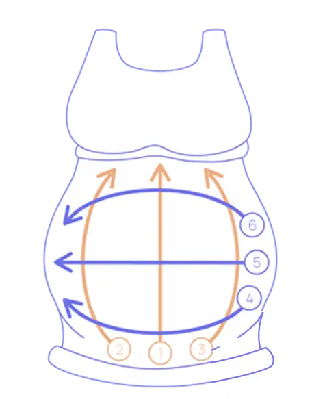
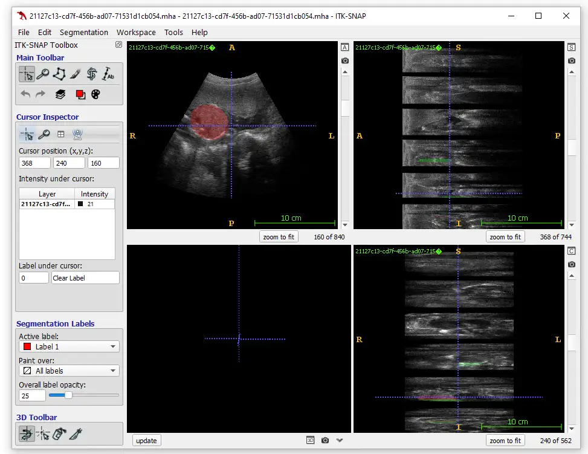

# Dataset Name

<div align="center">
    <a href="https://github.com/openmedlab/"></a>
</div>
<p style="text-align:center;font-size:10px;"><em></em></p>

## Dataset Information

**Competition Vision**  
ACOUSLIC-AI (Abdominal Circumference Operator-agnostic UltraSound Measurement) is a classification and segmentation challenge for MICCAI 2024. It is the first challenge to propose using blind scan data for fetal biometric tasks. The goal is to develop and benchmark AI models to automatically measure fetal abdominal circumference (AC) from this specific data type, aiming to expand access to prenatal care in regions with limited resources.

**Competition Content**  
Diagnosing fetal growth restriction (FGR) presents a significant challenge in areas with limited medical resources. FGR affects up to 10% of pregnancies and is a critical factor in perinatal morbidity and mortality. Prenatal ultrasound measurement of fetal abdominal circumference (AC) is an important means of monitoring fetal growth, but routine practice is often limited due to high-cost equipment and a shortage of skilled professionals.

To address this issue, an AI-driven, low-cost prenatal ultrasound solution has emerged. This solution uses low-cost portable ultrasound devices combined with a standardized blind scanning protocol, allowing novice operators to collect valid data. At its core is the Obstetric Scanning Protocol (OSP), which includes six scans: three transverse and three longitudinal. As shown in the figure below, the orange arrows represent transverse scans from caudal to cranial (1-3), and the purple arrows represent longitudinal scans from left to right (4-6). The operator performs the scans without viewing real-time images, following instructions displayed on a smartphone screen. Although the resulting 2D ultrasound frame sequences may not contain ideal standard planes, they provide a wealth of training data for AI algorithms.


<div align="center">
    <a href="https://github.com/openmedlab/"></a>
</div>
<p style="text-align:center;font-size:10px;"><em>Schematic diagram of the Obstetric Sweep Protocol (OSP).</em></p>

## Dataset Meta Information

| Dimensions | Modality   | Task Type          | Anatomical Structures | Number of Categories | Data Volume                                    | File Format |
|------------|------------|--------------------|-----------------------|----------------------|------------------------------------------------|-------------|
| 3D         | Ultrasound | Waist measurement  | Fetal abdomen         | 3                    | 300 for train, 10 for validation, 290 for test | .mha, .csv    |


### Data characteristics

| Attribute            | Value                                                   |
|----------------------|---------------------------------------------------------|
| Data Type            | 2D B-mode ultrasound scan data and abdominal circumference annotations |
| Number of Frames     | 840 frames                                              |
| Frame Size           | 744 x 562 pixels                                        |
| Fixed Spacing        | 0.28 mm/pixel                                           |
| Annotation Type      | Fetal abdominal pixel segmentation                      |
| Annotation Category  | Optimal plane (1), suboptimal plane (2), no annotation (0) |
| Reference Abdominal Circumference | Reference abdominal circumference for each scan (mm)    |

## Label Information Statistics

| Category Name                    | Annotation Pixel Value |
|----------------------------------|------------------------|
| No Annotation (Background)       | 0                      |
| Optimal Plane Mask               | 1                      |
| Suboptimal Plane Mask            | 2                      |

## Visualization

<div align="center">
    <a href="https://github.com/openmedlab/"></a>
</div>
<p style="text-align:center;font-size:10px;"><em></em></p>

## File Structure

The csv file records the measurement data of fetal abdominal circumference (AC)

``` 
acouslic-ai-train-set/
│
├── circumferences/
│   └── fetal_abdominal_circumferences_per_sweep.csv
│
└── images/
    ├── stacked_fetal_ultrasound/
    │   ├── 0d0a3298-a9c6-43c3-a9e3-df3a9c0afa06.mha
    │   ├── 0d7c4d8f-6e07-4f2b-aa76-8915ce15a38f.mha
    │   ├── ...
    │
    └── masks/
        └── stacked_fetal_abdomen/
            ├── 0d0a3298-a9c6-43c3-a9e3-df3a9c0afa06.mha
            ├── 0d7c4d8f-6e07-4f2b-aa76-8915ce15a38f.mha
            ├── ...
```

## Authors and Institutions

The challenge is organized by Radboud University Medical Center and sponsored by Delft Imaging Systems.

## Source Information

Official Website: https://acouslic-ai.grand-challenge.org/overview-and-goals/

Download Link: https://acouslic-ai.grand-challenge.org/datasets/

Article Address: TBD

Publication Date: 2024-05-10

## Citation

``` 
TBD
```

Original introduction article is [here](https://zhuanlan.zhihu.com/p/712728203).