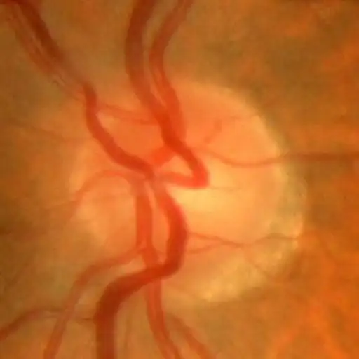
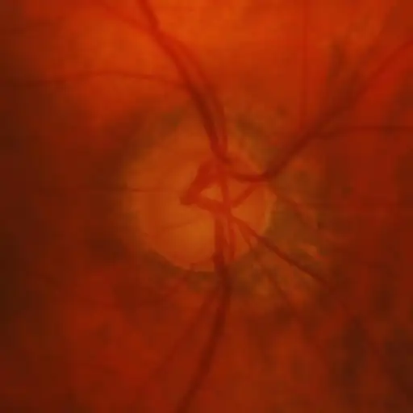

# ACRIMA

<div align="center">
    <a href="https://github.com/openmedlab/"></a>
</div>
<p style="text-align:center;font-size:10px;"><em></em></p>

## Dataset Information

The ACRIMA dataset contains 705 fundus images, including 396 images of glaucoma and 309 normal images. These images were obtained from FISABIO Oftalmología Médica in Valencia, Spain, in compliance with the ethical standards of the Helsinki Declaration and with patient consent, and were annotated by glaucoma specialists. The database aims to provide resources for researchers in fundus image analysis, glaucoma diagnosis, and disease research. It supports the development and evaluation of glaucoma diagnostic algorithms, disease classification prediction, and the exploration of fundus image features. Additionally, ACRIMA can be used for medical education, helping professionals and students learn fundus image interpretation and diagnosis.

Glaucoma is an eye disease characterized by damage to the optic nerve and is mainly divided into open-angle and closed-angle types. Open-angle glaucoma progresses slowly and has no obvious early symptoms, while closed-angle glaucoma is more common in Asians, with sudden onset and symptoms such as eye pain and vision loss. Diagnosis of glaucoma relies on intraocular pressure examination, optic nerve assessment, and visual field testing. Treatment methods include medication, laser, and surgery. As a leading cause of blindness worldwide, regular eye examinations are particularly important for individuals over 40 years old or those with a family history. Early detection and proper treatment can preserve vision for most patients.

## Dataset Meta Information

| Dimensions | Modality | Task Type      | Anatomical Structures | Anatomical Area | Number of Categories | Data Volume | File Format |
|------------|----------|----------------|-----------------------|-----------------|----------------------|-------------|-------------|
| 2D         | Fundus       | Classification | Eye                   | Eye             | 2                    | 705         | PNG         |


### Resolution Details

| Dataset Statistics | size        |
|--------------------|-------------|
| min                | [178,178]   |
| median             | [524,524]   |
| max                | [1420,1420] |

## Label Information Statistics

| Categories | Number |
|------------|--------|
| Glaucoma   | 396    |
| Normal     | 309    |

## Visualization

<div align="center">
    <a href="https://github.com/openmedlab/"></a>
</div>
<p style="text-align:center;font-size:10px;"><em>Normal example image.</em></p>

<div align="center">
    <a href="https://github.com/openmedlab/"></a>
</div>
<p style="text-align:center;font-size:10px;"><em>Glaucoma example image.</em></p>

## File Structure

The naming structure of the images is as follows: First, the name begins with the two letters `Im` followed by a three-digit image number (ranging from 001 to 705), and ending with a label (if the image is pathological, the label is `g`; if the image is normal, the label is `_`). All image names end with the database name `ACRIMA`. For example, the name of a glaucoma image would be `Im686_g_ACRIMA`, and the name of a normal image would be `Im001_ACRIMA`.

``` 
ACRIMA
├── images
│   ├──xxxx.png
│   ├──xxxx.png
│   │    ...
├──train.txt
├──val.txt
```

## Authors and Institutions

Silvia Ovreiu (Faculty of Electronics)

Elena-Anca Paraschiv (Systems and Applications for Society Department)

Elena Ovreiu (Faculty of Electronics)

## Source Information

Official Website: https://figshare.com/s/c2d31f850af14c5b5232

Download Link: https://figshare.com/s/c2d31f850af14c5b5232

Article Address: https://ieeexplore.ieee.org/document/9515188

Publication Date: 2019-03

## Citation

``` 
@inproceedings{ovreiu2021deep,
  title={Deep learning \& digital fundus images: Glaucoma detection using DenseNet},
  author={Ovreiu, Silvia and Paraschiv, Elena-Anca and Ovreiu, Elena},
  booktitle={2021 13th international conference on electronics, computers and artificial intelligence (ECAI)},
  pages={1--4},
  year={2021},
  organization={IEEE}
}
```

Original introduction article is [here](https://zhuanlan.zhihu.com/p/693835119).