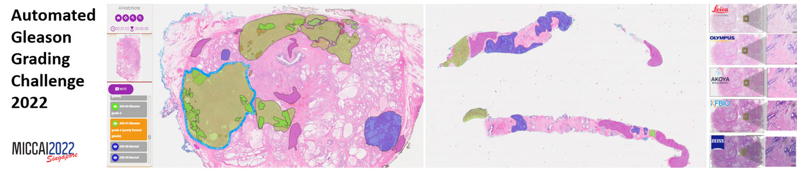
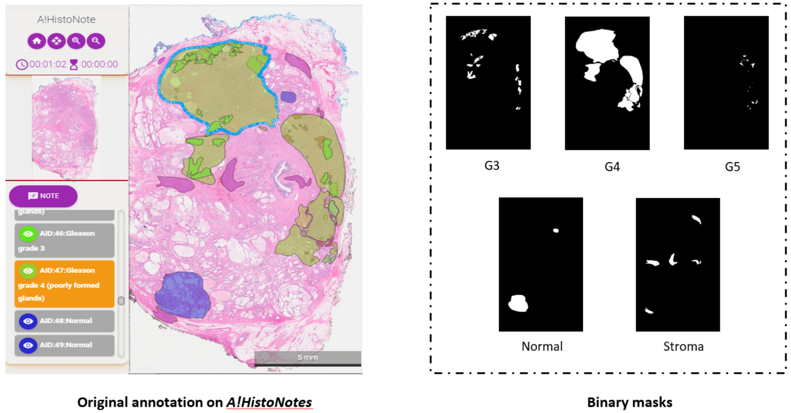

# AGGC Dataset

<div align="center">
    <a href="https://github.com/openmedlab/"></a>
</div>
<p style="text-align:center;font-size:10px;"><em></em></p>

## Dataset Information

The **AGGC (Automated Gleason Grading Challenge)** dataset is a competition dataset designed to develop automated prostate grading algorithms. This dataset provides H&E-stained whole-slide imaging (WSI) data from prostatectomy and biopsy specimens annotated by experienced pathologists. Each case in the dataset includes a series of binary masks for five categories: **Gleason Pattern 3**, **Gleason Pattern 4**, **Gleason Pattern 5**, **Normal**, and **Stroma**. The WSI images consist of **105 training cases** and **45 test cases**, while the biopsy images include **37 training cases** and **16 test cases**.

The significance of this dataset lies in promoting research and innovation in the automated grading of prostate cancer, particularly in the field of computational pathology. By providing annotated H&E-stained whole-slide images with different Gleason patterns, along with images scanned using different scanners, researchers can develop more accurate and generalizable algorithms. These algorithms not only enable automatic identification of various Gleason patterns but also address challenges arising from image digitization variability. This dataset serves as a valuable resource for advancing computer-aided diagnostic systems and holds the potential to improve the efficiency and accuracy of prostate cancer diagnosis.

## Dataset Meta Information

| Dimensions | Modality             | Task Type     | Anatomical Structures   | Anatomical Area | Number of Categories | Data Volume | File Format |
|------------|----------------------|---------------|-------------------------|-----------------|----------------------|-------------|-------------|
| 2D         | Pathological Images  | Segmentation  | Prostate cancer         | Prostate        | 5                    | 203         | .tif        |


### Resolution Details

| Dataset Statistics | size         |
|--------------------|--------------|
| min                | 7920*4800    |
| median             | 9360*11520   |
| max                | 19440*21120  |

## Label Information Statistics

| Anatomical Structure                       | Occurrences | Percentage (%) |
|--------------------------------------------|-------------|----------------|
| Gleason Pattern 3 - Gleason Grade 3        | 164         | 81.13%         |
| Gleason Pattern 4 - Gleason Grade 4        | 126         | 62.26%         |
| Gleason Pattern 5 - Gleason Grade 5        | 23          | 11.32%         |
| Normal Prostate Tissue                     | 184         | 90.57%         |
| Stromal Tissue                             | 199         | 98.11%         |

## Visualization

Use the official visualization example.

G3 - Gleason Pattern 3

G4 - Gleason Pattern 4

G5 - Gleason Pattern 5

Normal - Normal Prostate Tissue

Stroma - Stromal Tissue

<div align="center">
    <a href="https://github.com/openmedlab/"></a>
</div>
<p style="text-align:center;font-size:10px;"><em></em></p>

## File Structure

``` 
AGGC22
│
├── AGGC2022_test
│   ├── Subset1_Test_annotation
│   ├── Subset1_Test_image
│   ├── Subset2_Test_annotation
│   ├── Subset2_Test_image
│   ├── Subset3_Test_annotation
│   └── Subset3_Test_image
│
└── AGGC2022_train
    ├── Subset1_Train_annotation
    │   ├── Subset1_Train_1
    │   │   ├── G3_Mask.tif
    │   │   ├── G4_Mask.tif
    │   │   ├── Normal_Mask.tif
    │   │   └── Stroma_Mask.tif
    │   ├── Subset1_Train_2
    │   │   └── ... 
    │   └── Subset1_Train_3
    │       └── ... 
    ├── Subset1_Train_image
    ├── Subset2_Train_annotation
    ├── Subset2_Train_image
    ├── Subset3_Train_annotation
    └── Subset3_Train_image
```

## Authors and Institutions

Xinmi Huo (Agency for Science, Technology and Research (A*STAR) - Bioinformatics Institute)

Kok Haur Ong (Agency for Science, Technology and Research (A*STAR) - Bioinformatics Institute)

Kah Weng Lau (National University of Singapore (NUS) - National University Hospital)

Laurent Gole (University of Tartu - Institute of Molecular and Cell Biology)

Char Loo Tan (National University of Singapore (NUS) - National University Hospital)

Chongchong Zhang (Government of the People's Republic of China - Department of Pathology)

Yonghui Zhang (Government of the People's Republic of China - Department of Pathology)

Xiaohui Zhu (Southern Medical University - Department of Pathology)

Longjie Li (Agency for Science, Technology and Research (A*STAR) - Bioinformatics Institute)

Hao Han (University of Tartu - Institute of Molecular and Cell Biology)

David Young (University of Tartu - Institute of Molecular and Cell Biology)

Haoda Lu (Agency for Science, Technology and Research (A*STAR) - Bioinformatics Institute)

Jun Xu (Nanjing University of Information Science & Technology (NUIST) - Jiangsu Key Laboratory of Big Data Analysis Technique; Nanjing University of Information Science & Technology (NUIST) - CICAEE)

Wanyuan Chen (Hangzhou Medical College - Cancer Center)

Stephan J. Sanders (University of California, San Diego (UCSD) - Department of Psychiatry)

Lee Hwee Kuan (Agency for Science, Technology and Research (A*STAR) - Bioinformatics Institute)

Susan Swee-Shan Hue (National University of Singapore (NUS) - National University Hospital)

Weimaio Yu (Agency for Science, Technology and Research (A*STAR) - Bioinformatics Institute)

Soo Yong Tan (National University of Singapore (NUS) - National University Hospital)

## Source Information

Official Website: https://aggc22.grand-challenge.org/

Download Link: https://aggc22.grand-challenge.org/

Article Address: https://papers.ssrn.com/sol3/papers.cfm?abstract_id=4172090

Publication Date: 2022-04

## Citation

``` 
@article{huo2022comprehensive,
  title={Comprehensive AI model development for Gleason grading: From scanning, cloud-based annotation to pathologist-AI interaction},
  author={Huo, Xinmi and KokHaur, ONG and Lau, Kah Weng and Gole, Laurent and Young, David and Tan, Char Loo and Zhang, Chongchong and Zhang, Yonghui and Zhu, Xiaohui and Li, Longjie and others},
  year={2022}
}
```

Original introduction article is [here](https://zhuanlan.zhihu.com/p/1132635950).