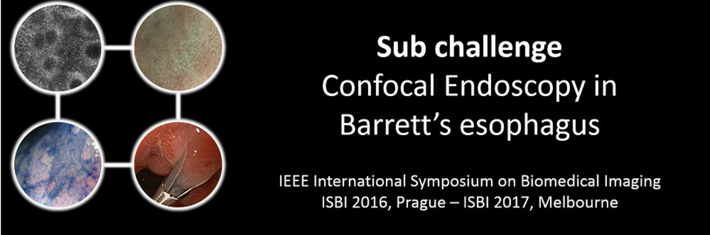
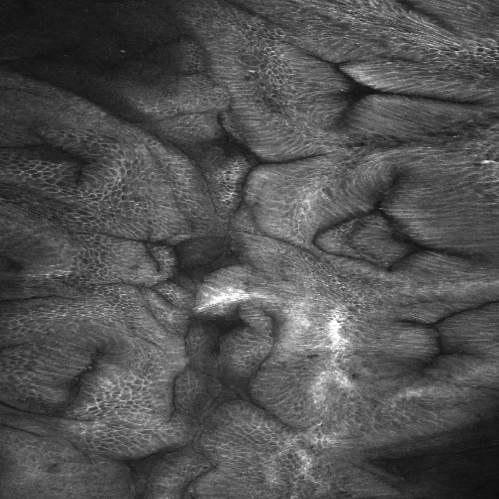
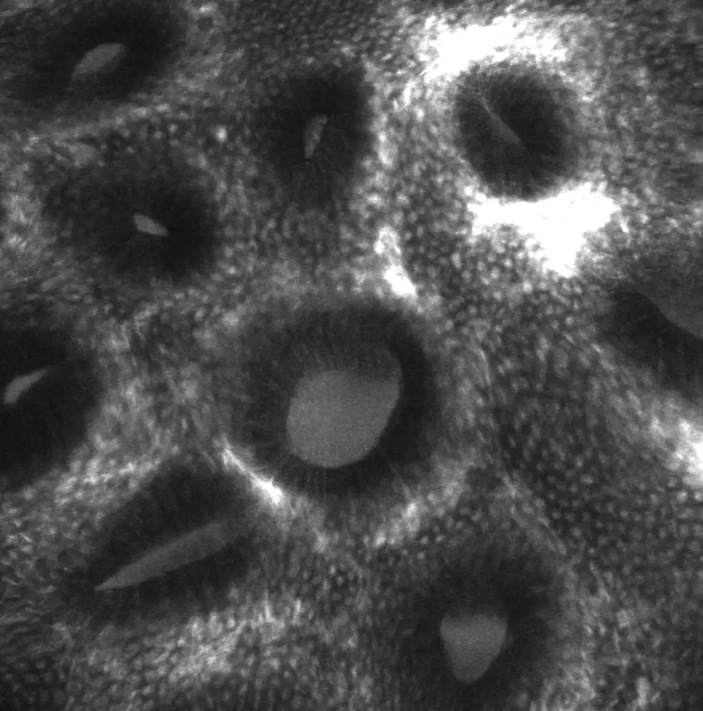
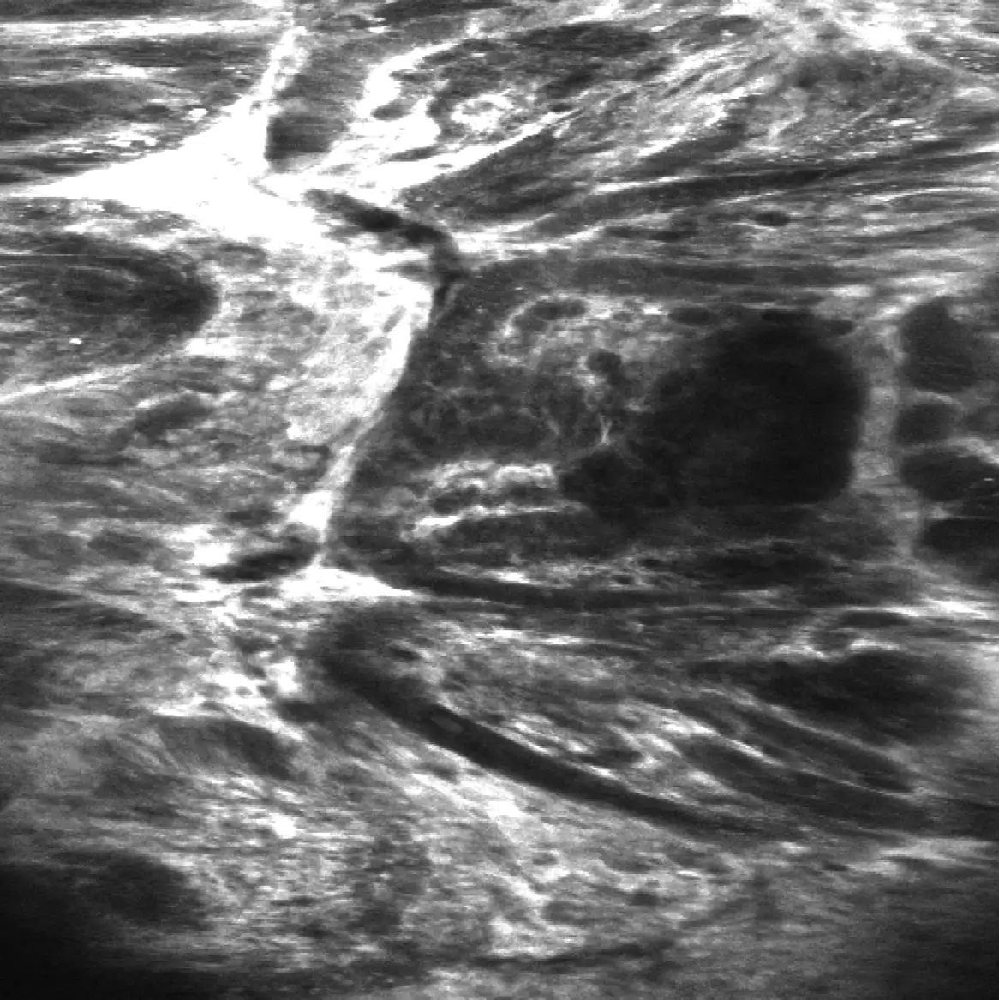

# AIDA-E2

<div align="center">
    <a href="https://github.com/openmedlab/"></a>
</div>
<p style="text-align:center;font-size:10px;"><em></em></p>

## Dataset Information

The AIDA-E2 dataset is a disease classification dataset within the confocal endoscopy modality, part of the ISBI2016 challenge. This dataset includes 262 cases, divided into three key categories: Barrett's Esophagus (BAR) with 172 cases, Gastric Metaplasia (GMP) with 30 cases, and Neoplastic Lesions (NPL) with 60 cases. This detailed categorization is crucial for the early detection of diseases and the development of treatment plans.

**Barrett's Esophagus (BAR)** results from chronic acid reflux leading to changes in the esophageal cells, which increases the risk of esophageal cancer; hence, early detection is essential for prevention. **Gastric Metaplasia (GMP)** involves abnormal changes in the gastric mucosal cells and may be an early sign of stomach cancer, so monitoring these changes can help in early detection and treatment. **Neoplastic Lesions (NPL)** indicate a state of abnormal cellular proliferation that has not yet formed cancer; identifying these lesions can help prevent potential worsening. **Confocal endoscopy** technology provides high-resolution real-time images, allowing physicians to observe tissues at the cellular level, which is critical for the early identification of these diseases. Early detection and accurate classification are vital to prevent further health issues, and the AIDA-E2 dataset is designed to foster research in this area.

## Dataset Meta Information

| Dimensions | Modality           | Task Type      | Anatomical Structures | Number of Categories | Data Volume | File Format |
|------------|--------------------|----------------|-----------------------|----------------------|-------------|-------------|
| 2D         | Confocal Endoscopy | Classification | Digestive Tract       | 3                    | 262         | JPG         |


### Resolution Details


| Dataset Statistics | size         |
|--------------------|--------------|
| min                | 1024 * 1024  |
| median             | 1024 * 1024  |
| max                | 1024 * 1024  |

## Label Information Statistics

| Pathology                  | Cases    | Percentage |
|----------------------------|----------|------------|
| BAR (Barrett's)            | 172      | 65.6%      |
| GMP (Gastric Metaplasia)   | 30       | 11.4%      |
| NPL (Neoplastic Lesions)   | 60       | 22.9%      |

## Visualization

<div align="center">
    <a href="https://github.com/openmedlab/"></a>
</div>
<p style="text-align:center;font-size:10px;"><em> BAR example.</em></p>

<div align="center">
    <a href="https://github.com/openmedlab/"></a>
</div>
<p style="text-align:center;font-size:10px;"><em> GMP example.</em></p>


<div align="center">
    <a href="https://github.com/openmedlab/"></a>
</div>
<p style="text-align:center;font-size:10px;"><em> NPL example.</em></p>


## File Structure

The file structure of this dataset is as follows: Each filename prefix indicates its category (BAR for Barrett's esophagus, GMP for gastric metaplasia, and NPL for neoplastic lesions formed by abnormal proliferation), followed by a specific identifier number.

``` 
Dataset
│
├── BAR_02_004.jpg
├── BAR_02_007.jpg
├── BAR_02_009.jpg
├── ......
├── GMP_01_004.jpg 
├── GMP_01_005.jpg 
├── GMP_01_006.jpg 
├── ......
├── NPL_03_004.jpg 
├── NPL_03_005.jpg 
├── NPL_03_006.jpg 
├── ......
```

## Authors and Institutions

Ruwan Nawarathna (University of North Texas, Department of Computer Science and Engineering, USA)

JungHwan Oh (University of North Texas, Department of Computer Science and Engineering, USA)

Jayantha Muthukudage (University of North Texas, Department of Computer Science and Engineering, USA)

Wallapak Tavanapong (Iowa State University, Department of Computer Science, USA)

Johnny Wong (Iowa State University, Department of Computer Science, USA)

Piet C. de Groen (Mayo Clinic College of Medicine, USA)

Shou Jiang Tang (University of Mississippi Medical Center, USA)

## Source Information

Official Website: https://isbi-aida.grand-challenge.org/

Download Link: https://isbi-aida.grand-challenge.org/

Article Address: N/A

Publication Date: 2015-11

## Citation

``` 
@article{kiesslich2005vivo,
  title={In vivo histology of Barrett's esophagus and associated neoplasias by confocal laser endomicroscopy},
  author={Kiesslich, Ralf and Gossner, Liebwin and Dahlmann, Alexandra and Vieth, Michael and Stolte, Manfred and Hofmann, Arthur and Jung, Michael and Nafe, Bernhard and Galle, Peter R and Ell, Christian and others},
  journal={Gastrointestinal Endoscopy},
  volume={61},
  number={5},
  pages={AB101},
  year={2005},
  publisher={Elsevier}
}
@article{grisan2013oc,
  title={OC. 10.2 COMPUTER AIDED DIAGNOSIS OF BARRETT'S ESOPHAGUS AND ASSOCIATED NEOPLASIA USING CONFOCAL LASER ENDOMICROSCOPY},
  author={Grisan, Enrico and Veronese, E and Trovato, C and Diamantis, G and Battaglia, Giorgio and Crosta, C},
  journal={Digestive and Liver Disease},
  volume={45},
  pages={S77},
  year={2013},
  publisher={Elsevier}
}
@inproceedings{grisan2012computer,
  title={Computer aided diagnosis of barrett's esophagus using confocal laser endomicroscopy: preliminary data},
  author={Grisan, Enrico and Veronese, Elisa and Diamantis, Giorgio and Trovato, Cristina and Crosta, Cristiano and Battaglia, Giorgio},
  booktitle={Gastrointestinal Endoscopy},
  volume={75},
  number={4},
  pages={126--126},
  year={2012},
  organization={MOSBY-ELSEVIER 360 PARK AVENUE SOUTH, NEW YORK, NY 10010-1710 USA}
}
@inproceedings{veronese2013hybrid,
  title={Hybrid patch-based and image-wide classification of confocal laser endomicroscopy images in Barrett's esophagus surveillance},
  author={Veronese, Elisa and Grisan, Enrico and Diamantis, Giorgio and Battaglia, Giorgio and Crosta, Cristiano and Trovato, Cristina},
  booktitle={2013 IEEE 10th international symposium on biomedical imaging},
  pages={362--365},
  year={2013},
  organization={IEEE}
}
```

Original introduction article is [here](https://zhuanlan.zhihu.com/p/689739865).