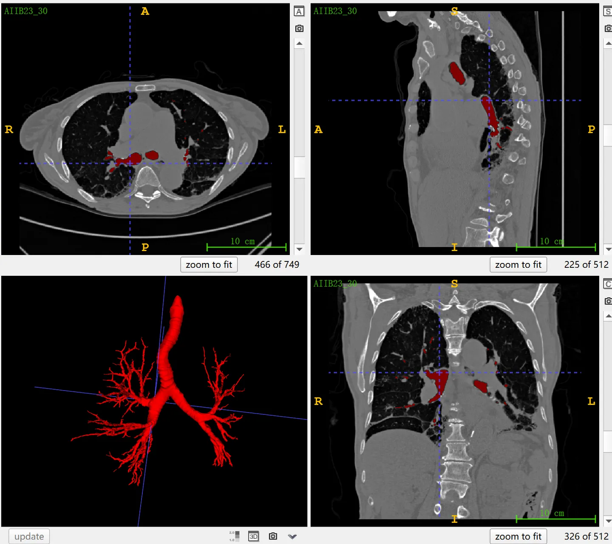

# AIIB 23

<div align="center">
    <a href="https://github.com/openmedlab/"></a>
</div>
<p style="text-align:center;font-size:10px;"><em></em></p>

## Dataset Information

AIIB23 (Airway-Informed Imaging Biomarker) is a dataset for the automatic segmentation of CT images of the airways in fibrotic lung diseases, part of a challenge at MICCAI 2023. Unlike other datasets that mainly focus on diseases with minor tracheal changes, AIIB23 encompasses the honeycombing structures in lung tissue of fibrotic lung diseases, making the annotation more complex and error-prone. The dataset includes 312 cases, with 120 fibrotic cases in the training set, 52 fibrotic cases in the validation set, and the test set comprising 90 fibrotic and 50 COVID-19 cases. This dataset aims to promote the development of automatic airway segmentation models with high robustness and generalization capabilities. The officials will send data download links via email to registered teams, but only the CT scans for training and validation will be released; test data will not be publicly published.

## Dataset Meta Information

| Dimensions | Modality | Task Type | Anatomical Structures          | Anatomical Area | Number of Categories | Data Volume | File Format |
|------------|----------|-----------|--------------------------------|-----------------|--------------------|---------|-------------|
| 3D         | CT       | Segmentation | Trachea of the lung | Chest           | 1                  | 120 for training, 52 for validation, 140 for test.        | .nii.gz     |


### Resolution Details

| Dataset Statistics | spacing (mm)     | size            |
|--------------------|------------------|-----------------|
| min                | (0.42, 0.42, 0.40)              | (512, 512, 146)     |
| median             | (0.70, 0.70, 0.5)           | (512, 512, 597) |
| max                | (0.93, 0.93, 2.0)             | (768, 768, 947) |

## Label Information Statistics

| Anatomical Structure | Airway |
|----------------------|--------|
| Cases                | 120    |
| Coverage             | 100%   |
| Mean Volume (cm³)    | 11     |
| Median Volume (cm³)  | 64     |
| Max Volume (cm³)     | 146    |


## Visualization

<div align="center">
    <a href="https://github.com/openmedlab/"></a>
</div>
<p style="text-align:center;font-size:10px;"><em> ITK-SNAP Visualization, skeletal lesions.</em></p>

## File Structure

The official file structure is as follows, including two directories named `image` and `label`, which are used to store training images and annotation files, respectively. Each directory contains multiple files in `.nii.gz` format, with filenames starting with `AIIB23_` followed by a serial number.

``` 
AIIB23
├── image
│   ├── AIIB23_30.nii.gz
     └── ...
└── label
    ├── AIIB23_30.nii.gz
    └── ...
```

## Authors and Institutions

Guang Yang (National Heart and Lung Institute, Imperial College London, UK)

Yang Nan (National Heart and Lung Institute, Imperial College London, UK)

Xiaodan Xing (National Heart and Lung Institute, Imperial College London, UK)

Shiyi Wang (National Heart and Lung Institute, Imperial College London, UK)

Zeyu Tang (National Heart and Lung Institute, Imperial College London, UK)

Athol U. Wells (Royal Brompton Hospital, UK)

Simon Walsh (Royal Brompton Hospital, UK)

Federico Felder (Royal Brompton Hospital, UK)


## Source Information

Official Website: https://codalab.lisn.upsaclay.fr/competitions/13238

Download Link: https://codalab.lisn.upsaclay.fr/competitions/13238#learn_the_details-dataset

Article Address: None

Publication Date: May 2023.

## Citation

``` 
@ARTICLE{10129972,
  author={Nan, Yang and Ser, Javier Del and Tang, Zeyu and Tang, Peng and Xing, Xiaodan and Fang, Yingying and Herrera, Francisco and Pedrycz, Witold and Walsh, Simon and Yang, Guang},
  journal={IEEE Transactions on Neural Networks and Learning Systems}, 
  title={Fuzzy Attention Neural Network to Tackle Discontinuity in Airway Segmentation}, 
  year={2023},
  volume={},
  number={},
  pages={1-14},
  doi={10.1109/TNNLS.2023.3269223}}

@article{LI2022106241,
title = {Human treelike tubular structure segmentation: A comprehensive review and future perspectives},
journal = {Computers in Biology and Medicine},
volume = {151},
pages = {106241},
year = {2022},
issn = {0010-4825},
doi = {https://doi.org/10.1016/j.compbiomed.2022.106241},
url = {https://www.sciencedirect.com/science/article/pii/S0010482522009490}, 
author = {Hao Li and Zeyu Tang and Yang Nan and Guang Yang},
keywords = {Treelike tubular structure, Medical imaging, Segmentation, Review, Airways, Blood vessels},
abstract = {Various structures in human physiology follow a treelike morphology, which often expresses complexity at very fine scales. Examples of such structures are intrathoracic airways, retinal blood vessels, and hepatic blood vessels. Large collections of 2D and 3D images have been made available by medical imaging modalities such as magnetic resonance imaging (MRI), computed tomography (CT), Optical coherence tomography (OCT) and ultrasound in which the spatial arrangement can be observed. Segmentation of these structures in medical imaging is of great importance since the analysis of the structure provides insights into disease diagnosis, treatment planning, and prognosis. Manually labelling extensive data by radiologists is often time-consuming and error-prone. As a result, automated or semi-automated computational models have become a popular research field of medical imaging in the past two decades, and many have been developed to date. In this survey, we aim to provide a comprehensive review of currently publicly available datasets, segmentation algorithms, and evaluation metrics. In addition, current challenges and future research directions are discussed.}
```

Original introduction article is [here](https://zhuanlan.zhihu.com/p/659025319).