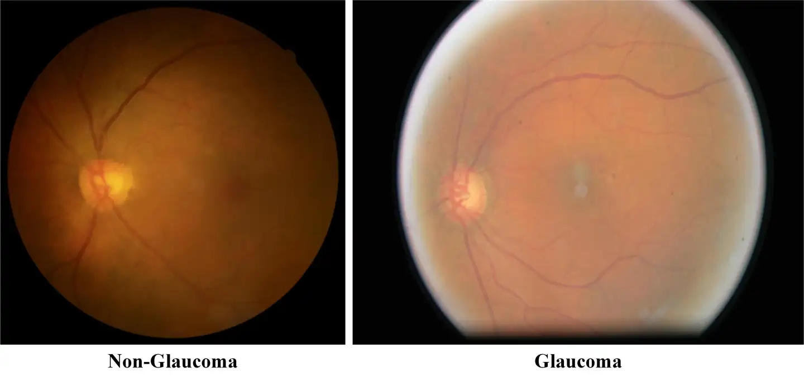

# AIROGS

<div align="center">
    <a href="https://github.com/openmedlab/"></a>
</div>
<p style="text-align:center;font-size:10px;"><em></em></p>

## Dataset Information

The Rotterdam EyePACS AIROGS dataset, including a complete training set and test set, comprises 113,893 color fundus images from 60,357 subjects across approximately 500 different locations with diverse ethnic backgrounds. All images are marked by human experts as either diagnosable for glaucoma, not diagnosable for glaucoma, or ungradable. The training set can be downloaded from Zenodo. Please note that downloading this dataset requires manual acceptance on Zenodo, so access may be delayed.

For each image, raters need to indicate whether the eye should be referred ("diagnosable for glaucoma"), should not be referred ("not diagnosable for glaucoma"), or if the image is ungradable ("ungradable"). Note that the training set contains about 101,000 gradable images. The test set contains about 11,000 gradable and ungradable images. To ensure high quality of the label set, each image is initially scored twice. If the raters agree, the agreed-upon label becomes the final label. If there is a disagreement, the image is scored by a third rater, one of two experienced glaucoma specialists, and this label becomes the final label.

Early detection of glaucoma can prevent vision impairment, which can be achieved through screening. Artificial Intelligence (AI) can reduce the demand for manual labor, thus improving the cost-effectiveness of glaucoma screening. AI methods for detecting glaucoma through color fundus photography (CFP) have been proposed and have shown promising laboratory performance. However, a significant drop in performance often occurs when AI solutions are applied in real-world settings. Unexpected out-of-distribution data and poor quality images are the main reasons for performance degradation.

## Dataset Meta Information

| Dimensions | Modality | Task Type      | Anatomical Structures | Anatomical Area | Number of Categories | Data Volume | File Format |
|------------|----------|----------------|-----------------------|-----------------|----------------------|-------------|-------------|
| 2D         | Fundus   | Classification | Eye                   | Eye             | 2                    | 101442      | JPG         |


### Resolution Details

| Dataset Statistics | size            |
|--------------------|-----------------|
| min                | (212, 320, 3)   |
| median             | (2354, 3296, 3) |
| max                | (6000, 6000, 3) |

## Label Information Statistics

| Categories   | Number |
|--------------|--------|
| Non-Glaucoma | 98172  |
| Glaucoma     | 3270   |


## Visualization

<div align="center">
    <a href="https://github.com/openmedlab/"></a>
</div>
<p style="text-align:center;font-size:10px;"><em>Local Visiualization.</em></p>

## File Structure

The dataset file structure is as follows: images are stored in the 'images' directory, and the annotations for train and test are provided in txt format.

``` 
AIROGS
├── images
│   ├── xxx.jpg
│   ├── xxx.jpg
│   │    ...
├── train.txt
├── test.txt
```

## Authors and Institutions

Coen de Vente (Rotterdam Eye Hospital)

Koenraad A. Vermeer (Rotterdam Eye Hospital)

## Source Information

Official Website: https://airogs.grand-challenge.org/data-and-challenge/

Download Link: https://airogs.grand-challenge.org/data-and-challenge/

Article Address: https://ieeexplore.ieee.org/abstract/document/10253652

Publication Date: 2023

## Citation

``` 
@ARTICLE{10253652,
  author={de Vente, Coen and Vermeer, Koenraad A. and Jaccard, Nicolas and Wang, He and Sun, Hongyi and Khader, Firas and Truhn, Daniel and Aimyshev, Temirgali and Zhanibekuly, Yerkebulan and Le, Tien-Dung and Galdran, Adrian and Ballester, Miguel Ángel González and Carneiro, Gustavo and Devika, R. G. and Sethumadhavan, Hrishikesh Panikkasseril and Puthussery, Densen and Liu, Hong and Yang, Zekang and Kondo, Satoshi and Kasai, Satoshi and Wang, Edward and Durvasula, Ashritha and Heras, Jónathan and Zapata, Miguel Ángel and Araújo, Teresa and Aresta, Guilherme and Bogunović, Hrvoje and Arikan, Mustafa and Lee, Yeong Chan and Cho, Hyun Bin and Choi, Yoon Ho and Qayyum, Abdul and Razzak, Imran and van Ginneken, Bram and Lemij, Hans G. and Sánchez, Clara I.},
  journal={IEEE Transactions on Medical Imaging}, 
  title={AIROGS: Artificial Intelligence for Robust Glaucoma Screening Challenge}, 
  year={2024},
  volume={43},
  number={1},
  pages={542-557},
  keywords={Glaucoma;Artificial intelligence;Training;Robustness;Visualization;Image color analysis;Cameras;Color fundus photography;glaucoma screening;out-of-distribution detection;retina;robustness},
  doi={10.1109/TMI.2023.3313786}}
```

Original introduction article is [here](https://zhuanlan.zhihu.com/p/706368095).