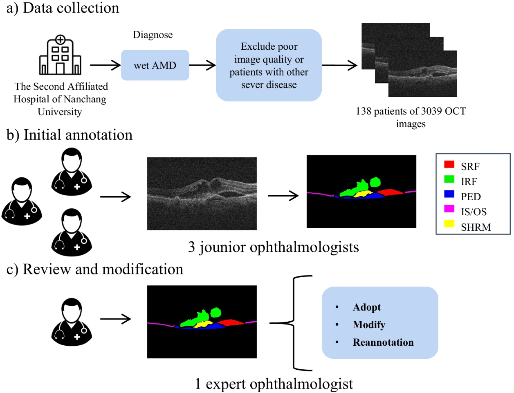
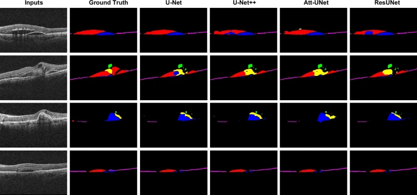

# AMD-SD

<div align="center">
    <a href="https://github.com/openmedlab/"></a>
</div>
<p style="text-align:center;font-size:10px;"><em></em></p>

## Dataset Information

Wet age-related macular degeneration (wet AMD) is a common eye disease that significantly impacts patients' vision. Optical coherence tomography (OCT) has become a valuable tool for diagnosing, treating, and monitoring wet AMD due to its cost-effectiveness, non-invasiveness, and repeatability. OCT provides detailed visualization of retinal layers and enables precise segmentation of lesion areas, facilitating the identification and quantitative analysis of abnormalities. However, the lack of high-quality datasets for assessing wet AMD hinders the development of related algorithms. To address this issue, the authors curated a comprehensive wet AMD OCT segmentation dataset (AMD-SD), which includes 3,049 B-scan images from 138 patients, each annotated with five segmentation labels: subretinal fluid, intraretinal fluid, ellipsoid zone continuity, subretinal hyperreflective material, and pigment epithelial detachment. This dataset provides valuable opportunities to study the accuracy and reliability of various segmentation algorithms for wet AMD and serves as a critical data resource for developing AI-assisted clinical applications for wet AMD.

<div align="center">
    <a href="https://github.com/openmedlab/"></a>
</div>
<p style="text-align:center;font-size:10px;"><em></em></p>

**Figure 1. Workflow for constructing AMD-SD (Wet AMD OCT Segmentation Dataset)**

(a) **Data Collection**: A total of 138 patients diagnosed with wet AMD at the Ophthalmology Department of the Second Affiliated Hospital of Nanchang University participated in the study. OCT B-scans were performed on 156 eyes, resulting in 3,049 images.

(b) **Preliminary Annotation**: Three junior ophthalmologists manually annotated subretinal fluid (SRF), intraretinal fluid (IRF), and pigment epithelial detachment (PED) on the OCT slices.

## Dataset Meta Information

| Dimensions | Modality | Task Type      | Anatomical Area | Number of Categories | Data Volume | File Format |
|------------|----------|----------------|-----------------|----------------------|-------------|-------------|
| 2D         | OCT      | Segmentation   | Retina          | 5                    | 3049        | PNG         |


### Resolution Details

| Dataset Statistics | size         |
|--------------------|--------------|
| min                | (1140, 380)  |
| median             | (1140, 380)  |
| max                | (1140, 380)  |

## Label Information Statistics

| English                             | Chinese     |
|-------------------------------------|-------------|
| subretinal fluid                    | 视网膜下积液      |
| intraretinal fluid                  | 视网膜内积液      |
| ellipsoid zone continuity           | 椭圆区连续性      |
| subretinal hyperreflective material | 视网膜下高反射物质   |
| pigment epithelial detachment       | 色素上皮脱离      |

## Visualization

<div align="center">
    <a href="https://github.com/openmedlab/"></a>
</div>
<p style="text-align:center;font-size:10px;"><em>Figure 2. Comparison of visual segmentation results. Red, blue, green, yellow, and pink represent subretinal fluid (SRF), pigment epithelial detachment (PED), intraretinal fluid (IRF), subretinal hyperreflective material (SHRM), and the ellipsoid zone/photoreceptor connection (IS/OS), respectively.</em></p>

## File Structure

``` 
AMD-SD/
│
├── images
│   ├── 1
│   │   ├── 1_1.png
│   │   ├── 1_10.png
│   │   ├── ...
│   ├── 10
│   ├── ...
│   ├── Demographics of the participants.xlsx
│   ├── training.txt
│   ├── validation.txt
```

## Authors and Institutions

Yunwei Hu1,3, YundiGao1,3, WeihaoGao2,3, Wenbin Luo1, ZhongyiYang1, FenXiong1, ZidanChen1, Yucai Lin1, XinjingXia1, XiaolongYin1 ✉, Yan Deng1 ✉, Lan Ma2 ✉ & Guodong Li1 ✉

1 Ophthalmic Center, The Second Affiliated Hospital, Jiangxi Medical College, Nanchang University, Nanchang, 330000, P. R. China.

2 Shenzhen International Graduate School, Tsinghua University, Lishui Rd, Shenzhen, 518055, Guangdong, P. R. China.

3 These authors contributed equally: Yunwei Hu, Yundi Gao, Weihao Gao.

## Source Information

Official Website: https://www.nature.com/articles/s41597-024-03844-6?_gl=1*b3wq4u*_up*MQ..&gclid=Cj0KCQjw3bm3BhDJARIsAKnHoVXSgcCZ1IVP-iFrZ3UUAyGYcDxTqRoRzajibS9q1F6dA5GEF2xAyw4aAmrcEALw_wcB

Download Link: https://springernature.figshare.com/articles/dataset/An_Optical_Coherence_Tomography_Image_Dataset_for_wet_AMD_Lesions_Segmentation/25513435?backTo=%2Fcollections%2FAMD-SD_An_Optical_Coherence_Tomography_Image_Dataset_for_wet_AMD_Lesions_Segmentation%2F7157554&file=48777037

Article Address: https://www.nature.com/articles/s41597-024-03844-6?_gl=1*b3wq4u*_up*MQ..&gclid=Cj0KCQjw3bm3BhDJARIsAKnHoVXSgcCZ1IVP-iFrZ3UUAyGYcDxTqRoRzajibS9q1F6dA5GEF2xAyw4aAmrcEALw_wcB

Publication Date: 2024-09

## Citation

``` 
@article{hu2024amd,
  title={AMD-SD: An Optical Coherence Tomography Image Dataset for wet AMD Lesions Segmentation},
  author={Hu, Yunwei and Gao, Yundi and Gao, Weihao and Luo, Wenbin and Yang, Zhongyi and Xiong, Fen and Chen, Zidan and Lin, Yucai and Xia, Xinjing and Yin, Xiaolong and others},
  journal={Scientific Data},
  volume={11},
  number={1},
  pages={1014},
  year={2024},
  publisher={Nature Publishing Group UK London}
}
```

Original introduction article is [here](https://zhuanlan.zhihu.com/p/721365498).