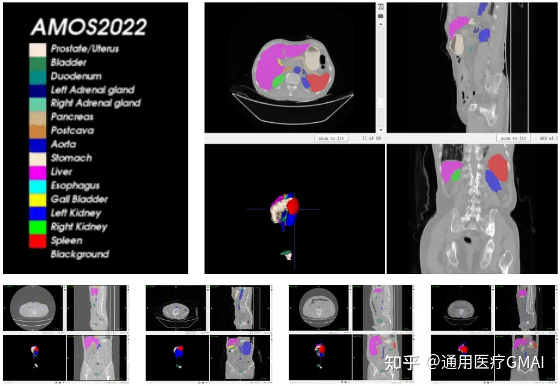
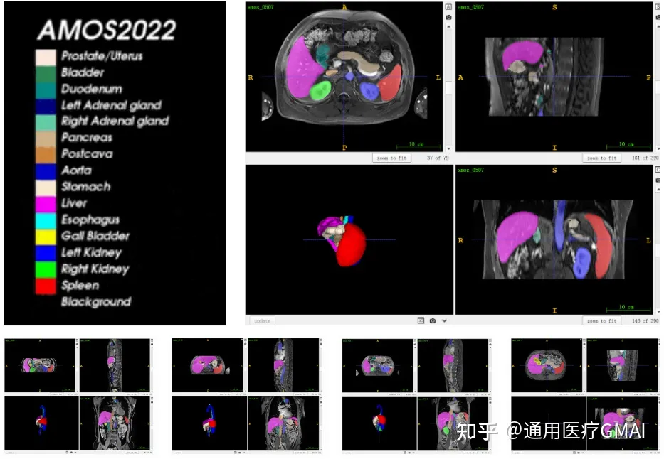

# AMOS 2022

<div align="center">
    <a href="https://github.com/openmedlab/"></a>
</div>
<p style="text-align:center;font-size:10px;"><em></em></p>

## Dataset Information

Abdominal multi-organ segmentation is one of the most attractive topics in the field of medical image analysis, playing an important role in supporting clinical workflows such as disease diagnosis and treatment. The recent success of deep learning methods applied to abdominal multi-organ segmentation has exposed the lack of large-scale benchmarks to develop and compare these methods. Although there are several benchmark datasets for abdominal organ segmentation, the limited number of organs of interest and training samples still restrict the capabilities of modern deep models and make it difficult to provide a comprehensive and fair estimate of different methods.

Moreover, most current medical image analysis research focuses on building customized systems to handle monotonous inputs and outputs related to a single task. The complexity of such systems increases dramatically when the inputs or outputs become more diversified. If an algorithm can handle a variety of input patterns and outputs, then actual deployment will be greatly simplified, and it will align with human capabilities: the ability to absorb data from many sources, learn general rules, seamlessly integrate them, and serve a variety of tasks.

To address the aforementioned drawbacks and further promote the development of medical image segmentation technology, a large-scale, clinically-oriented, and diversified abdominal multi-organ segmentation benchmark dataset, AMOS, has been proposed. It provides 500 CT and 100 MR scans from multi-centers, multi-vendors, multi-modalities, multi-phases, and multi-disease patients, each with voxel-level annotations for 15 abdominal organs.

Compared to previous medical image analysis datasets, AMOS ensures a large data volume while providing fine annotations for up to 15 types of abdominal organs, possessing high clinical value.

### Task information

#### Task 1 - Abdominal Organ Segmentation (CT only)

Task 1 is a more routine task, aimed at comprehensively evaluating the performance of different segmentation methods across a wide range and diversity of CT scans. It involves 500 patients and 15 organs (spleen, right kidney, left kidney, gallbladder, esophagus, liver, stomach, aorta, inferior vena cava, pancreas, right adrenal gland, left adrenal gland, duodenum, bladder, prostate/uterus).

#### Task 2 - Abdominal Organ Segmentation (CT and MR)

This task extends the imaging modality targets of Task 1 to MR modality. In this cross-modality setting, an algorithm is needed to segment abdominal organs from both CT and MR. Specifically, an additional 100 MR scans with the same type of annotations will be provided.

In traditional multi-modality segmentation tasks common in medical imaging, there are multiple modal inputs for each inference, for example, the BraTS dataset provides 4 types of MR modality inputs for each sample. Compared to the traditional setting, the cross-modality setting of AMOS is more challenging; the model will only input one modality at a time during training and inference, either CT or MR, requiring the model to adapt to both modalities."

## Dataset Meta Information

| Dimensions | Modality | Task Type | Anatomical Structures | Anatomical Area | Number of Categories | Data Volume                                        | File Format |
|------------|----------|-----------|-----------------------|-----------------|----------------------|----------------------------------------------------|-------------|
| 3D         | CT, MRI  | Segmentation | Spleen, right kidney, left kidney, gallbladder, esophagus, liver, stomach, aorta, inferior vena cava, pancreas, right adrenal gland, left adrenal gland, duodenum, bladder, prostate/uterus                      | Abdomen       | 15                   | 240 for training, 120 for validation, 240 for test | .nii.gz     |


### Resolution Details

| Dataset Statistics | spacing (mm)     | size              |
|--------------------|------------------|-------------------|
| min                | (0.45, 0.45, 0.82)             | (192, 60, 64)     |
| median             | (0.78, 0.78, 5)           | (512, 512, 100)   |
| max                | (1.95, 1.95, 5)              | 	(768, 768, 512)  |

## Intensity Information Statistics

### CT Intensity Information Statistics
| Organs | CT - min | CT - 0.5% | CT - median | CT - mean | CT - std | CT - 99.5% | CT - max |
| ------ | -------- | --------- | ----------- | --------- | -------- | ---------- | -------- |
| Liver  | -90.03   | -21.97    | 49.99       | 47.95     | 18.58    | 86          | 112      |
| Right Kidney | -75.99 | -31       | 25.03       | 23.96     | 16       | 62.02       | 91.98    |
| Spleen | -103.03  | -33.02    | 28.02       | 26.94     | 16.2     | 62.99       | 99       |
| Pancreas | -80.99  | -31       | 20.02       | 19.79     | 15.38    | 57.99       | 122.99   |
| Aorta  | -56.03   | -31       | 39.98       | 36.83     | 19.98    | 80.45       | 96.01    |
| Inferior Vena Cava | -156.01 | -12.02    | 57.99       | 56.87     | 17.93    | 98.03       | 338.02  |
| Right Adrenal Gland | -714.97 | -221.36 | 26.98       | 22.03     | 39.45    | 75.99       | 176.03  |
| Left Adrenal Gland    | -130     | -38.02    | 42          | 39.93     | 20.91    | 86.98      | 315.99   |
| Gallbladder           | -86.97   | -39       | 42          | 39.63     | 21.98    | 91.98      | 122.99   |
| Esophagus             | -91.98   | -31       | 36.01       | 34.35     | 20.47    | 81.97      | 115.97   |
| Stomach               | -75.01   | -54.38    | 18.98       | 16.91     | 26.27    | 73         | 91.01    |
| Duodenum              | -72.02   | -43.03    | 25.03       | 23.15     | 21.97    | 72.03      | 85.03    |
| Left Kidney           | -646     | -98.12    | 34.98       | 31.41     | 28.92    | 81.97      | 166.02   |
| Bladder               | -116.03  | -33.02    | 13          | 12.52     | 12.79    | 44.99      | 502.02   |
| Prostate/Uterus       | -57.01   | -23.01    | 42          | 42.65     | 25.47    | 112.98     | 154.97   |

### MR Intensity Information Statistics

| Organs            | MR - min | MR - 0.5% | MR - median | MR - mean | MR - std | MR - 99.5% | MR - max |
| ----------------- | -------- | --------- | ----------- | --------- | -------- | ---------- | -------- |
| Liver             | 0        | 86        | 169         | 170.95    | 26.52    | 277        | 409      |
| Right Kidney      | 0        | 38        | 166         | 166.14    | 38.39    | 272        | 364      |
| Spleen            | 0        | 14        | 155         | 155.34    | 42.12    | 291        | 384      |
| Pancreas          | 49       | 72.98     | 237.5       | 245.64    | 75.55    | 440.76     | 469      |
| Aorta             | 0        | 0         | 141         | 131.62    | 48.39    | 224.55     | 247      |
| Inferior Vena Cava| 0        | 92        | 213         | 216.82    | 43.13    | 352        | 421      |
| Right Adrenal Gland| 0        | 0         | 168         | 153.38    | 62.73    | 277        | 374      |
| Left Adrenal Gland| 5        | 83        | 215         | 227.39    | 78.59    | 411.19     | 460      |
| Gallbladder       | 25       | 61        | 143         | 144.95    | 34.98    | 270        | 392      |
| Esophagus         | 4        | 97        | 258         | 252.16    | 46.85    | 365        | 427      |
| Stomach           | 0        | 19.43     | 177.5       | 169.28    | 54.34    | 263.05     | 276      |
| Duodenum          | 82       | 94.8      | 191.5       | 189.41    | 32.36    | 254.67     | 258      |
| Left Kidney       | 0        | 0         | 167         | 155.1     | 64.18    | 285        | 350      |
| Bladder           | nan      | nan       | nan         | nan       | nan      | nan        | nan      |
| Prostate/Uterus   | nan      | nan       | nan         | nan       | nan      | nan        | nan      |


## Label Information Statistics

| Organ/Tissue        | Voxel Ratio (min) | Voxel Ratio (median) | Voxel Ratio (mean) | Voxel Ratio (max) | Actual Size cm³ (min) | Actual Size cm³ (median) | Actual Size cm³ (mean) | Actual Size cm³ (max) | Number of Instances |
|---------------------|-------------------|----------------------|--------------------|-------------------|-----------------------|--------------------------|------------------------|-----------------------|---------------------|
| Spleen              | 1.15%             | 3.17%                | 3.42%              | 10.40%            | 1379                  | 2571                     | 2669                   | 7330                  | 200                 |
| Right Kidney        | 0.22%             | 0.17%                | 0.18%              | 0.52%             | 14                    | 135                      | 142                    | 343                   | 200                 |
| Left Kidney         | 0.17%             | 0.17%                | 0.19%              | 1.32%             | 10                    | 142                      | 150                    | 1008                  | 199                 |
| Gall Bladder        | 0.03%             | 0.03%                | 0.04%              | 0.29%             | 1                     | 24                       | 30                     | 143                   | 189                 |
| Esophagus           | 0.02%             | 0.02%                | 0.02%              | 0.07%             | 0                     | 12                       | 15                     | 60                    | 199                 |
| Liver               | 0.58%             | 1.52%                | 1.67%              | 5.08%             | 653                   | 1231                     | 1318                   | 5840                  | 200                 |
| Stomach             | 0.00%             | 0.31%                | 0.44%              | 2.87%             | 0                     | 244                      | 325                    | 1254                  | 198                 |
| Aorta               | 0.03%             | 0.12%                | 0.14%              | 0.57%             | 26                    | 92                       | 116                    | 373                   | 200                 |
| Inferior Vena Cava  | 0.02%             | 0.08%                | 0.09%              | 0.23%             | 31                    | 69                       | 69                     | 135                   | 200                 |
| Pancreas            | 0.02%             | 0.08%                | 0.09%              | 0.26%             | 15                    | 70                       | 69                     | 183                   | 200                 |
| Right Adrenal Gland | 0.00%             | 0.00%                | 0.00%              | 0.01%             | 1                     | 3                        | 3                      | 8                     | 199                 |
| Left Adrenal Gland   | 0.00%             | 0.00%                | 0.01%              | 0.02%             | 0                     | 3                        | 3                      | 9                     | 200                 |
| Duodenum             | 0.02%             | 0.06%                | 0.07%              | 0.19%             | 19                    | 50                       | 55                     | 146                   | 200                 |
| Bladder              | 0.01%             | 0.11%                | 0.17%              | 2.98%             | 14                    | 85                       | 128                    | 1255                  | 195                 |
| Prostate/Uterus      | 0.01%             | 0.04%                | 0.07%              | 0.59%             | 7                     | 30                       | 51                     | 268                   | 192                 |

## Visualization

<div align="center">
    <a href="https://github.com/openmedlab/"></a>
</div>
<p style="text-align:center;font-size:10px;"><em> CT image example.</em></p>

<div align="center">
    <a href="https://github.com/openmedlab/"></a>
</div>
<p style="text-align:center;font-size:10px;"><em> MR image example.</em></p>

## File Structure

After decompressing the official compressed package, the file structure is as follows, which conforms to the nnUNet standard format.

``` 
AMOS22
  ├── dataset.json
  ├── imagesTr
  │   ├── amos_0001.nii.gz
  │   ├── amos_0004.nii.gz
  │   ├── amos_0005.nii.gz
  │   ├── ...
  ├── labelsTr
  │   ├── amos_0001.nii.gz
  │   ├── amos_0004.nii.gz
  │   ├── amos_0005.nii.gz
  │   ├── ...
  ├── imagesTs
  │   ├── amos_0002.nii.gz
  │   ├── amos_0003.nii.gz
  │   ├── ...
```

## Authors and Institutions

Xiang Wan (SRIBD)

Ruimao Zhang (CUHKSZ)

Zhen Li (CUHKSZ)

Guanbin Li (SYSU)

Ping Luo (HKU)

Yuanfeng Ji (HKU)

Weijie Ma (CUHKSZ)

Haotian Bai (CUHKSZ)

Jie Yang (CUHKSZ)

Chongjian Ge (HKU)

Lingyan Zhang (LGCHSZ)

Wanling Ma (LGDPHSZ)

Shaohua Zhou (ICTCAS & CUHKSZ)

Shuguang Cui (CUHKSZ)


## Source Information

Official Website: https://amos22.grand-challenge.org/

Download Link: https://amos22.grand-challenge.org/Instructions/

Article Address: https://arxiv.org/abs/2206.08023

Release Date: 2022-05

## Citation

``` 
@article{ji2022amos,
  title={AMOS: A Large-Scale Abdominal Multi-Organ Benchmark for Versatile Medical Image Segmentation},
  author={Ji, Yuanfeng and Bai, Haotian and Yang, Jie and Ge, Chongjian and Zhu, Ye and Zhang, Ruimao and Li, Zhen and Zhang, Lingyan and Ma, Wanling and Wan, Xiang and others},
  journal={arXiv preprint arXiv:2206.08023},
  year={2022}
}
```

Original introduction article is [here](https://zhuanlan.zhihu.com/p/650388336).