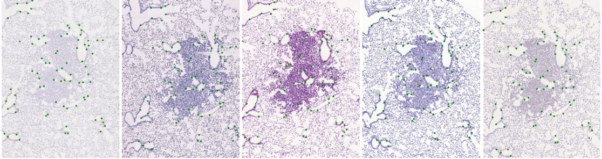
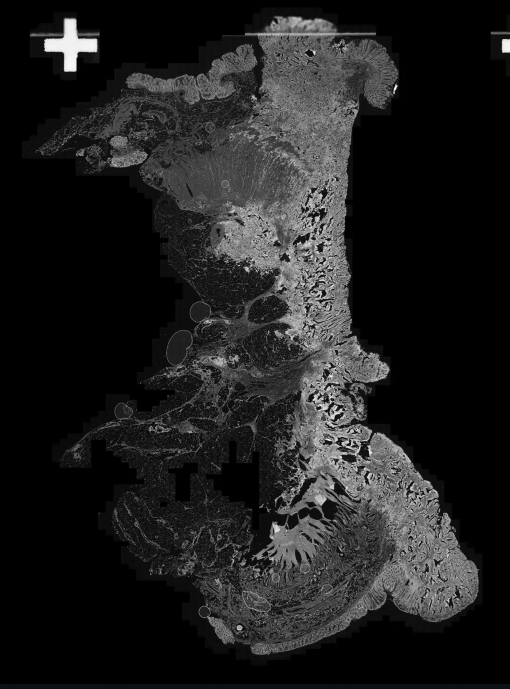

# ANHIR

<div align="center">
    <a href="https://github.com/openmedlab/"></a>
</div>
<p style="text-align:center;font-size:10px;"><em></em></p>

## Dataset Information

The Automatic Non-rigid Histological Image Registration (ANHIR) dataset is a collection designed for registering histological images of lung lobes and breast tissue, and it was part of a challenge at ISBI 2019. The dataset contains 481 pairs of registration data, with images and labels provided for 222 training cases, while 259 validation cases come with images only.

In the field of digital pathology, one of the simplest yet most useful tasks is the visual comparison of consecutive tissue sections, which requires aligning all images to a common frame. Image alignment is also relevant for applications such as 3D reconstruction and image fusion. It enables pathologists to assess histology and expression of multiple biomarkers within the same region. Moreover, slices may undergo non-linear deformations due to tissue processing and pre-analytical steps, meaning they stretch and warp from one slice to another. Currently, only a few automated alignment tools are capable of handling large images with sufficient accuracy and reasonable processing time.

The ANHIR challenge focuses on comparing the accuracy and speed of automated non-linear registration methods on large images stained with different biomarkers from the same tissue sample. Manual landmarks annotated on the images will be used to evaluate the accuracy of the registrations. Robustness of the methods will be estimated by computing the number of times the final image alignment is improved by the performed registration operations. As a secondary criterion, the computation time will also be measured. The challenge requires all methods to operate fully automatically, without interaction or specific parameter settings for specific images (such as placing key points or adjusting parameters for some special images).

## Dataset Meta Information

| Dimensions | Modality | Task Type     | Anatomical Structures | Anatomical Area | Data Volume | File Format |
|------------|----------|---------------|-----------------------|-----------------|-------------|-------------|
| 2D         | Histopathology       | Registration  | Cell, Tissue          | Chest                               | 481         | JPG, PNG    |


### Resolution Details

|                  | Magnification | Image size                  |
|------------------|---------------|-----------------------------|
| Image Statistics | 40 times      | 15k x 15k--50k x 50k Pixels |

Detailed information on pathological images of different tissues:

| Name               | Tissue                                       | Scanner                | Magnitude | Resolution [µm/pixel] | Avg. size [pixels] |
|--------------------|----------------------------------------------|------------------------|-----------|----------------------|--------------------|
| lung-lesion_       | Lung lesion                                  | Zeiss Axio Imager M1   | 40x       | 0.174                | 18k×15k            |
| lung-lobes_        | Whole mice lung lobes                        | Zeiss Axio Imager M1   | 10x       | 1.274                | 11k×6k             |
| mammary-glands_    | Mammary glands                               | Zeiss Axio Imager M1   | 10x       | 2.294                | 12k×4k             |
| mice-kidney_       | Mice kidney                                  | NanoZoomer 2.0HT       | 20x       | 0.227                | 37k×30k            |
| COAD_              | COlon ADenocarcinoma (colon cancer)          | 3DHistec Pannoramic    | 10x       | 0.468                | 60k×50k            |
| gastric_           | Gastric mucosa and gastric adenocarcinoma tissue fragments | Leica Biosystems        | 40x       | 0.2528               | 60k×75k            |
| breast_            | Human breast                                 | Leica Biosystems       | 40x       | 0.2528               | 65k×60k            |
| kidney_            | Human kidney                                 | Leica Biosystems       | 40x       | 0.2528               | 18k×55k            |


## Label Information Statistics

The data for the registration task mainly include the initial image, the image after registration, and the paired landmarks of the two images.

The landmarks mainly represent the correspondence between points in the two images but do not include all points. The format of the landmark file is as follows:

```
,X,Y
1,226,173
2,256,171
3,278,182
4,346,207
...
```

## Visualization

<div align="center">
    <a href="https://github.com/openmedlab/"></a>
</div>
<p style="text-align:center;font-size:10px;"><em> Original Image.</em></p>

<div align="center">
    <a href="https://github.com/openmedlab/"></a>
</div>
<p style="text-align:center;font-size:10px;"><em> Target Image.</em></p>

## File Structure

The challenge has prepared original size versions of 100%, 50%, 25%, 10%, and 5% reductions, with different versions corresponding to different scale-xpc. The folder includes both original and registration images.

``` 
DATASET
|- lesions_1
|   |- scale-5pc
|   |   |- 29-041-Izd2-w35-CD31-3-les1.jpg
|   |   |- 29-041-Izd2-w35-CD31-3-les1.csv
|   |   |- 29-041-Izd2-w35-CD31-3-les1.jpg
|   |   |- 29-041-Izd2-w35-CD31-3-les1.csv
|   |   | ...
|   |   |- 29-041-Izd2-w35-CD31-3-les1.jpg
|   |   '- 29-041-Izd2-w35-CD31-3-les1.csv
|   |- scale-10pc
|   | ...
|   '- scale-100pc
|   |- 29-041-Izd2-w35-CD31-3-les1.png
|   |- 29-041-Izd2-w35-CD31-3-les1.csv
|   | ...
|   |- 29-041-Izd2-w35-CD31-3-les1.png
|   '- 29-041-Izd2-w35-CD31-3-les1.csv
|- lesions_2
| ...
'- mammary-gland_2
```

## Authors and Institutions

Jiří Borovec (Czech Technical University, Czech Republic)

Jan Kybic (Czech Technical University, Czech Republic)

Ignacio Arganda-Carreras (University of the Basque Country, Spain)

Dmitry V Sorokin (Lomonosov Moscow State University, Russia)


## Source Information

Official Website: https://anhir.grand-challenge.org/

Download Link: https://anhir.grand-challenge.org/Download/

Article Address: https://ieeexplore.ieee.org/abstract/document/9058666

Publication Date: 2020-07

## Citation

``` 
@article{borovec2020anhir,
  title={ANHIR: automatic non-rigid histological image registration challenge},
  author={Borovec, Ji{\v{r}}{\'\i} and Kybic, Jan and Arganda-Carreras, Ignacio and Sorokin, Dmitry V and Bueno, Gloria and Khvostikov, Alexander V and Bakas, Spyridon and Eric, I and Chang, Chao and Heldmann, Stefan and others},
  journal={IEEE transactions on medical imaging},
  volume={39},
  number={10},
  pages={3042--3052},
  year={2020},
  publisher={IEEE}
}
```

Original introduction article is [here](https://zhuanlan.zhihu.com/p/686331719).