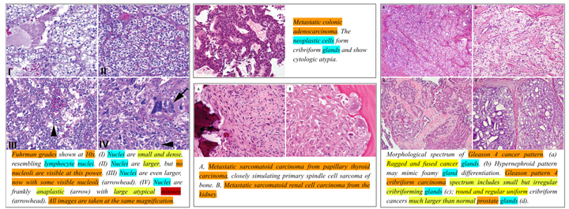
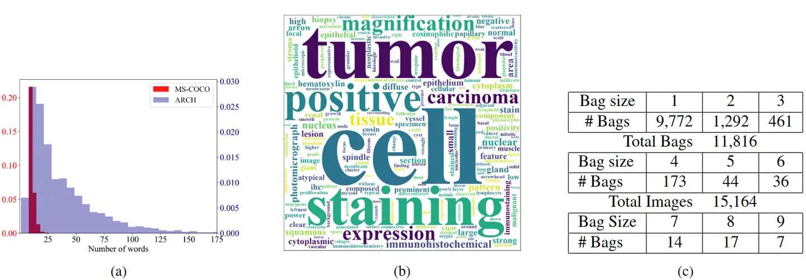
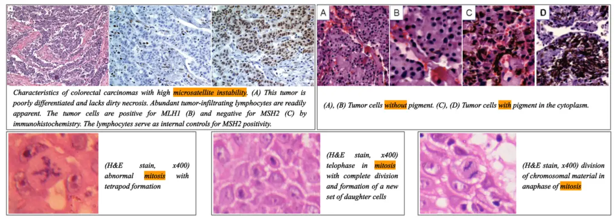

# ARCH

<div align="center">
    <a href="https://github.com/openmedlab/"></a>
</div>
<p style="text-align:center;font-size:10px;"><em></em></p>

## Dataset Information

The ARCH dataset is designed specifically for multi-instance description tasks in computational pathology. Pathology images typically contain rich visual information, such as various tissue structures and cell morphologies. In actual diagnostic procedures, pathologists often analyze multiple tissue slides or images stained by different methods to obtain comprehensive pathological information. Multi-instance methods can more effectively simulate this process, thereby providing diagnostic tools that are closer to actual clinical operations. The ARCH dataset includes multi-instance images with detailed descriptions across various staining methods, tissue types, and pathological diagnoses, laying a solid foundation for the development of more advanced automated pathology diagnostic tools.

The ARCH dataset is constructed based on the PubMed medical article database and pathology textbooks. Researchers screened all relevant journals on PubMed using keywords such as pathology, histochemistry, histology, and histopathology, extracting pathology images and their corresponding text descriptions. After rigorous quality checks and filtering, a total of 11,816 "bags" and 15,164 images were obtained. Each bag contains one or more images and their associated textual descriptions.

## Dataset Information

| Task Type | Language | Number | File Format  | Size |
|-----------|----------|--------|--------------|------|
| Caption   | English  | 11,186 | .jpg, .json  | 5GB  |

## Dataset Meta Information

<div align="center">
    <a href="https://github.com/openmedlab/"></a>
</div>
<p style="text-align:center;font-size:10px;"><em>Dataset statistics (source article): (a) Histogram of title length (b) Word cloud of the 1,000 most common words in the ARCH dataset (c) Table of the number of images with a single title in each bag in the ARCH dataset.</em></p>


## Dataset Information Statistics

<div align="center">
    <a href="https://github.com/openmedlab/"></a>
</div>
<p style="text-align:center;font-size:10px;"><em>Four data examples (source article). The examples on the left and right each contain four image instances and a corresponding caption; the upper middle shows an image-caption pair, while the lower middle contains two image instances and a corresponding caption. The examples marked with different colors are examples of common tasks in computational pathology: diagnosis (orange); detection and classification (cyan); description (yellow); special cell detection (red).</em></p>


<div align="center">
    <a href="https://github.com/openmedlab/"></a>
</div>
<p style="text-align:center;font-size:10px;"><em>Five data examples (source article). Top left: The caption describes the morphological characteristics of microsatellite instability (MSI) in colon cancer; Top right: The caption provides comparative supervision, requiring the comparison of cells in the first two images with pigmented cells in the last two images; Bottom: The caption provides morphological descriptions of different stages of cell division or mitosis.</em></p>

## File Structure

The author divides the dataset into two parts: book_set.zip and pubmed_set.zip for download.

``` 
.               
├── pubmed
    ├── images
    ├────1.jpg
    ├────2.jpg
    ├────3.jpg
    ├────...
    ├── captions.json
├── book
```

## Authors and Institutions

Jevgenij Gamper (University of Warwick, UK)

Nasir Rajpoot (University of Warwick, UK)

## Source Information

Official Website: https://warwick.ac.uk/fac/cross_fac/tia/data/arch

Download Link: https://warwick.ac.uk/fac/cross_fac/tia/data/arch

Article Address: https://openaccess.thecvf.com/content/CVPR2021/html/Gamper_Multiple_Instance_Captioning_Learning_Representations_From_Histopathology_Textbooks_and_Articles_CVPR_2021_paper.html

Publication Date: 2021-03

## Citation

``` 
@inproceedings{gamper2021multiple,
  title={Multiple instance captioning: Learning representations from histopathology textbooks and articles},
  author={Gamper, Jevgenij and Rajpoot, Nasir},
  booktitle={Proceedings of the IEEE/CVF conference on computer vision and pattern recognition},
  pages={16549--16559},
  year={2021}
}
```

Original introduction article is [here]().