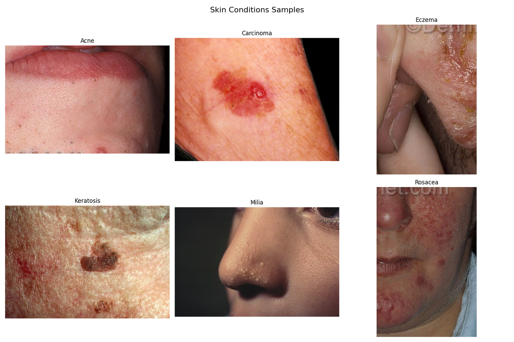

# Augmented Skin Conditions Image Dataset

<div align="center">
    <a href="https://github.com/openmedlab/"></a>
</div>
<p style="text-align:center;font-size:10px;"><em></em></p>

## Dataset Information

The **Augmented Skin Conditions Image Dataset** is a collection of images focusing on six common skin conditions. The dataset contains a total of 2,394 JPEG images, with 399 images for each skin condition type: acne, cancer, eczema, keratosis, milia, and rosacea. These images have been processed with various augmentation techniques, such as rotation, flipping, scaling, and brightness adjustments, to enhance data diversity. The images have variable dimensions, reflecting the characteristics of real-world medical imaging. The dataset is designed to serve as an ideal resource for training machine learning models, particularly in the field of medical image analysis.

This augmented skin lesion image dataset holds significant value for advancing artificial intelligence applications in dermatology. It provides balanced and diverse samples, creating opportunities for developing more accurate and reliable diagnostic algorithms for skin conditions. The dataset's balance and use of image augmentation techniques help reduce bias during model training, effectively supporting the development and testing of AI solutions related to dermatological diseases.

## Dataset Meta Information

| Dimensions | Modality      | Task Type       | Number of Categories | Data Volume | File Format |
|------------|---------------|-----------------|----------------------|-------------|-------------|
| 2D         | Dermatoscope  | Classification  | 6                    | 2394        | JPG         |


### Resolution Details

| Dataset Statistics | size          |
|--------------------|---------------|
| min                | (111, 58)     |
| median             | (243, 360)    |
| max                | (3504, 2336)  |

## Label Information Statistics

| Label            | Acne               | Carcinoma         | Eczema           | Keratosis        | Milia               | Rosacea           |
|------------------|--------------------|-------------------|------------------|------------------|---------------------|-------------------|
| Occurrences      | 399                | 399               | 399              | 399              | 399                 | 399               |
| Percentage       | 16.67%             | 16.67%            | 16.67%           | 16.67%           | 16.67%              | 16.67%            |
| Minimum Size     | (253, 166)         | (158, 160)        | (111, 58)        | (208, 157)       | (180, 136)          | (151, 173)        |
| Median Size      | (360, 237)         | (1048, 801)       | (325, 217)       | (594, 462)       | (814, 363)          | (237, 360)        |
| Maximum Size     | (1500, 1500)       | (3504, 2336)      | (1641, 1877)     | (2778, 2052)     | (1981, 1433)        | (1000, 667)       |

## Visualization

<div align="center">
    <a href="https://github.com/openmedlab/"></a>
</div>
<p style="text-align:center;font-size:10px;"><em> Data Visualization.</em></p>

## File Structure

``` 
Skin_Conditions
│
│   ├── Acne
│   │   Acne
│   │   │   └── Acne_1.jpg
│   │   │   └── ......
│   ├── Carcinoma
│   │   Carcinoma
│   │   │   └── Carcinoma_1.jpg
│   │   │   └── ......
│   ├── Eczema
│   │   Eczema
│   │   │   └── Eczema_1.jpg
│   │   │   └── ......
│   ├── Keratosis
│   │   Keratosis
│   │   │   └── Keratosis_1.jpg
│   │   │   └── ......
│   ├── Milia
│   │   Milia
│   │   │   └── Milia_1.jpg
│   │   │   └── ......
│   ├── Rosacea
│       Rosacea
│       │   └── Rosacea_1.jpg
│   │   │   └── ......
```

## Authors and Institutions

Syed Ali Raza Naqvi (Federal Urdu University of Arts and Sciences)

## Source Information

Official Website: https://www.kaggle.com/datasets/syedalinaqvi/augmented-skin-conditions-image-dataset

Download Link: https://www.kaggle.com/datasets/syedalinaqvi/augmented-skin-conditions-image-dataset/data

Article Address: TBD

Publication Date: 2024-08

## Citation

``` 
@misc{naqvi2023augmented,
  author       = {Syed Ali Raza Naqvi},
  title        = {Augmented Skin Conditions Image Dataset},
  year         = {2023},
  howpublished = {Kaggle},
  url          = {https://www.kaggle.com/datasets/syedalinaqvi/augmented-skin-conditions-image-dataset}
}
```

Original introduction article is [here](https://zhuanlan.zhihu.com/p/740273900).