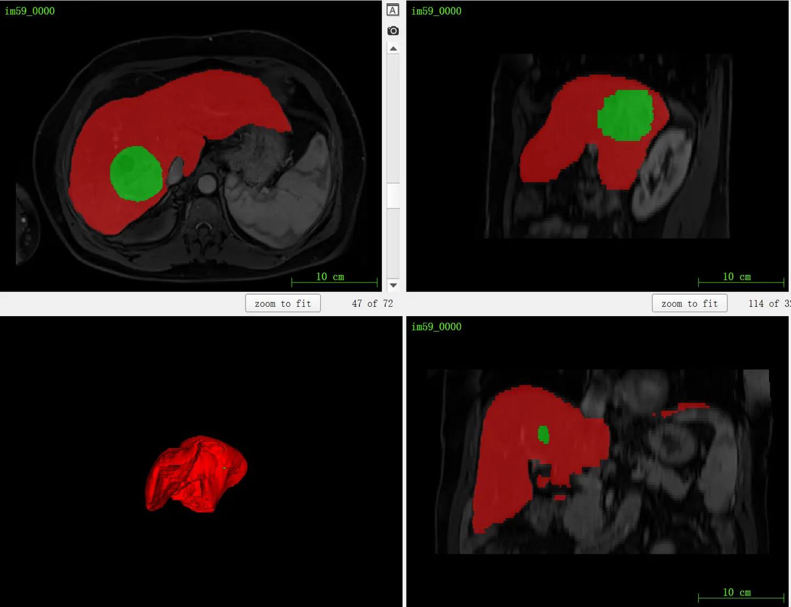

# ATLAS (MICCAI2023) 

<div align="center">
    <a href="https://github.com/openmedlab/"></a>
</div>
<p style="text-align:center;font-size:10px;"><em></em></p>

## Dataset Information

**ATLAS** (**A**utomatic **T**umour and **L**iver **A**utomatic **S**egmentation) is one of the newly released datasets in this year's MICCAI 2023 Challenge. As the full name suggests, it is a segmentation dataset for the liver and tumors, somewhat similar to the previously introduced LiTS dataset. The difference is that the ATLAS dataset provides a dataset of 90 cases in the **CE-MRI** (Contrast-Enhanced Magnetic Resonance Imaging) modality, rather than the CT modality data of LiTS. This modal difference is due to the collection of the ATLAS dataset being related to the treatment of hepatocellular carcinoma with transarterial radioembolisation (TARE), and TARE treatment requires the preoperative capture of CE-MRI images for radiometric estimation; while traditional surgical methods related to liver surgery mainly use CT images, as long as the tumor location can be clearly determined. In summary, the unique CE-MRI modality enriches the modality of abdominal segmentation benchmarks, which is commendable.

## Dataset Meta Information

| Dimensions | Modality | Task Type | Anatomical Structures          | Anatomical Area | Number of Categories | Data Volume                   | File Format |
|------------|----------|-----------|--------------------------------|-----------------|----------------------|-------------------------------|-------------|
| 3D         | CE-MRI       | Segmentation | liver, hepatocellular carcinoma | abdomen       | 2                    | 60 for training, 30 for test. | .nii.gz     |

Number of slices in the training set: 4744.

### Resolution Details

| Dataset Statistics | spacing (mm)     | size          |
|--------------------|------------------|---------------|
| min                | (0.68, 0.68, 2.00)              | (320, 250, 44)   |
| median             | (1.04, 1.04, 3.00)           | (384, 300, 80) |
| max                | (1.41, 1.41, 4.00)              | (512, 512, 136) |

## Label Information Statistics

| Organ | Liver | Hepatic Tumour |
|-------|-------|----------------|
| Number of Cases | 60 | 60 |
| Coverage | 100% | 100% |
| Minimum Volume (cm³) | 923 | 2.57 |
| Median Volume (cm³) | 1660 | 206 |
| Maximum Volume (cm³) | 2781 | 2188 |


## Visualization

<div align="center">
    <a href="https://github.com/openmedlab/"></a>
</div>
<p style="text-align:center;font-size:10px;"><em> ITK-SNAP Visualization. Red: liver, green: liver tumors. </em></p>

## File Structure

The format of the processed nnUNet is as follows, divided into train set and test set files, respectively:

``` 
Dataset
│
├── imagesTr
│   ├── im01.nii.gz
│   └── ...
├── labelsTr
│   ├── im01.nii.gz
│   └── ...
├── imagesTs
│   ├── im61.nii.gz
│   └── ...
```

## Authors and Institutions

Benoît Presles: Institute of Molecular Chemistry of the University of Burgundy, France.


## Source Information

Official Website: https://atlas-challenge.u-bourgogne.fr/

Download Link: https://atlas-challenge.u-bourgogne.fr/dataset

Article Address: https://doi.org/10.3390/data8050079

Publication Date: 2023-04

## Citation

``` 
@article{quinton2023tumour,
  title={A Tumour and Liver Automatic Segmentation (ATLAS) Dataset on Contrast-Enhanced Magnetic Resonance Imaging for Hepatocellular Carcinoma},
  author={Quinton, F{\'e}lix and Popoff, Romain and Presles, Beno{\^\i}t and Leclerc, Sarah and Meriaudeau, Fabrice and Nodari, Guillaume and Lopez, Olivier and Pellegrinelli, Julie and Chevallier, Olivier and Ginhac, Dominique and others},
  journal={Data},
  volume={8},
  number={5},
  pages={79},
  year={2023},
  publisher={MDPI}
}
```

Original introduction article is [here](https://zhuanlan.zhihu.com/p/660158297).