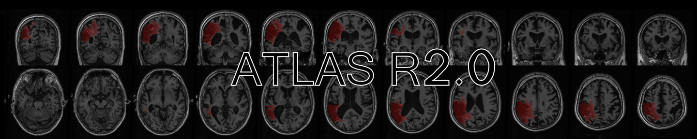
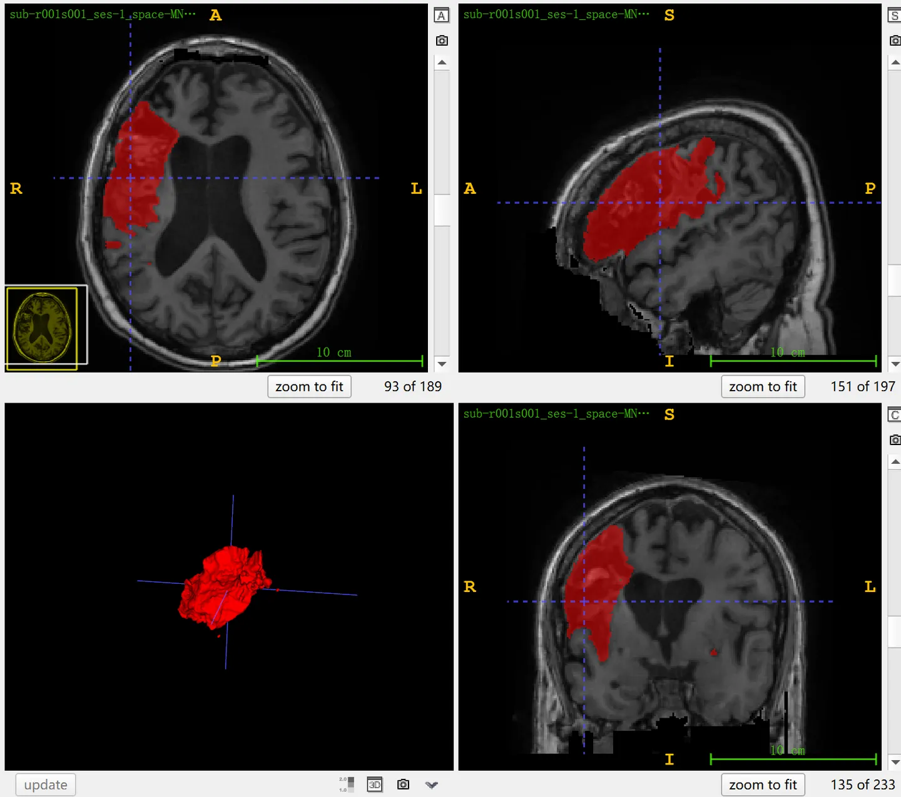

# ATLAS v2.0 (ISLES 2022)

<div align="center">
    <a href="https://github.com/openmedlab/"></a>
</div>
<p style="text-align:center;font-size:10px;"><em></em></p>

## Dataset Information

**ATLAS v2.0** (**A**natomical **T**racings of **L**esions **A**fter **S**troke) is a dataset for segmenting brain stroke lesion areas from MR T1 weighted (T1W) **single modality** images, and it is part of the MICCAI ISLES 2022 challenge. T1W MRI provides excellent spatial resolution and is necessary for registering other modalities of images, making it the modality of choice in stroke recovery research. While other modalities like T2 weighted or FLAIR imaging help to more comprehensively identify lesions, they may not be routinely collected due to MRI scanning time constraints and the specific needs of researchers, making T1W MRI the preferred choice for a single modality. ATLAS v2.0 is an expansion of the previously released ATLAS v1.2, offering a total of 1271 cases of images. Among these, 955 are publicly available images, divided into 655 training set images and 300 test set images with hidden annotations; additionally, there are 316 previously unpublished images from a new cohort.

## Dataset Meta Information

| Dimensions | Modality | Task Type | Anatomical Structures         | Anatomical Area | Number of Categories | Data Volume                                                                        | File Format |
|------------|--------|-----------|-------------------------------|-----------------|--------------------|------------------------------------------------------------------------------------|-------------|
| 3D         | MR T1W	       | Segmentation | Stroke focus | Head            | 1                  | 655 for training, 300 for identity distribution test, 316 for generalization test. | .nii.gz     |


### Resolution Details

| Dataset Statistics | spacing (mm)     | size            |
|--------------------|------------------|-----------------|
| min                | (1.0, 1.0, 1.0)              | (197, 233, 189)     |
| median             | (1.0, 1.0, 1.0)           | (197, 233, 189) |
| max                | (1.0, 1.0, 1.0)              | (197, 233, 189) |

## Label Information Statistics

| Segmentation Class | Lesions After Stroke |
|--------------------|------------------------------------|
| Case Count         | 655                                |
| Detection Rate     | 100%                               |
| Min Volume (cm³)   | 0.01                               |
| Median Volume (cm³)| 5                                  |
| Max Volume (cm³)   | 497                                |


## Visualization

<div align="center">
    <a href="https://github.com/openmedlab/"></a>
</div>
<p style="text-align:center;font-size:10px;"><em> ITK-SNAP Visualization.</em></p>

## File Structure

The official original file structure of ATLAS v2.0 is as follows, organized according to the Brain Imaging Data Structure (BIDS) format.

``` 
ATLAS_2/
├── 20211112_ATLAS_2.0_SupplementaryInfo.csv
├── 20220425_ATLAS_2.0_MetaData.xlsx
├── MNI152NLin2009aSym.nii.gz
├── Training/
│   ├── R001/
│   │   ├── dataset_description.json
│   │   ├── sub-r001s001/
│   │   │   └── ses-1/
│   │   │       └── anat/
│   │   │           ├── sub-r001s001_ses-1_space-MNI152NLin2009aSym_T1w.nii.gz
│   │   │           └── sub-r001s001_ses-1_space-MNI152NLin2009aSym_label-L_desc-T1lesion_mask.nii.gz
│   │   ├── sub-r001s002/
│   │   ├── sub-r001s003/
│   │   ├── ...
│   │   └── sub-r001s039/
│   ├── R002/
│   ├── R003/
│   ├── ...
│   └── R052/
├── Testing/
│   ├── R005/
│   ├── R014/
│   ├── ...
│   └── R052/
└── ...
```

## Authors and Institutions

Note: Only two main authors are listed below, please refer to the original text for the complete list of authors

Sook-Lei Liew (University of California, Los Angeles UCLA, USA)

Bethany P. Lo (University of California, Los Angeles UCLA, USA)


## Source Information

Official Website: https://atlas.grand-challenge.org/

Download Link: http://fcon_1000.projects.nitrc.org/indi/retro/atlas.html

Article Address: https://www.nature.com/articles/s41597-022-01401-7

Publication Date: December, 2021.

## Citation

``` 
@article{liew2022large,
  title={A large, curated, open-source stroke neuroimaging dataset to improve lesion segmentation algorithms},
  author={Liew, Sook-Lei and Lo, Bethany P and Donnelly, Miranda R and Zavaliangos-Petropulu, Artemis and Jeong, Jessica N and Barisano, Giuseppe and Hutton, Alexandre and Simon, Julia P and Juliano, Julia M and Suri, Anisha and others},
  journal={Scientific data},
  volume={9},
  number={1},
  pages={320},
  year={2022},
  publisher={Nature Publishing Group UK London}
}
```

Original introduction article is [here](https://zhuanlan.zhihu.com/p/659111927).
