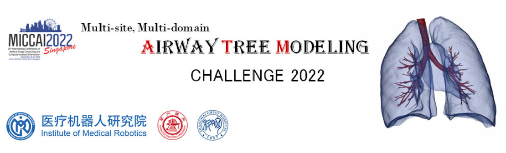
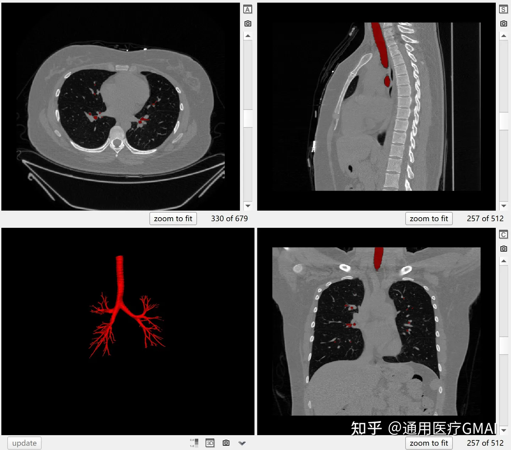

# ATM 22

<div align="center">
    <a href="https://github.com/openmedlab/"></a>
</div>
<p style="text-align:center;font-size:10px;"><em></em></p>

## Dataset Information

ATM22 (Airway Tree Modeling Challenge 2022) is a large-scale lung airway segmentation CT dataset. The dataset includes CT scans with complete lung airway annotations for 500 cases. The officials have divided these data into 300 cases for training, 50 cases for validation, and 150 cases for testing. It is important to note that 20 cases in the training set come directly from the EXACT'09 training set. Additionally, it was discovered that one case in the original training set had labels that did not match the CT images; this case has been removed in the latest version. Therefore, the actual number of training cases available for use is 299. The validation set does not provide labels, but submissions can be made on the official website for online validation.

## Dataset Meta Information

| Dimensions | Modality | Task Type | Anatomical Structures | Anatomical Area | Number of Categories | Data Volume                                       | File Format |
|------------|----------|-----------|-----------------------|-----------------|--------------------|---------------------------------------------------|-------------|
| 3D         | CT       | Segmentation | Airway of the lung.   | Chest           | 1                  | 300 for Training, 50 for Validation, 150 for test | .nii.gz     |

Number of slices in the training set: 198,163 (based on statistics from 299 available training cases).

### Resolution Details


| Dataset Statistics | spacing (mm)     | size           |
|--------------------|------------------|----------------|
| min                | (0.5137, 0.5137, 0.5)              | (512, 512, 84)    |
| median             | (0.7813, 0.7813, 0.5)           | (512, 512, 679) |
| max                | (0.9199, 0.9199, 5)              | (512, 512, 1125) |

## Label Information Statistics

| Anatomical Structure | Airway |
|----------------------|--------|
| Cases                | 299    |
| Coverage             | 100%   |
| Mean Volume (cm³)    | 19.8   |
| Median Volume (cm³)  | 46.9   |
| Max Volume (cm³)     | 111.6  |

## Visualization

<div align="center">
    <a href="https://github.com/openmedlab/"></a>
</div>
<p style="text-align:center;font-size:10px;"><em> ITK-SNAP Visualization.</em></p>

## File Structure

The official file structure is as follows, divided into six folders: training images, training labels, validation images, validation labels, test images, and test labels.

``` 
ATM2022
│
├── imagesTr
│   ├── ATM_001.nii.gz
│   └── ...
│
├── labelsTr
│   ├── ATM_001.nii.gz
│   └── ...
│
├── imagesVal
│   ├── ATM_281.nii.gz
│   └── ...
│
├── labelsVal
│   ├── ATM_281.nii.gz
│   └── ...
│
├── imagesTs
│   ├── ATM_314.nii.gz
│   └── ...
│
└── labelsTs
    ├── ATM_314.nii.gz
    └── ...
```

## Authors and Institutions

Minghui Zhang (Institute of Medical Robotics, Shanghai Jiao Tong University)

Yangqian Wu (Institute of Medical Robotics, Shanghai Jiao Tong University)

Hanxiao Zhang (Institute of Medical Robotics, Shanghai Jiao Tong University)

Hao Zheng (Institute of Medical Robotics, Shanghai Jiao Tong University)

Yulei Qin (Institute of Medical Robotics, Shanghai Jiao Tong University)

Weihao Yu (Institute of Medical Robotics, Shanghai Jiao Tong University)

Yun Gu (Institute of Medical Robotics, Shanghai Jiao Tong University)

Guang-Zhong Yang (Institute of Medical Robotics, Shanghai Jiao Tong University)


## Source Information

Official Website: https://atm22.grand-challenge.org/

Download Link: https://atm22.grand-challenge.org/

Article Address: https://www.sciencedirect.com/science/article/pii/S1361841523002177

Publication Date: May, 2022.

## Citation

``` 
@article{zhang2023multi,
  title={Multi-site, Multi-domain Airway Tree Modeling},
  author={Zhang, Minghui and Wu, Yangqian and Zhang, Hanxiao and Qin, Yulei and Zheng, Hao and Tang, Wen and Arnold, Corey and Pei, Chenhao and Yu, Pengxin and Nan, Yang and others},
  journal={Medical Image Analysis},
  pages={102957},
  year={2023},
  publisher={Elsevier}
}

@inproceedings{zhang2022cfda,
  title={CFDA: Collaborative Feature Disentanglement and Augmentation for Pulmonary Airway Tree Modeling of COVID-19 CTs},
  author={Zhang, Minghui and Zhang, Hanxiao and Yang, Guang-Zhong and Gu, Yun},
  booktitle={Medical Image Computing and Computer Assisted Intervention--MICCAI 2022: 25th International Conference, Singapore, September 18--22, 2022, Proceedings, Part I},
  pages={506--516},
  year={2022},
  organization={Springer}
}

@article{zheng2021alleviating,
  title={Alleviating class-wise gradient imbalance for pulmonary airway segmentation},
  author={Zheng, Hao and Qin, Yulei and Gu, Yun and Xie, Fangfang and Yang, Jie and Sun, Jiayuan and Yang, Guang-Zhong},
  journal={IEEE Transactions on Medical Imaging},
  volume={40},
  number={9},
  pages={2452--2462},
  year={2021},
  publisher={IEEE}
}

@inproceedings{yu2022break,
  title={BREAK: Bronchi Reconstruction by gEodesic transformation And sKeleton embedding},
  author={Yu, Weihao and Zheng, Hao and Zhang, Minghui and Zhang, Hanxiao and Sun, Jiayuan and Yang, Jie},
  booktitle={2022 IEEE 19th International Symposium on Biomedical Imaging (ISBI)},
  pages={1--5},
  year={2022},
  organization={IEEE}
}

@inproceedings{qin2019airwaynet,
  title={Airwaynet: a voxel-connectivity aware approach for accurate airway segmentation using convolutional neural networks},
  author={Qin, Yulei and Chen, Mingjian and Zheng, Hao and Gu, Yun and Shen, Mali and Yang, Jie and Huang, Xiaolin and Zhu, Yue-Min and Yang, Guang-Zhong},
  booktitle={International Conference on Medical Image Computing and Computer-Assisted Intervention},
  pages={212--220},
  year={2019},
  organization={Springer}
}
```

Original introduction article is [here](https://zhuanlan.zhihu.com/p/655310191).