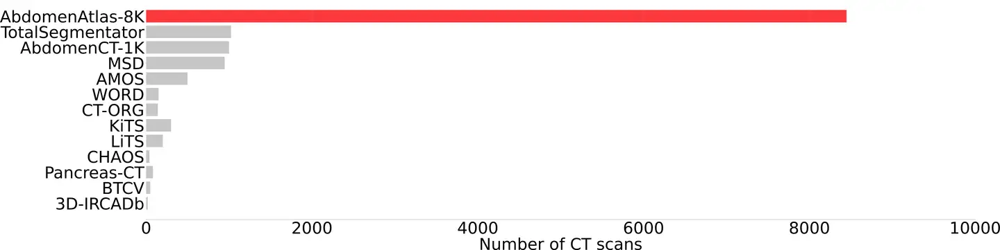
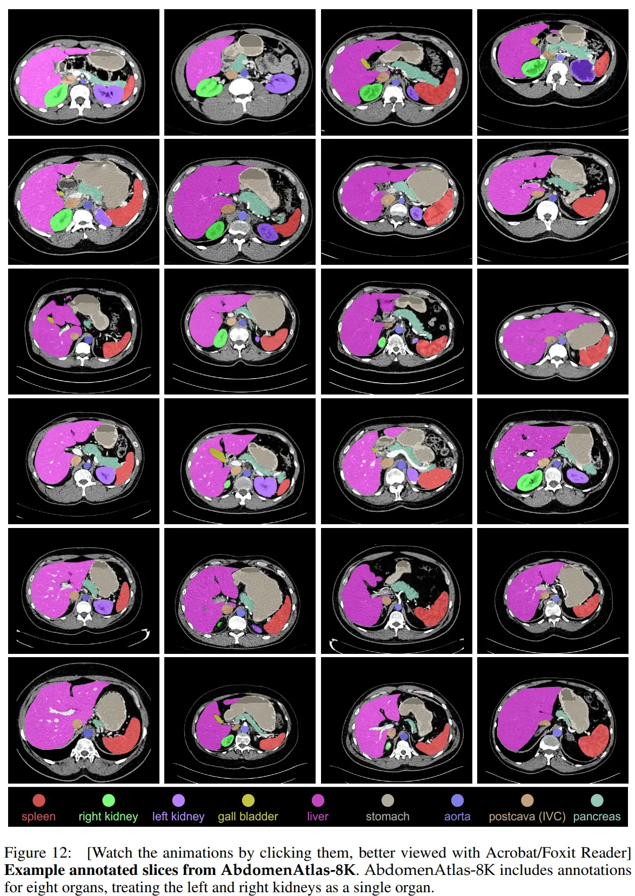

# ~~AbdomenAtlas 1.0 Mini~~

<div align="center">
    <a href="https://github.com/openmedlab/"></a>
</div>
<p style="text-align:center;font-size:10px;"><em></em></p>

## Dataset Information

AbdomenAtlas 1.0 Mini is a subset of the AbdomenAtlas-8K dataset that is currently publicly available, including 5,195 detailed annotated CT volumetric data. The AbdomenAtlas-8K dataset itself is much larger, containing a total of 8,448 CT cases. AbdomenAtlas Mini covers nine categories (eight different organs, but the left and right kidneys are marked as separate organs in the annotations): spleen, liver, left kidney, right kidney, stomach, gallbladder, pancreas, aorta, and inferior vena cava (IVC). It is also worth noting that the original image data for AbdomenAtlas Mini comes from 16 public datasets depicted in the figure below, most of which have already been detailed in previous articles; a summary table of these datasets can be found at the end of the referenced articles.

| Dataset              | # of organs | # of volumes | # of centers | source countries         | license       | # of volumes in AbdomenAtlas-8K |
|----------------------|-------------|--------------|--------------|--------------------------|---------------|---------------------------------|
| Pancreas-CT [74]     | 1           | 82           | 1            | US                       | CC BY 3.0     | 42                              |
| LiTS [7]             | 1           | 201          | 7            | DE, NL, CA, FR, IL       | CC BY-SA 4.0  | 131                             |
| KiTS [29]            | 1           | 300          | 1            | US                       | CC BY-NC-SA 4.0 | 300                            |
| AbdomenCT-1K [54]    | 4           | 1,112        | 12           | DE, NL, CA, FR, IL, US, CN | CC BY-NC-SA | 1000                            |
| CT-ORG [72]          | 5           | 140          | 8            | DE, NL, CA, FR, IL, US   | CC BY 3.0    | 140                             |
| CHAOS [86]           | 4           | 40           | 1            | TR                       | CC BY-SA 4.0 | 20                              |
| MSD CT Tasks [1]     | 9           | 947          | 1            | US                       | CC BY-SA 4.0 | 945                             |
| BTCV [45]            | 12          | 50           | 1            | US                       | CC BY 4.0    | 47                              |
| AMOS22 [39]          | 15          | 500          | 2            | CN                       | CC BY-NC-SA  | 200                             |
| WORD [50]            | 16          | 150          | 1            | CN                       | GNU GPL 3.0  | 120                             |
| FLARE’23             | 13          | 4,000        | 30           | -                        | CC BY-NC-ND 4.0 | 2200                          |
| AbdomenCT-120rgan [53]| 12         | 50           | -            | -                        | CC BY-NC-SA  | 50                              |

- The table comes from the appendix of the original paper. Note that the last column represents the number of contributions each public dataset makes to the AbdomenAtlas Mini dataset.

## Dataset Meta Information

| Dimensions | Modality | Task Type | Anatomical Structures                                                                             | Anatomical Area | Number of Categories | Data Volume | File Format |
|------------|----------|-----------|---------------------------------------------------------------------------------------------------|----------------|----------------------|-------------|-------------|
| 3D         | CT       | Segmentation | Spleen, liver, left and right kidneys, stomach, gallbladder, pancreas, aorta, inferior vena cava  | Abdomen        | 9                    | 5195        | .nii.gz     |


### Resolution Details

Statistics based on the 5170 cases of data we actually downloaded.

| Dataset Statistics | spacing (mm)       | size              |
|--------------------|--------------------|-------------------|
| min                | (0.44, 0.39, 0.36) | (29, 79, 49)      |
| median             | (0.83, 0.81, 2.0)  | (493, 364, 205)   |
| max                | (5.0, 3.0, 8.0)    | (1059, 519, 2572) |

Number of two-dimensional slices in the data set: 1,638,917

## Label Information Statistics

| Category        | Occurrence | Percentage | Median Volume (cm³) | Maximum Volume (cm³) |
|-----------------|------------|------------|---------------------|----------------------|
| aorta           | 5162       | 99.84%     | 76                  | 611                  |
| gallbladder     | 5122       | 99.07%     | 20                  | 159                  |
| kidney_left     | 5139       | 99.40%     | 172                 | 1609                 |
| kidney_right    | 5135       | 99.33%     | 173                 | 1690                 |
| liver           | 5166       | 99.92%     | 1531                | 8555                 |
| pancreas        | 5162       | 99.84%     | 77                  | 1327                 |
| postcava        | 5165       | 99.90%     | 68                  | 366                  |
| spleen          | 5155       | 99.70%     | 216                 | 3088                 |
| stomach         | 5162       | 99.84%     | 263                 | 2411                 |


## Visualization

<div align="center">
    <a href="https://github.com/openmedlab/"></a>
</div>
<p style="text-align:center;font-size:10px;"><em> Official Visualization.</em></p>

## File Structure

The file structure of the `AbdomenAtlas1.0Mini` dataset is as follows: it contains several numbered folders, such as `BDMAP_00000001`, each containing a compressed three-dimensional CT scan image (`ct.nii.gz`) of a patient. Under each case folder, the `segmentations` subdirectory includes multiple `.nii.gz` format files, which detail annotations for 9 major abdominal organs.

``` 
AbdomenAtlas1.0Mini
├── BDMAP_00000001
│   ├── ct.nii.gz
│   └── segmentations
│       ├── aorta.nii.gz
│       ├── gall_bladder.nii.gz
│       ├── kidney_left.nii.gz
│       ├── kidney_right.nii.gz
│       ├── liver.nii.gz
│       ├── pancreas.nii.gz
│       ├── postcava.nii.gz
│       ├── spleen.nii.gz
│       └── stomach.nii.gz
├── BDMAP_00000002
├── BDMAP_00000003
├── ...
└── BDMAP_00005195
```

## Authors and Institutions

Chongyu Qu (Johns Hopkins University, USA)  

Tiezhang Zhang (Johns Hopkins University, USA)  

Hualin Qiao (Rutgers University, USA)  

Jie Liu (City University of Hong Kong)  

Yucheng Tang (NVIDIA Corporation, USA)  

Alan L. Yuille (Johns Hopkins University, USA)  

Zongwei Zhou (Johns Hopkins University, USA)

## Source Information

Official Website: https://github.com/MrGiovanni/AbdomenAtlas

Download Link: https://huggingface.co/datasets/AbdomenAtlas/AbdomenAtlas_1.0_Mini

Article Address: https://www.cs.jhu.edu/~alanlab/Pubs23/qu2023abdomenatlas.pdf

Publication Date: 2024-02

## Citation

``` 
@article{qu2023abdomenatlas,
  title={Abdomenatlas-8k: Annotating 8,000 CT volumes for multi-organ segmentation in three weeks},
  author={Qu, Chongyu and Zhang, Tiezheng and Qiao, Hualin and Tang, Yucheng and Yuille, Alan L and Zhou, Zongwei and others},
  journal={Advances in Neural Information Processing Systems},
  volume={36},
  year={2023}
}

@inproceedings{li2024well,
  title={How Well Do Supervised Models Transfer to 3D Image Segmentation?},
  author={Li, Wenxuan and Yuille, Alan and Zhou, Zongwei},
  booktitle={The Twelfth International Conference on Learning Representations},
  year={2024}
}
```

Original introduction article is [here]().