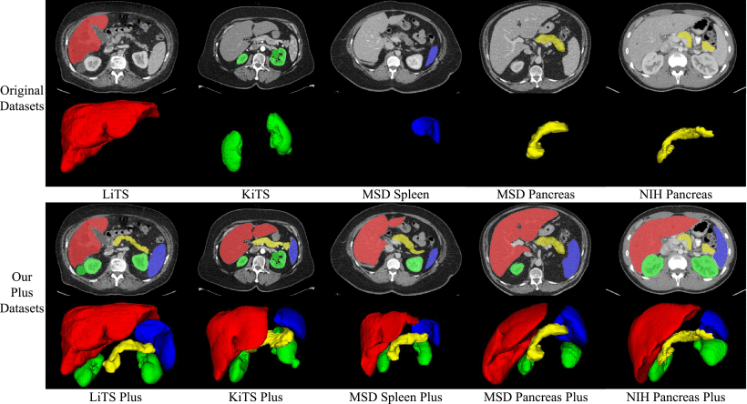
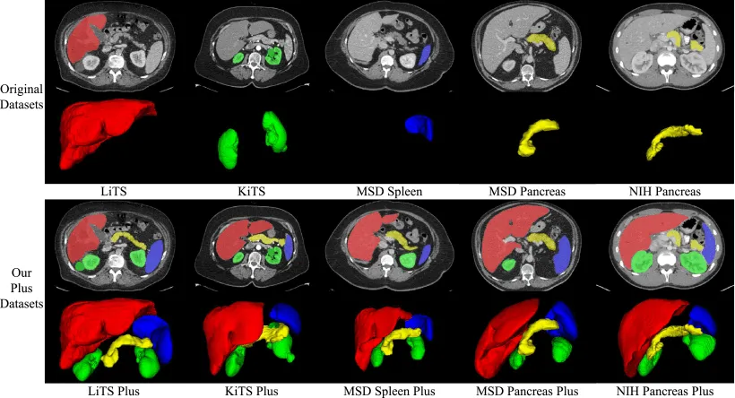
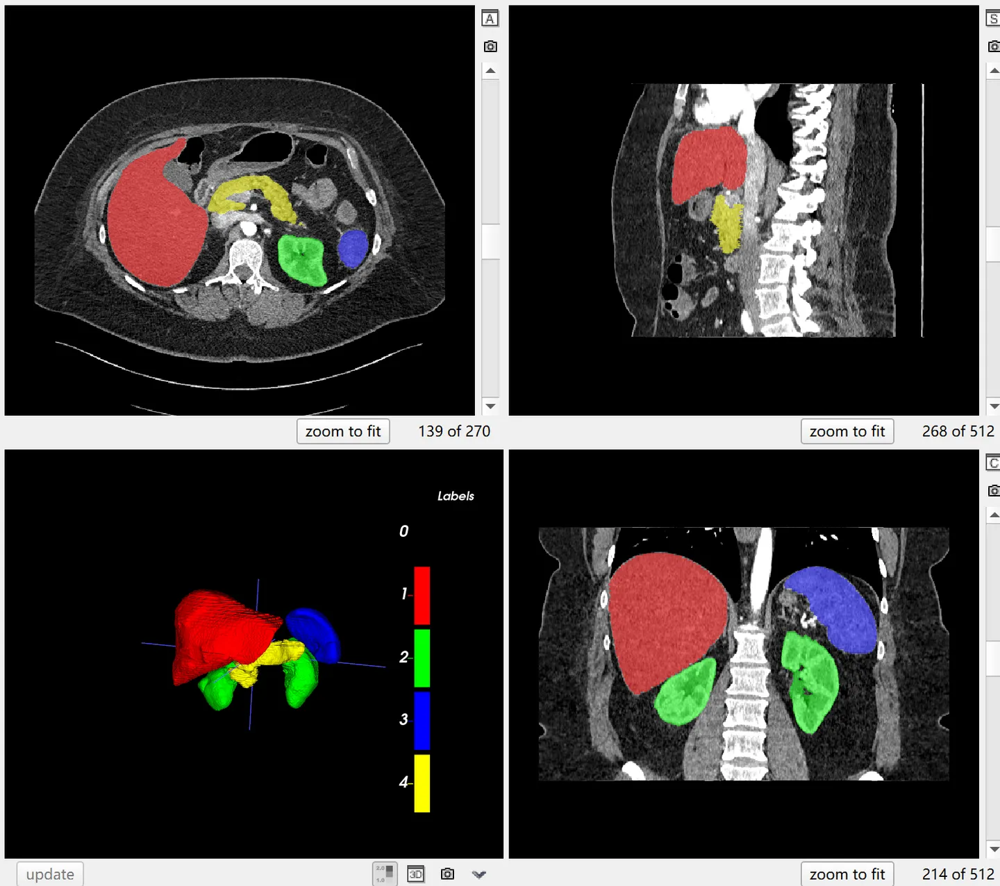

# AbdomenCT-1K

<div align="center">
    <a href="https://github.com/openmedlab/"></a>
</div>
<p style="text-align:center;font-size:10px;"><em></em></p>

## Dataset Information

The AbdomenCT-1K is a large-scale abdominal CT dataset comprising 1112 CT scans for segmentation of four types of abdominal organs, which include the liver, kidneys (not distinguished between left and right), spleen, and pancreas. These data primarily come from six datasets, five of which are public datasets: LiTS (201 cases), KiTS19 (300 cases), MSD Spleen (61 cases), MSD Pancreas (420 cases), and NIH Pancreas (80 cases). There is also a new dataset from Nanjing University consisting of 50 CT scans. The original public datasets generally provided annotations for only one specific organ, but in AbdomenCT-1K, every CT scan has comprehensive annotations for these four organs. Currently, annotations for only 1000 cases have been made publicly available.

## Dataset Meta Information

| Dimensions | Modality | Task Type | Anatomical Structures          | Anatomical Area | Number of Categories | Data Volume | File Format |
|------------|----------|-----------|--------------------------------|---------------|----------------------|-------------|-------------|
| 3D         | CT       | Segmentation | liver, kidney, spleen, pancreas | abdomen       | 4                    | 50          | .nii.gz     |


### Resolution Details

| Dataset Statistics | spacing (mm)     | size            |
|--------------------|------------------|-----------------|
| min                | (0.45, 0.45, 0.45)              | (512, 79, 31)     |
| median             | (0.79, 0.79, 2.5)           | (512, 512, 103) |
| max                | (1.04, 3.0, 8.0)              | (796, 512, 1026) |

Number of slices: 201,528 (based on 1000 published annotated images)

## Label Information Statistics

Statistics based on 1000 publicly annotated images:

| Organ/Tissue | Number of Cases | Coverage Percentage | Minimum Volume (cm³) | Median Volume (cm³) | Maximum Volume (cm³) |
|--------------|-----------------|---------------------|----------------------|---------------------|----------------------|
| Liver        | 1000            | 100%                | 505                  | 1573                | 4504                 |
| Kidney       | 1000            | 100%                | 27                   | 380                 | 1947                 |
| Spleen       | 998             | 99.8%               | 31                   | 223                 | 1256                 |
| Pancreas     | 1000            | 100%                | 18                   | 85                  | 868                  |


## Visualization

<div align="center">
    <a href="https://github.com/openmedlab/"></a>
</div>
<p style="text-align:center;font-size:10px;"><em> Official Visualization.</em></p>

<div align="center">
    <a href="https://github.com/openmedlab/"></a>
</div>
<p style="text-align:center;font-size:10px;"><em> ITK-SNAP Visualization. Red: liver, green: kidneys, blue: spleen, yellow: pancreas.</em></p>

## File Structure

The dataset is organized according to the `nnUNetv1` standard format. It includes three main directories: `imagesTr` for images used for training, `labels` for the corresponding label data, and `imagesTs` for test images. Additionally, the dataset comes with a `dataset.json` file.

``` 
AbdomenCT-1K/
│
├── imagesTr/
│   ├── Case_00001_0000.nii.gz
│   └── ...
│
├── labels/
│   ├── Case_00001.nii.gz
│   └── ...
│
├── imagesTs/
│   ├── Case_00010_0000.nii.gz
│   └── ...
│
└── dataset.json
```

## Authors and Institutions

Jun Ma (Department of Mathematics, Nanjing University of Science and Technology)

Yao Zhang (Institute of Computing Technology, Chinese Academy of Sciences; University of Chinese Academy of Sciences)

Song Gu (School of Automation, Nanjing University of Information Science and Technology)

Cheng Zhu (Shenzhen Huikang Medical Equipment Co., Ltd.)

Cheng Ge (School of Bioinformatics and Medical Engineering, Jiangsu University of Science and Technology)

Yichi Zhang (School of Biomedical Engineering and Biology, Beihang University)

Xingle An (Beijing Think and Vision Medical Technology Co., Ltd.)

Congcong Wang (School of Computer Science and Engineering, Tianjin University of Technology; Department of Computer Science, Norwegian University of Science and Technology)

Qiyuan Wang (School of Electronic Science and Engineering, Nanjing University)

Xin Liu (Suzhou Longkai Medical Technology Co., Ltd.)

Shucheng Cao (Biological and Environmental Science and Engineering Division, King Abdullah University of Science and Technology)

Qi Zhang (Department of Computer and Information Science, Faculty of Science and Technology, University of Macau)

Shangqing Liu (School of Biomedical Engineering, Southern Medical University)

Yunpeng Wang (Institute of Biomedical Sciences, Fudan University)

Yuhui Li (Computational Biology, University of Southern California)

Jian He (Department of Nuclear Medicine, Nanjing Drum Tower Hospital)

Xiaoping Yang (Department of Mathematics, Nanjing University)


## Source Information

Official Website: https://github.com/JunMa11/AbdomenCT-1K

Download Link: https://github.com/JunMa11/AbdomenCT-1K

Article Address: https://ieeexplore.ieee.org/document/9497733

Publication Date: 2021-07

## Citation

``` 
@ARTICLE{9497733,
  author={Ma, Jun and Zhang, Yao and Gu, Song and Zhu, Cheng and Ge, Cheng and Zhang, Yichi and An, Xingle and Wang, Congcong and Wang, Qiyuan and Liu, Xin and Cao, Shucheng and Zhang, Qi and Liu, Shangqing and Wang, Yunpeng and Li, Yuhui and He, Jian and Yang, Xiaoping},
  journal={IEEE Transactions on Pattern Analysis and Machine Intelligence}, 
  title={AbdomenCT-1K: Is Abdominal Organ Segmentation a Solved Problem?}, 
  year={2022},
  volume={44},
  number={10},
  pages={6695-6714},
  doi={10.1109/TPAMI.2021.3100536}}
```

Original introduction article is [here](https://zhuanlan.zhihu.com/p/658079064).