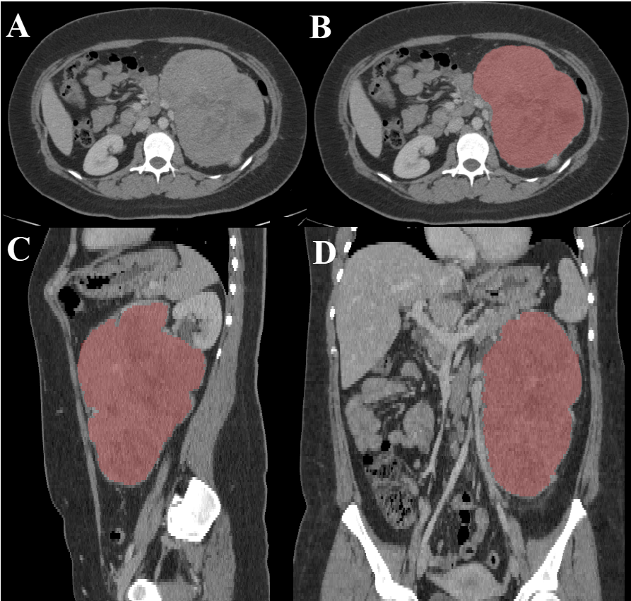

# Adrenal-ACC-Ki67-Seg

<div align="center">
    <a href="https://github.com/openmedlab/"></a>
</div>
<p style="text-align:center;font-size:10px;"><em></em></p>

## Dataset Information

The Adrenal-ACC-Ki67-Seg dataset includes enhanced CT imaging studies of 53 patients with pathologically confirmed adrenocortical carcinoma (ACC) from 2006 to 2018. Semi-automatic segmentation of adrenal tumors was performed using AMIRA software, followed by manual refinement by experienced radiologists.

Adrenocortical carcinoma (ACC) is a rare adrenal tumor with an annual incidence of about 1 to 2 cases per million people worldwide. This tumor can occur at any age, particularly between the ages of 40 and 50. ACC typically presents as a large mass with irregular borders and internal necrosis or hemorrhage. The primary treatment for ACC is surgical resection of the tumor, and the prognosis depends on factors such as tumor size, invasion of surrounding tissues, presence of distant metastases, and the patient's overall health. The five-year survival rate for advanced cases is relatively low.

## Dataset Meta Information

| Dimensions | Modality | Task Type | Anatomical Structures     | Anatomical Area | Number of Categories | Data Volume | File Format |
|------------|----------|-----------|---------------------------|-----------------|----------------------|-------------|-------------|
| 3D         | CT       | Segmentation | Adrenocortical Carcinoma  | abdomen       | 1                    | 57          | DICOM       |


### Resolution Details

| Dataset Statistics | spacing (mm)       | size            |
|--------------------|--------------------|-----------------|
| min                | (0.47, 0.47, 0.5)  | (512, 512, 48)  |
| median             | (0.78, 0.78, 3.0)  | (512, 512, 114) |
| max                | (0.97, 0.97, 5.0)  | (512, 512, 769) |

Number of 2D slices in the data set: 10,315.

## Label Information Statistics

| Metric              | ACC (Adrenal Cancer) |
|---------------------|----------------------|
| Case Count          | 64                   |
| Coverage            | 100%                 |
| Min Volume (cm³)    | 2.6                  |
| Median Volume (cm³) | 177                  |
| Max Volume (cm³)    | 7864                 |

## Visualization

<div align="center">
    <a href="https://github.com/openmedlab/"></a>
</div>
<p style="text-align:center;font-size:10px;"><em>Abdominal CT scan (A) shows a left adrenal mass. The adrenal mass (in red) is segmented in all planes: axial (B), sagittal (C), and coronal (D) planes.</em></p>

## File Structure

The data set file structure is as follows

``` 
Adrenal-ACC-Ki67-Seg
├── metadata.csv
└── Adrenal_Ki67_Seg_001
    └── 08-22-2000...MEN-56266
        ├── 2.00000...B40f-18492
        │   ├── 1-01.dcm
        │   ├── 1-02.dcm
        │   └── ...
        ├── 5.00000...B40f-94387
        └── 300.0000...tion-33545
├── Adrenal_Ki67_Seg_002
└── ...
```

## Authors and Institutions

A.A. Ahmed (University of Texas, USA)

M.M. Elmohr(University of Texas, USA)

D. Fuentes(University of Texas, USA)

M.A. Habra(University of Texas, USA)

S.B. Fisher (University of Texas, USA)

N.D. Perrier (University of Texas, USA)

M. Zhang (University of Texas, USA)

K.M. Elsayes (University of Texas, USA)

## Source Information

Official Website: https://www.cancerimagingarchive.net/collection/adrenal-acc-ki67-seg/

Download Link: https://www.cancerimagingarchive.net/collection/adrenal-acc-ki67-seg/

Article Address: https://www.clinicalradiologyonline.net/article/S0009-9260(20)30048-9/

Publication Date: 2023-5

## Citation

``` 
@article{ahmed2020radiomic,
  title={Radiomic mapping model for prediction of Ki-67 expression in adrenocortical carcinoma},
  author={Ahmed, AA and Elmohr, MM and Fuentes, D and Habra, MA and Fisher, SB and Perrier, ND and Zhang, M and Elsayes, KM},
  journal={Clinical Radiology},
  volume={75},
  number={6},
  pages={479--e17},
  year={2020},
  publisher={Elsevier}
}
```

Original introduction article is [here](https://zhuanlan.zhihu.com/p/696548037).