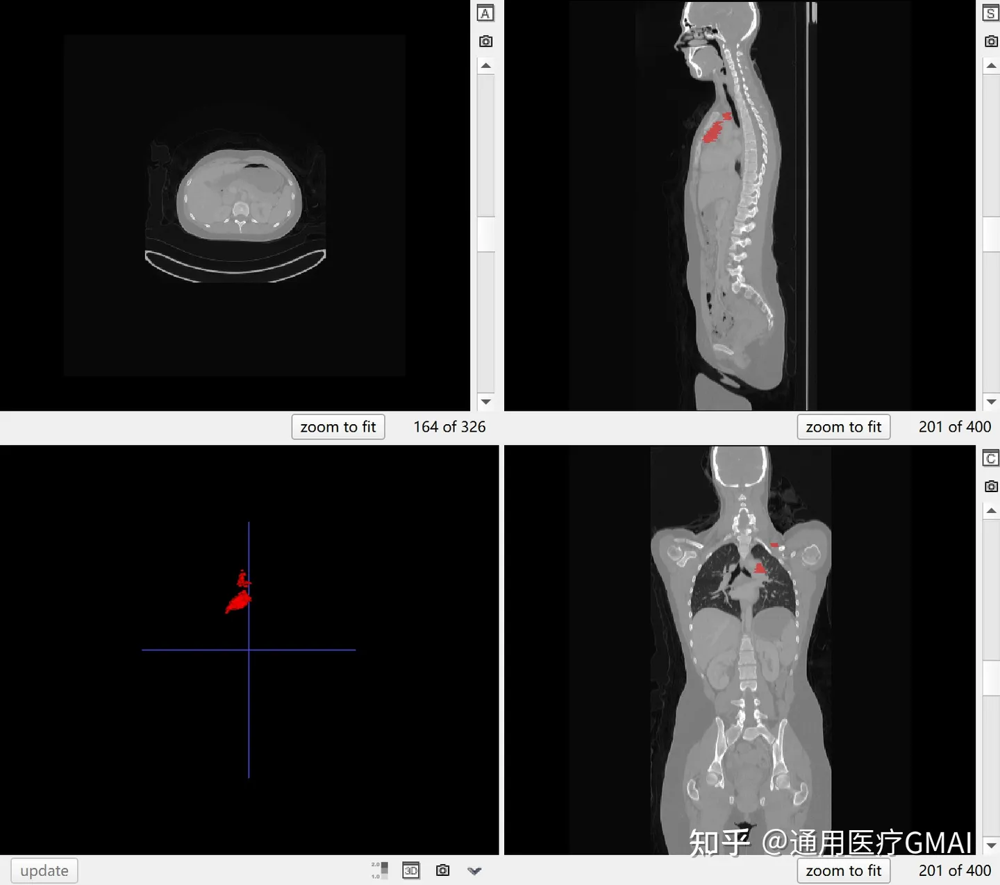
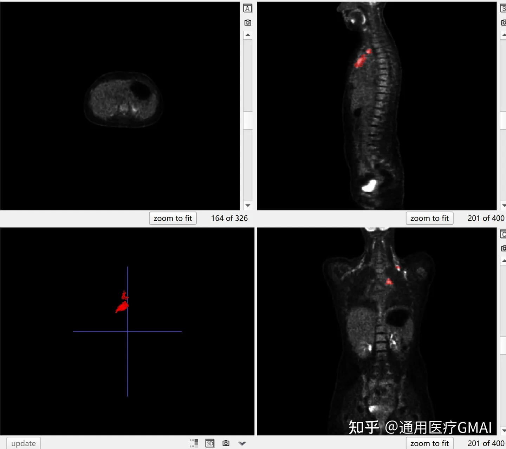

## Auto-PET

## Dataset Information

AutoPET is an automatic PET/CT organ segmentation dataset. It was presented at MICCAI 2022 and further expanded at MICCAI 2023. The initial dataset comprises 900 PET/CT volumes with 1014 corresponding PET-CT volumes. By the end of 2022, 150 additional volumes were added, and by March 2023, another 200 volumes. This expansion includes a new set of FDG-PET-CT images, creating a comprehensive CT and PET dataset that includes brain masks. The segmentation labels provided are consistent with LITS, and the data includes FDG-PET/CT images collected from the Ludwig Maximilian University of Munich, providing a valuable resource for organ segmentation research.

## Dataset Meta Information

| Dimensions | Modality | Task Type | Anatomical Structures | Anatomical Area | Number of Categories | Data Volume | File Format |
|------------|---------|-----------|-----------------------|-----------------|-----------------|---------|-------------|
| 3D         | CT, PET       | Segmentation | Tumor                 | Whole Body       | 1               | 1014 for training, 200 for test     | .nii.gz     |

### Resolution Details

The dataset is provided in DICOM format from the TCIA database and can be converted to the NIFTI format. The FDG uptake in the PET scans is quantified using the Standard Uptake Value (SUV). The raw DICOM files can be processed into NIFTI format, which facilitates research with various software tools.

The main features of the imaging dataset include:

| Dataset Statistics  | spacing (mm)      | size           |
|-------------------|-------------------|----------------|
| min               | (2.036, 2.036, 3) | (400, 400, 200)|
| median            | (2.036, 2.036, 3) | (400, 400, 326)|
| max               | (2.036, 2.036, 3) | (512, 512, 743)|

Number of slices after resampling the 1014 training datasets: 711,010 (355,505 × 2 modalities)

## Label Information Statistics

| Metric        | Tumor    |
|---------------|----------|
| Case Count    | 501      |
| Coverage      | 49.4%    |
| Min Volume (cm³) | 0.1    |
| Median Volume (cm³) | 99 |
| Max Volume (cm³) | 2480   |

## Visualization

<div align="center">
    <a href="https://github.com/openmedlab/"></a>
</div>
<p style="text-align:center;font-size:10px;"><em> CT image and segmentation result.</em></p>

<div align="center">
    <a href="https://github.com/openmedlab/"></a>
</div>
<p style="text-align:center;font-size:10px;"><em> PET image and segmentation result.</em></p>

## File Structure

The official provided NIFTY data format is as follows, with each patient providing pre-processed CT and PET images, and some patients providing results from multiple scans as different Studies.

``` 
|--- Patient 1
     |--- Study 1
          |--- SUV.nii.gz    (PET image in SUV)
          |--- CTres.nii.gz  (CT image resampled to PET)
          |--- CT.nii.gz     (Original CT image)
          |--- SEG.nii.gz    (Manual annotations of tumor lesions)
          |--- PET.nii.gz    (Original PET image as actictivity counts)
     |--- Study 2            (Potential 2nd visit of same patient)
          |--- ...
|--- Patient 2
     |--- ...
```

## Authors and Institutions

Sergios Gatidis (University Hospital Tübingen, Max Planck Institute for Intelligent Systems Tübingen Branch, Germany)

Thomas Küstner (University Hospital Tübingen, Germany)

Michael Ingrisch (LMU Munich University Hospital, Germany)

Matthias Fabritius (LMU Munich University Hospital, Germany)

Clemens Cyran (LMU Munich University Hospital, Germany)

## Source Information

Official Website: https://autopet.grand-challenge.org/, https://autopet-ii.grand-challenge.org/

Download Link: https://wiki.cancerimagingarchive.net/pages/viewpage.action?pageId=93258287

Article Address: https://www.nature.com/articles/s41597-022-01718-3, https://www.researchsquare.com/article/rs-2572595/v1

Publication Date: April 2022

## Citation

``` 
@article{gatidis2022whole,
  title={A whole-body FDG-PET/CT Dataset with manually annotated Tumor Lesions},
  author={Gatidis, Sergios and Hepp, Tobias and Fr{\"u}h, Marcel and La Foug{\`e}re, Christian and Nikolaou, Konstantin and Pfannenberg, Christina and Sch{\"o}lkopf, Bernhard and K{\"u}stner, Thomas and Cyran, Clemens and Rubin, Daniel},
  journal={Scientific Data},
  volume={9},
  number={1},
  pages={601},
  year={2022},
  publisher={Nature Publishing Group UK London}
}

@article{gatidis2023autopet,
  title={The autoPET challenge: Towards fully automated lesion segmentation in oncologic PET/CT imaging},
  author={Gatidis, Sergios and Fr{\"u}h, Marcel and Fabritius, Matthias and Gu, Sijing and Nikolaou, Konstantin and La Foug{\`e}re, Christian and Ye, Jin and He, Junjun and Peng, Yige and Bi, Lei and others},
  year={2023}
} 
```

Original introduction article is [here](https://zhuanlan.zhihu.com/p/652954346).