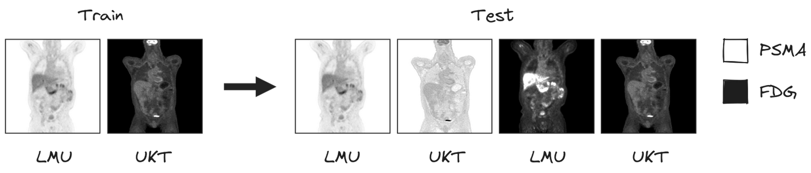
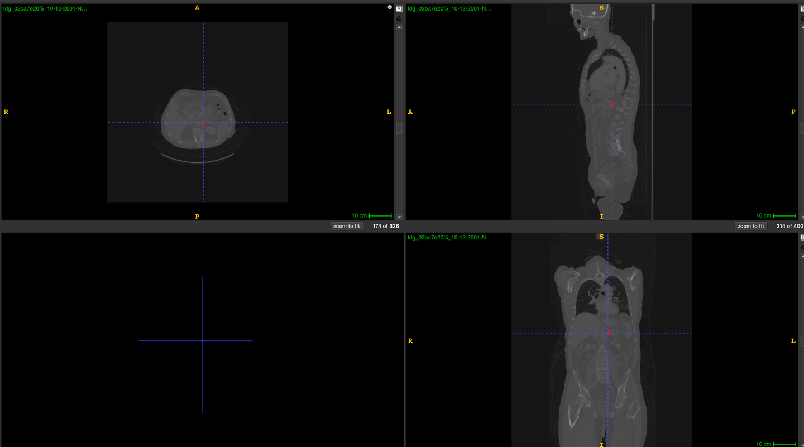
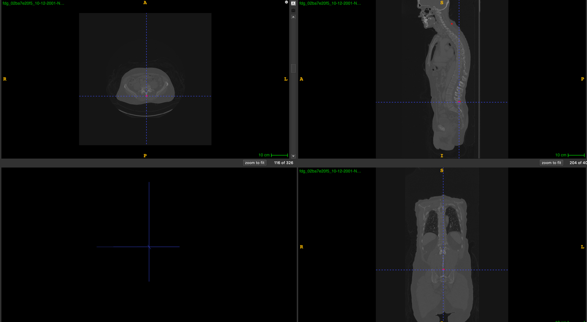

# MICCAI2024-AutoPETIII

<div align="center">
    <a href="https://github.com/openmedlab/"></a>
</div>
<p style="text-align:center;font-size:10px;"><em></em></p>

## Dataset Information

The **Automated Lesion Segmentation in Whole-Body PET/CT - Multitracer Multicenter Generalization (AutoPETIII)** dataset is part of the MICCAI 2024 AutoPET competition. This dataset includes tumor labels (`tumor=1`). The goal of the AutoPET III challenge is to further optimize automated tumor lesion segmentation in a multicenter, multi-tracer environment. PET/CT is a crucial diagnostic tool in oncology, but it primarily relies on qualitative analysis, whereas quantitative analysis can offer more precise personalized treatment plans. Manual lesion segmentation is time-consuming and labor-intensive, limiting the application of automated quantitative analysis. This challenge aims to advance the development of generalizable models across tracers and centers by providing multi-center PET/CT data with two different tracers: prostate-specific membrane antigen (PSMA) and fluorodeoxyglucose (FDG). The challenge introduces two award categories, encouraging participants to develop robust algorithms for multi-tracer datasets and optimize model performance by improving data processing pipelines.

The dataset comprises 1,014 FDG cases (from 900 patients) and 597 PSMA cases (from 378 patients) for training. The test set includes a final evaluation set of 200 cases and an initial evaluation set of 5 cases (for testing purposes). The FDG dataset primarily involves patients with malignant melanoma, lymphoma, and lung cancer, while the PSMA dataset focuses on prostate cancer patients. Differences between the datasets include variations in patient age distribution, imaging conditions, and scanner types. The annotations were performed by radiologists with years of experience in hybrid imaging, using manual, slice-by-slice segmentation to identify and label tumor lesions.

<div align="center">
    <a href="https://github.com/openmedlab/"></a>
</div>
<p style="text-align:center;font-size:10px;"><em>Two different PET/CT training datasets: one is a large annotated FDG-PET/CT dataset collected at the University Hospital Tübingen (UKT) in Germany, and the other is a large annotated PSMA-PET/CT dataset collected at the LMU Hospital in Munich, Germany.</em></p>

## Dataset Meta Information

| Dimensions | Modality | Task Type      | Anatomical Structures | Anatomical Area   | Number of Categories | Data Volume | File Format |
|------------|----------|----------------|-----------------------|-------------------|----------------------|-------------|-------------|
| 3D         | CT, PET  | Segmentation   | Tumor                 | Entire body       | 1                    | 1614        | .nii.gz     |


### Resolution Details

| Dataset Statistics | spacing (mm)     | size         |
|--------------------|------------------|--------------|
| min                | (2.04,2.04,2.0)  | 168x168x164  |
| median             | (4.07,4.07,3.27) | 200x200x263  |
| max                | (4.07,4.07,5.0)  | 400x400x963  |

Number of 2D slices in the dataset: 174276.

## Label Information Statistics

| Metric              | Tumor    |
|---------------------|----------|
| Case Count          | 501      |
| Coverage            | 89.07%%  |
| Min Volume (cm³)    | 0.1      |
| Median Volume (cm³) | 43.84    |
| Max Volume (cm³)    | 2858.68  |

## Visualization

<div align="center">
    <a href="https://github.com/openmedlab/"></a>
</div>
<p style="text-align:center;font-size:10px;"><em>Red is tumor.</em></p>

<div align="center">
    <a href="https://github.com/openmedlab/"></a>
</div>
<p style="text-align:center;font-size:10px;"><em>Red is tumor. This picture and the previous picture belong to the same data but different parts of the tumor.</em></p>

## File Structure

``` 
.
|--- imagesTr
     |--- tracer_patient1_study1_0000.nii.gz  (CT image resampled to PET)
     |--- tracer_patient1_study1_0001.nii.gz  (PET image in SUV)
     |--- ...
|--- labelsTr
     |--- tracer_patient1_study1.nii.gz       (manual annotations of tumor lesions)     
|--- dataset.json                             (nnUNet dataset description)
|--- dataset_fingerprint.json                 (nnUNet dataset fingerprint)
|--- splits_final.json                        (reference 5fold split)
|--- psma_metadata.csv                        (metadata csv for psma)
|--- fdg_metadata.csv                         (original metadata csv for fdg)
```

## Authors and Institutions

Sergios Gatidis (University Hospital Tübingen, Germany)

Tobias Hepp (University Hospital Tübingen, Germany)

Marcel Früh (University Hospital Tübingen, Germany)

Christian La Fougère (University Hospital Tübingen, Germany)

Konstantin Nikolaou (University Hospital Tübingen, Germany)

Christina Pfannenberg (University Hospital Tübingen, Germany)

Bernhard Schölkopf (Max Planck Institute for Intelligent Systems, Germany)

Thomas Küstner (University Hospital Tübingen, Germany)

Clemens Cyran (LMU Hospital, Germany)

Daniel Rubin (Stanford University School of Medicine, USA)

## Source Information

Official Website: https://autopet-iii.grand-challenge.org/task/

Download Link: https://autopet-iii.grand-challenge.org/dataset/

Article Address: https://www.nature.com/articles/s41597-022-01718-3

Publication Date: 2024-07

## Citation

``` 
@article{gatidis2022whole,
  title={A whole-body FDG-PET/CT dataset with manually annotated tumor lesions},
  author={Gatidis, Sergios and Hepp, Tobias and Fr{\"u}h, Marcel and La Foug{\`e}re, Christian and Nikolaou, Konstantin and Pfannenberg, Christina and Sch{\"o}lkopf, Bernhard and K{\"u}stner, Thomas and Cyran, Clemens and Rubin, Daniel},
  journal={Scientific Data},
  volume={9},
  number={1},
  pages={601},
  year={2022},
  publisher={Nature Publishing Group UK London}
}
```

Original introduction article is [here](https://zhuanlan.zhihu.com/p/720692110).