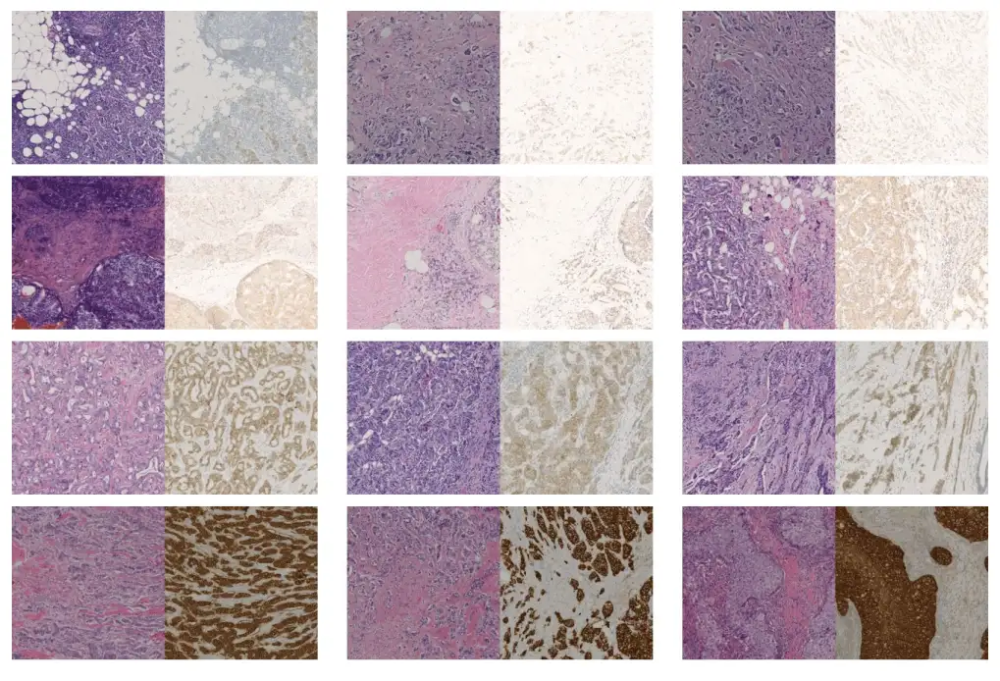

# BCI

<div align="center">
    <a href="https://github.com/openmedlab/"></a>
</div>
<p style="text-align:center;font-size:10px;"><em></em></p>

## Dataset Information

The BCI dataset is a paired dataset used for converting HE (Hematoxylin and Eosin) stained pathology images to IHC (Immunohistochemistry) images. HE images are conventionally stained pathology images, while IHC images are used to display the expression levels of Human Epidermal Growth Factor Receptor 2 (HER2). This dataset contains 4,870 pairs of such images, reflecting different HER2 expression levels (0, 1+, 2+, 3+).

Assessing the expression level of HER2 is crucial for the treatment of breast cancer. Currently, HER2 is primarily evaluated using a technique called immunohistochemistry (IHC), which is costly. If the HER2 expression level images can be accurately converted from HE images, it would significantly reduce the cost of evaluation. This not only aids in the assessment of HER2 but also provides a reference for the conversion and analysis of other medical images.

## Dataset Meta Information

| Dimensions | Modality  | Task Type        | Anatomical Structures | Anatomical Area | Number of Categories | Data Volume | File Format |
|------------|-----------|------------------|-----------------------|-----------------|----------------------|-------------|-------------|
| 2D         | Pathology | Image Conversion | Breast                | Breast          | 4                    | 4870        | PNG         |


### Resolution Details

| Dataset Statistics | spacing (mm)  | size          |
|--------------------|---------------|---------------|
| min                | (0.46, 0.46)  | (1024, 1024)  |
| median             | (0.46, 0.46)  | (1024, 1024)  |
| max                | (0.46, 0.46)  | (1024, 1024)  |

## Label Information Statistics

The dataset contains 4,870 HE-IHC image pairs, which correspond to four levels of HER2 expression (0, 1+, 2+, 3+).

| HER2 Expression Level | Number of Images | Percentage |
|-----------------------|------------------|------------|
| 0                     | 240              | 4.93%      |
| 1+                    | 1153             | 23.68%     |
| 2+                    | 2142             | 43.98%     |
| 3+                    | 1335             | 27.41%     |


## Visualization

<div align="center">
    <a href="https://github.com/openmedlab/"></a>
</div>
<p style="text-align:center;font-size:10px;"><em>Examples of HE-IHC image pairs corresponding to the four HER2 expression levels, from top to bottom, corresponding to the expression levels 0, 1+, 2+, 3+.</em></p>


## File Structure

``` 
BCI_data
│
├── HE
│   ├── train
│   │   ├── 00000_train_1+.png
│   │   ├── 00000_train_3+.png
│   │   ├── ...
│   ├── test
│   │   ├── 00000_test_1+.png
│   │   ├── 00000_test_2+.png
│   │   ├── ...
├── IHC
│   ├── train
│   │   ├── 00000_train_1+.png
│   │   ├── 00000_train_3+.png
│   │   ├── ...
│   ├── test
│   │   ├── 00000_test_1+.png
│   │   ├── 00000_test_2+.png
│   │   ├── ...
```

## Authors and Institutions

Shengjie Liu (Beijing University of Posts and Telecommunications)

Chuang Zhu (Beijing University of Posts and Telecommunications)

Feng Xu (Capital Medical University)

Xinyu Jia (Beijing University of Posts and Telecommunications)

Zhongyue Shi (Capital Medical University)

Mulan Jin (Capital Medical University)


## Source Information

Official Website: https://bupt-ai-cz.github.io/BCI/

Download Link: https://bupt-ai-cz.github.io/BCI/

Article Address: https://openaccess.thecvf.com/content/CVPR2022W/CVMI/html/Liu_BCI_Breast_Cancer_Immunohistochemical_Image_Generation_Through_Pyramid_Pix2pix_CVPRW_2022_paper.html

Publication Date: 2023-04

## Citation

``` 
@inproceedings{liu2022bci,
  title={Bci: Breast cancer immunohistochemical image generation through pyramid pix2pix},
  author={Liu, Shengjie and Zhu, Chuang and Xu, Feng and Jia, Xinyu and Shi, Zhongyue and Jin, Mulan},
  booktitle={Proceedings of the IEEE/CVF conference on computer vision and pattern recognition},
  pages={1815--1824},
  year={2022}
}
```

Original introduction article is [here](https://zhuanlan.zhihu.com/p/702294425).