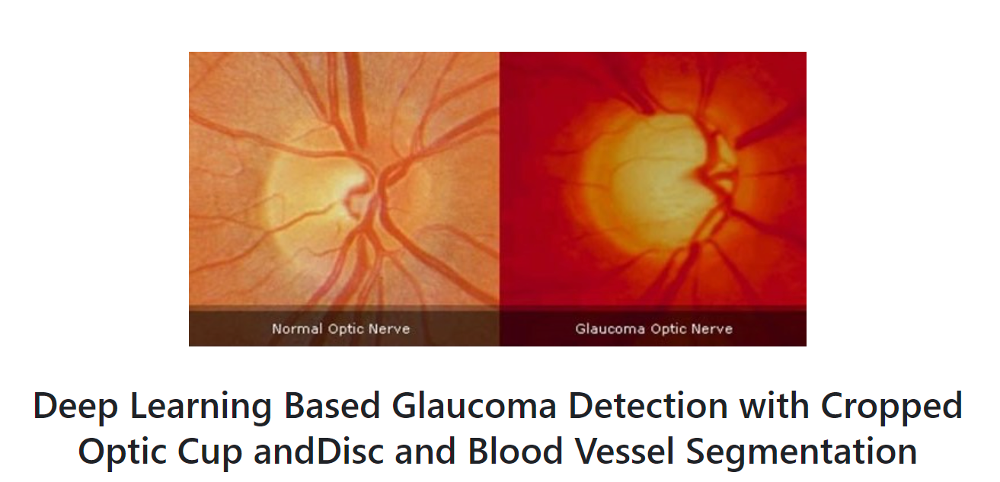
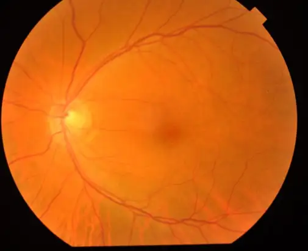
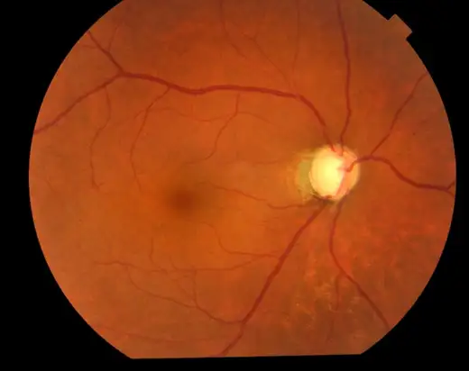

# BEH

<div align="center">
    <a href="https://github.com/openmedlab/"></a>
</div>
<p style="text-align:center;font-size:10px;"><em></em></p>

## Dataset Information

The BEH dataset is a collection of 634 color fundus images, of which 171 are diagnosed with glaucoma and 463 are classified as normal. This dataset was collected and annotated by two ophthalmologists (a pediatric ophthalmologist and a glaucoma and refractive surgery specialist) from the Bangladesh Eye Hospital. It is intended for the automated classification of glaucoma, with annotations focusing on the optic disc and cup areas, critical for diagnosing glaucoma.

This dataset provides a valuable resource for developing and testing deep learning models for glaucoma detection. Given that glaucoma is a difficult-to-diagnose, irreversible neurodegenerative condition, traditional detection methods are costly and rely on specialized resources. Automated detection via deep learning models helps overcome these challenges. The release of this dataset not only advances glaucoma detection technology but also sets a new benchmark in the field of medical image analysis, aiding in the development of more accurate and efficient automated diagnostic tools.

## Dataset Meta Information

| Dimensions | Modality           | Task Type           | Number of Categories | Data Volume | File Format |
|------------|--------------------|---------------------|----------------------|-------------|-------------|
| 2D         | Fundus photograph  | Classification      | 2                    | 634         | JPG         |


### Resolution Details

| Dataset Statistics | size          |
|--------------------|---------------|
| min                | (793, 613)    |
| median             | (3380, 2600)  |
| max                | (3380, 2600)  |

## Label Information Statistics

| Diagnostic Category | Normal | Glaucoma |
|---------------------|--------|----------|
| Number of Images    | 463    | 171      |
| Percentage          | 73%    | 27%      |
| Volume (cm³)        | (793, 613) | (764, 654)  |
| Median Volume (cm³) | (3380, 2600) | (3380, 2600) |
| Mean Volume (cm³)   | (3380, 2600) | (3380, 2600) |

## Visualization

<div align="center">
    <a href="https://github.com/openmedlab/"></a>
</div>
<p style="text-align:center;font-size:10px;"><em>Normal.</em></p>

<div align="center">
    <a href="https://github.com/openmedlab/"></a>
</div>
<p style="text-align:center;font-size:10px;"><em>Glaucoma.</em></p>

## File Structure

``` 
BEH
├── glaucoma
│   ├── IM000000_L.JPG
│   ├── IM000000_R.JPG
│   ├── IM000001.JPG
│   ├── ......
└── normal
    ├── IM000006_L.JPG
    ├── IM000006_R.JPG
    ├── IM000165 (3).JPG
    ├── ......
```

## Authors and Institutions

Mir Tanvir Islam (Department of Electrical and Computer Engineering, North South University, India)

Shafin T. Mashfu (Department of Electrical and Computer Engineering, North South University, India)

Abrar Faisal (Department of Electrical and Computer Engineering, North South University, India)

Sadman Chowdhury Siam (Department of Electrical and Computer Engineering, North South University, India)

Intisar Tahmid Naheen (Department of Electrical and Computer Engineering, North South University, India)

Riasat Khan (Department of Electrical and Computer Engineering, North South University, India)

## Source Information

Official Website: https://github.com/mirtanvirislam/Deep-Learning-Based-Glaucoma-Detection-with-Cropped-Optic-Cup-and-Disc-and-Blood-Vessel-Segmentation

Download Link: https://drive.google.com/file/d/1YdZm-sioiAbTdBRy4oej1q6tZL8Baft7/view

Article Address: https://ieeexplore.ieee.org/document/9664528?denied=

Publication Date: 2021-12

## Citation

``` 
@ARTICLE{9664528,
  author={Islam, Mir Tanvir and Mashfu, Shafin T. and Faisal, Abrar and Siam, Sadman Chowdhury and Naheen, Intisar Tahmid and Khan, Riasat},
  journal={IEEE Access}, 
  title={Deep Learning-Based Glaucoma Detection With Cropped Optic Cup and Disc and Blood Vessel Segmentation}, 
  year={2022},
  volume={10},
  number={},
  pages={2828-2841},
  keywords={Optical imaging;Retina;Image segmentation;Adaptive optics;Feature extraction;Optical sensors;Blood vessels;EfficientNet;fundus image;glaucoma;image classification;image segmentation;MobileNet;U-net},
  doi={10.1109/ACCESS.2021.3139160}}
```

Original introduction article is [here](https://zhuanlan.zhihu.com/p/716031647).