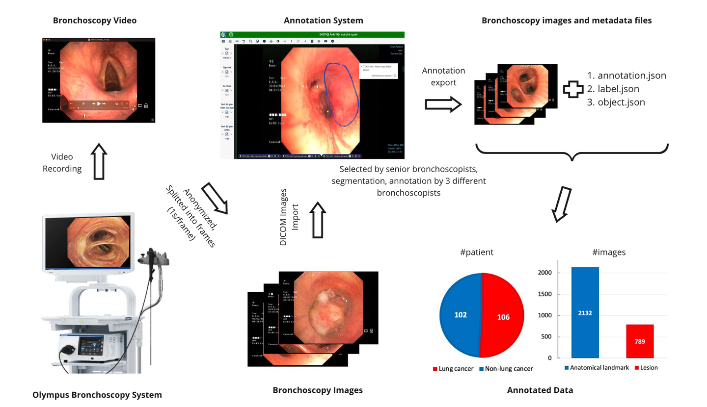
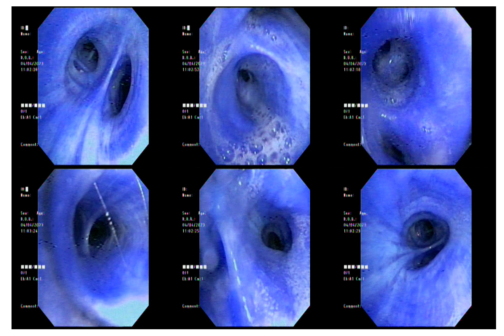
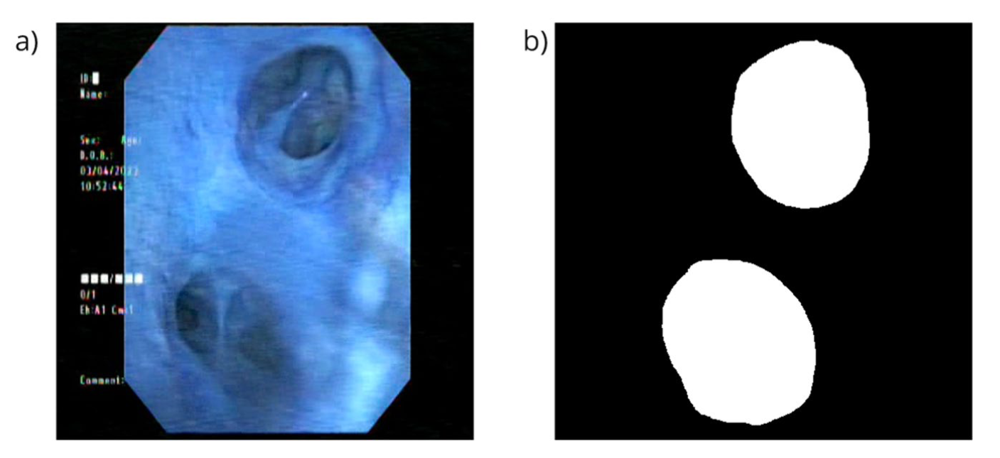

# BM-BronchoLC

<div align="center">
    <a href="https://github.com/openmedlab/"></a>
</div>
<p style="text-align:center;font-size:10px;"><em></em></p>

## Dataset Information

**BM-BronchoLC** is a bronchoscopy dataset jointly released by Bach Mai Hospital in Hanoi, Vietnam, and the University of Engineering and Technology, Vietnam National University. The dataset contains endoscopic images from 106 lung cancer patients and 102 non-lung cancer patients, with a total of 2,132 anatomically labeled images and 789 lesion images. The data was collected using an Olympus bronchoscopy system, and video frames were extracted at one frame per second, screened, and annotated by experienced bronchoscopy experts. The annotations include precise localization and classification of 11 anatomical landmarks (e.g., vocal cords, trachea, bronchi) and 7 lesion types (e.g., mucosal erythema, tumors). Each case includes at least 10 high-quality images, all of which have been de-identified to protect patient privacy.

This dataset is significant as it is the first to combine precise localization and recognition of anatomical landmarks and airway lesions in a single bronchoscopy dataset, providing a crucial benchmark for developing AI-assisted diagnostic systems. Evaluations using two mainstream AI models, **UNet++** and **ESFPNet**, demonstrated strong performance on segmentation and classification tasks, achieving over 70% Dice coefficients for anatomical landmark recognition. This opens new possibilities for improving the diagnostic accuracy of bronchoscopy and reducing the limitations of subjective clinical judgment.

## Dataset Meta Information

| Dimensions | Modality      | Task Type   | Anatomical Structures | Anatomical Area    | Number of Categories | Data Volume | File Format |
|------------|---------------|-------------|-----------------------|--------------------|----------------------|-------------|-------------|
| 2D         | Bronchoscopy  | Recognition | Bronchial tube        | Chest and abdomen  | 11 + 7               | 2921        | PNG         |


### Resolution Details

| Dataset Statistics | size        |
|--------------------|-------------|
| min                | (480, 480)  |
| median             | (480, 480)  |
| max                | (480, 480)  |

## Label Information Statistics

Landmark tags, 11 in total

| Number | Name               | Lung Cancer Patients | Non-Lung Cancer Patients | Lung Cancer Images | Non-Lung Cancer Images |
|--------|--------------------|-----------------------|---------------------------|---------------------|-------------------------|
| 1      | Vocal cords        | 60                    | 72                        | 120                 | 149                     |
| 2      | Main carina        | 86                    | 92                        | 163                 | 191                     |
| 3      | Intermediate       | 54                    | 68                        | 98                  | 111                     |
| 4      | Right upper lobe   | 62                    | 86                        | 117                 | 202                     |
| 5      | Right lower lobe   | 71                    | 85                        | 125                 | 200                     |
| 6      | Right middle lobe  | 71                    | 84                        | 134                 | 187                     |
| 7      | Left lower lobe    | 77                    | 88                        | 171                 | 224                     |
| 8      | Left upper lobe    | 72                    | 77                        | 146                 | 144                     |
| 9      | Right main bronchus| 84                    | 91                        | 175                 | 199                     |
| 10     | Left main bronchus | 89                    | 93                        | 199                 | 246                     |
| 11     | Trachea            | 36                    | 49                        | 50                  | 75                      |

Disease tags, 7 in total

| Number | Name                       | Lung Cancer Patients | Non-Lung Cancer Patients | Lung Cancer Lesions | Non-Lung Cancer Lesions |
|--------|----------------------------|-----------------------|---------------------------|---------------------|--------------------------|
| 1      | Mucosal congestion         | 16                    | 19                        | 35                  | 42                       |
| 2      | Soot deposition            | 6                     | 9                         | 13                  | 40                       |
| 3      | Narrowing                  | 43                    | 6                         | 111                 | 8                        |
| 4      | Bulging mucosal swelling   | 42                    | 9                         | 128                 | 28                       |
| 5      | Mucosal infiltration       | 74                    | 5                         | 355                 | 9                        |
| 6      | Blood vessel growth        | 39                    | 2                         | 111                 | 2                        |
| 7      | Tumor                      | 40                    | 0                         | 183                 | 0                        |


## Visualization

<div align="center">
    <a href="https://github.com/openmedlab/"></a>
</div>
<p style="text-align:center;font-size:10px;"><em>Bronchoscope case display.</em></p>

<div align="center">
    <a href="https://github.com/openmedlab/"></a>
</div>
<p style="text-align:center;font-size:10px;"><em>Left: Endoscopic image / Right: corresponding bronchial segmentation.</em></p>

## File Structure

``` 
BM-BronchoLC/
├── Lung_cancer/
│   ├── imgs/
│   │   ├── 00dd8f02-3e56-43e5-a584-e4138063ccf0/
│   │   │   ├── 5286dd59-75b5-461d-a280-da5482c0de18/
│   │   │   │   ├── 004e3a22-bc7f-4ced-88b5-f12488e63405.png
│   │   │   │   ├── 0ae93cda-535b-4ad3-ae9e-191384add4f8.png
│   │   │   │   ├── ...
│   │   │   │   └── (20 more files)
│   │   └── ... (105 similar directories)
│   ├── .DS_Store
│   ├── annotation.json
│   ├── labels.json
│   └── objects.json
└── Non_lung_cancer/
    ├── imgs/
    │   ├── 028ee078-68c3-400e-b7f5-aa2a50805f24/
    │   │   ├── 3dfbe232-049a-482e-9f7a-1a3ffccae90a/
    │   │   │   ├── 0173496d-02e5-461d-b259-f99d85441f3f.png
    │   │   │   ├── 13318412-7bf8-4b8f-8fd4-a9cd98fb6351.png
    │   │   │   ├── ...
    │   │   │   └── (10 more files)
    │   └── ... (101 similar directories)
    ├── .DS_Store
    ├── annotation.json
    ├── labels.json
    └── objects.json
```

## Authors and Institutions

There are many people, the main institutions are Bach Mai Hospital, Hanoi Medical University, and Vietnam National University. You can refer to the article:
https://www.nature.com/articles/s41

## Source Information

Official Website: https://figshare.com/articles/dataset/BM-BronchoLC/24243670

Download Link: https://figshare.com/articles/dataset/BM-BronchoLC/24243670

Article Address: https://www.nature.com/articles/s41597-024-03145-y

Publication Date: 2023-10

## Citation

``` 
@article{vu2024bm,
  title={BM-BronchoLC-A rich bronchoscopy dataset for anatomical landmarks and lung cancer lesion recognition},
  author={Vu, Van Giap and Hoang, Anh Duc and Phan, Thu Phuong and Nguyen, Ngoc Du and Nguyen, Thanh Thuy and Nguyen, Duc Nghia and Dao, Ngoc Phu and Doan, Thi Phuong Lan and Nguyen, Thi Thanh Huyen and Trinh, Thi Huong and others},
  journal={Scientific Data},
  volume={11},
  number={1},
  pages={321},
  year={2024},
  publisher={Nature Publishing Group UK London}
}
```

Original introduction article is [here](https://zhuanlan.zhihu.com/p/7439599879).