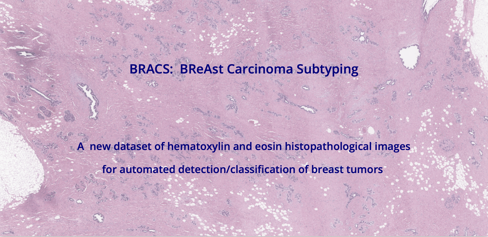
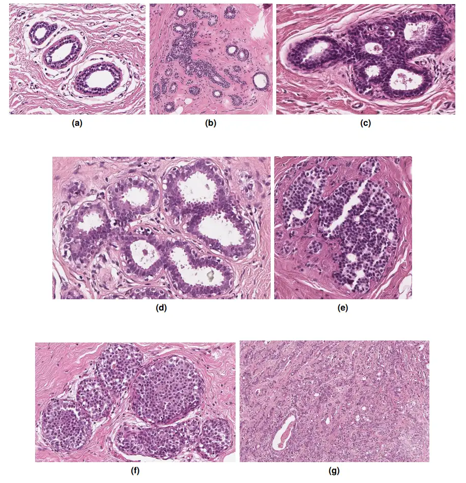

# BRACS

<div align="center">
    <a href="https://github.com/openmedlab/"></a>
</div>
<p style="text-align:center;font-size:10px;"><em></em></p>

## Dataset Information

The BRACS dataset is specifically designed for the classification of breast cancer subtypes and contains a large number of pathological images stained with H&E. This dataset encompasses 547 whole slide images (WSIs) and 4,539 regions of interest (ROIs) extracted from these slides. Each whole slide image and its corresponding ROIs are annotated by three professional pathologists and classified into different lesion types. Specifically, BRACS includes three main lesion types—benign, malignant, and atypical, which are further divided into seven subtypes.

Breast cancer is one of the most common types of cancer among women, and clear subclassification of subtypes is crucial for breast cancer research as it allows researchers and clinicians to develop personalized treatment plans based on the specific characteristics of the cancer. Advanced AI analysis using the BRACS dataset can help reveal subtle differences between different subtypes, which has potential value in improving diagnostic accuracy and treatment response. In this way, the BRACS dataset not only promotes the development of precise diagnostic technologies but also supports more effective patient management and treatment strategies, thereby improving the success rate of breast cancer treatment globally.

## Dataset Meta Information

| Dimensions | Modality  | Task Type              | Anatomical Structures | Anatomical Area | Number of Categories | Data Volume        | File Format |
|------------|-----------|------------------------|-----------------------|-----------------|----------------------|--------------------|-------------|
| 2D         | Pathology | Subtype Classification | Breast tissue         | Breast tissue   | 7                    | 4539 ROIs/547 WSIs | .png/.svs   |


### Resolution Details

Number of BRACS data labels according to lesion type.

| Category | Subcategory             | Count | Percentage |
|----------|-------------------------|-------|------------|
| **WSI**  |                         |       |            |
| Benign   | Normal                  | 44    | 8%         |
|          | Pathological Benign     | 147   | 27%        |
|          | Usual Ductal Hyperplasia| 74    | 14%        |
| Atypical | Flat Epithelial Atypia  | 41    | 7%         |
|          | Atypical Ductal Hyperplasia | 48 | 9%      |
| Malignant| Ductal Carcinoma in Situ| 61    | 11%        |
|          | Invasive Carcinoma      | 132   | 24%        |
| **ROI**  |                         |       |            |
| Benign   | Normal                  | 484   | 11%        |
|          | Pathological Benign     | 836   | 18%        |
|          | Usual Ductal Hyperplasia| 517   | 11%        |
| Atypical | Flat Epithelial Atypia  | 756   | 17%        |
|          | Atypical Ductal Hyperplasia | 507 | 11%      |
| Malignant| Ductal Carcinoma in Situ| 790   | 17%        |
|          | Invasive Carcinoma      | 649   | 14%        |


## Label Information Statistics

This section is statistics results of label information.

| Metric        | Tumor    |
|---------------|----------|
| Case Count    | 501      |
| Coverage      | 49.4%    |
| Min Volume (cm³) | 0.1    |
| Median Volume (cm³) | 99 |
| Max Volume (cm³) | 2480   |

## Visualization

<div align="center">
    <a href="https://github.com/openmedlab/"></a>
</div>
<p style="text-align:center;font-size:10px;"><em>(a) Normal (N), (b) Pathological Benign (PB), (c) Usual Ductal Hyperplasia(UDH), (d) Flat Epithelial Atypia (FEA), (e) Atypical Ductal Hyperplasia (ADH), (f) Carcinoma in Situ (DCIS) and (g)Invasive Carcinoma (IC).</em></p>

## File Structure

The BRACS dataset is publicly accessible and downloadable via the BRACS website. The data is organized as follows:

``` 
BRACS
│
├── Whole Slide Image Set
│   ├── Test
│   │   ├── Group_AT
│   │   ├── ...
│   └── Train
│   │   ├── Group_AT
│   │   ├── ...
│   └── Val
│   │   ├── Group_AT
│   │   ├── ...
├── Region of Interest Set
│   ├── Test
│   │   ├── 0_N
│   │   ├── ...
│   ├── Train
│   │   ├── 0_N
│   │   ├── ...
│   ├── Val
│   │   ├── 0_N
│   │   ├── ...
├── Whole Slide Image Annotations
│   ├── Test
│   │   ├── Group_AT
│   │   ├── ...
│   └── Train
│   │   ├── Group_AT
│   │   ├── ...
│   └── Val
│   │   ├── Group_AT
│   │   ├── ...
├── BRACS Summary File
│   ├── BRACS.xlsx
```

## Authors and Institutions

Nadia Brancati (Italian National Research Council of High Performance Computing and Networking)

Anna Maria Anniciello (Pascale Cancer Research Institute, Naples)

Pushpak Pati (IBM Research, Zurich)

Daniel Riccio (University of Naples Federico II)

Giosuè Scomagniglio (ETH Zurich)

Guillaume Jaume (IBM Research, Zurich; EPFL Lausanne)

Giuseppe De Pietro (Italian National Research Council of High Performance Computing and Networking)

Maurizio Di Bonito (Pascale Cancer Research Institute, Naples)

Antonio Foncubierta (IBM Research, Zurich)

Gerardo Botti (Pascale Cancer Research Institute, Naples)

Maria Gabrani (IBM Research, Zurich)

Florinda Feroce (Pascale Cancer Research Institute, Naples)

Maria Frucci (Italian National Research Council of High Performance Computing and Networking)


## Source Information

Official Website: https://www.bracs.icar.cnr.it/

Download Link: https://www.bracs.icar.cnr.it/download/

Article Address: https://academic.oup.com/database/article/doi/10.1093/database/baac093/6762252

Publication Date: 2022-10

## Citation

``` 
@article{brancati2022bracs,
  title={Bracs: A dataset for breast carcinoma subtyping in h\&e histology images},
  author={Brancati, Nadia and Anniciello, Anna Maria and Pati, Pushpak and Riccio, Daniel and Scognamiglio, Giosu{\`e} and Jaume, Guillaume and De Pietro, Giuseppe and Di Bonito, Maurizio and Foncubierta, Antonio and Botti, Gerardo and others},
  journal={Database},
  volume={2022},
  pages={baac093},
  year={2022},
  publisher={Oxford University Press UK}
}
```

Original introduction article is [here](https://zhuanlan.zhihu.com/p/698864763).