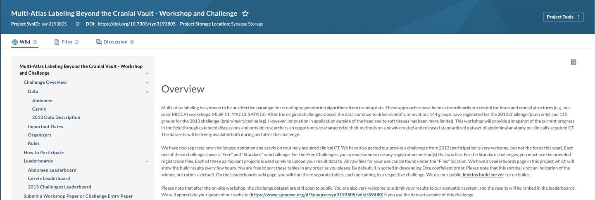
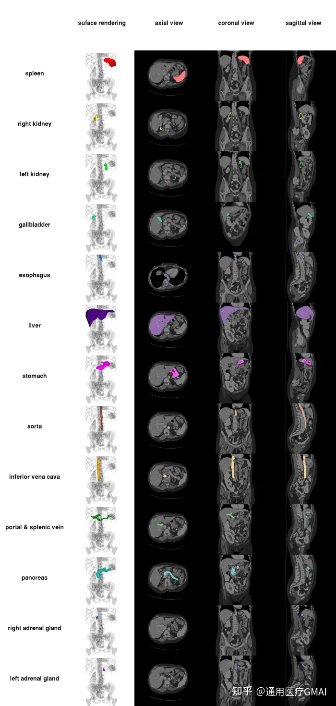

# BTCV 

<div align="center">
    <a href="https://github.com/openmedlab/"></a>
</div>
<p style="text-align:center;font-size:10px;"><em></em></p>

## Dataset Information

The BTCV (Beyond The Cranial Vault) is an important benchmark for the task of abdominal organ segmentation, utilized by many related research papers. The acronym BTCV originates from the Multi-Atlas Labeling Beyond The Cranial Vault workshop held at MICCAI 2015. Currently, the workshop’s webpage includes different versions of the dataset, such as the 2013 version, the Abdomen version, and the Cervix version, but BTCV generally refers specifically to the Abdomen version.

The dataset is provided by the Vanderbilt University Medical Center and comprises 50 abdominal CT scans from patients with metastatic liver cancer or postoperative abdominal wall hernia. Each scan in the dataset was captured during the portal venous contrast phase and comes with varying volumes and field of view parameters. The in-plane resolution of the images varies from 0.54 x 0.54 mm² to 0.98 x 0.98 mm², with slice thickness ranging from 2.5 mm to 5.0 mm. This standardized dataset is supported by registration data generated with NiftyReg, aiming to advance medical image analysis research in abdominal and pelvic anatomy.

## Dataset Meta Information

| Dimensions | Modality | Task Type | Anatomical Structures          | Anatomical Area | Number of Categories | Data Volume                   | File Format |
|------------|----------|-----------|--------------------------------|-----------------|----------------------|-------------------------------|-------------|
| 3D         | CT       | Segmentation | Spleen, right kidney, left kidney, gallbladder, esophagus, liver, stomach, aorta, inferior vena cava, portal and splenic veins, pancreas, right adrenal gland, left adrenal gland | abdomen       | 13                   | 30 for training, 20 for test. | .nii.gz     |


### Resolution Details

| Dataset Statistics | spacing (mm)     | size             |
|--------------------|------------------|------------------|
| min                | (0.59, 0.59, 2.50)              | (512, 512, 85)   |
| median             | (0.76, 0.76, 3.00)           | (512, 512, 127)  |
| max                | (0.98, 0.98, 5.00)              | (512, 512, 198)  |

## Intensity Information Statistics

| Organ       | CT - min | CT - 0.5% | CT - median | CT - mean | CT - std | CT - 99.5% | CT - max |
|-------------|----------|-----------|-------------|-----------|----------|------------|----------|
| Spleen      | -141     | -44       | 122         | 116.35    | 36.14    | 179        | 826      |
| Right Kidney| -92      | 10        | 176         | 168.68    | 38.24    | 234        | 436      |
| Left Kidney | -122     | -7        | 178         | 167.34    | 45.3     | 239        | 342      |
| Gallbladder | -41      | -28       | 50          | 52.44     | 38.1     | 140        | 167      |
| Esophagus   | -957     | -910      | 36          | -11.76    | 174.17   | 120        | 174      |
| Liver       | -471     | -14       | 124         | 121.71    | 29.54    | 208        | 272      |
| Stomach     | -1024    | -989      | 53          | -70.81    | 329.35   | 196        | 297      |
| Aorta       | -378     | -38       | 184         | 169.92    | 50.24    | 242        | 270      |
| Inferior Vena Cava | -230     | 21        | 147         | 145.62    | 31.52    | 215        | 253      |
| Portal and Splenic Veins | -79       | 19        | 179         | 171.71    | 39.45    | 242        | 273      |
| Pancreas           | -917     | -30       | 102         | 98.09     | 38.26    | 172        | 234      |
| Right Adrenal Gland| -114     | -83.93    | 42          | 37.15     | 44.19    | 125.93     | 140      |
| Left Adrenal Gland | -128     | -79       | 50          | 43.31     | 44.61    | 137.94     | 181      |


## Label Information Statistics

| Organ | Volume Fraction (%) min | Volume Fraction (%) median | Volume Fraction (%) mean | Volume Fraction (%) max | Actual Size (cm³) min | Actual Size (cm³) median | Actual Size (cm³) mean | Actual Size (cm³) max | Count of Inclusion |
|-------|-------------------------|----------------------------|--------------------------|-------------------------|------------------------|---------------------------|-------------------------|------------------------|--------------------|
| Whole foreground | 2.76% |	4.26% |	4.46% |	7.48% |	1766 |	3122 |	3223 |	6963 |	30 |
| Spleen | 0.13% | 0.44% | 3.32% | 2.76% | 63 | 224 | 338 | 3087 | 30 |
| Right Kidney | 0.02% | 0.21% | 0.22% | 0.39% | 10 | 151 | 158 | 259 | 30 |
| Left Kidney | 0.02% | 0.21% | 0.22% | 0.34% | 11 | 161 | 158 | 262 | 30 |
| Gallbladder | 0.01% | 0.03% | 0.04% | 0.11% | 2 | 17 | 28 | 82 | 28 |
| Esophagus | 0.01% | 0.02% | 0.02% | 0.05% | 3 | 14 | 16 | 51 | 30 |
| Liver | 1.58% | 2.45% | 3.70% | 10.33% | 1033 | 1659 | 1738 | 2563 | 30 |
| Stomach | 0.23% | 0.53% | 0.61% | 1.40% | 139 | 429 | 466 | 1277 | 30 |
| Aorta | 0.06% | 0.12% | 0.14% | 0.30% | 29 | 85 | 101 | 283 | 30 |
| Inferior Vena Cava | 0.06% | 0.11% | 0.13% | 0.21% | 27 | 83 | 88 | 175 | 30 |
| Portal and Splenic Vein     | 0.03%                  | 0.04%                     | 0.05%                   | 0.13%                  | 15                      | 31                         | 35                       | 125                     | 30                |
| Pancreas                    | 0.06%                  | 0.11%                     | 0.12%                   | 0.22%                  | 41                      | 85                         | 82                       | 137                     | 30                |
| Right Adrenal Gland         | 0.00%                  | 0.01%                     | 0.01%                   | 0.01%                  | 1                       | 4                          | 4                        | 8                       | 30                |
| Left Adrenal Gland          | 0.00%                  | 0.01%                     | 0.01%                   | 0.01%                  | 2                       | 5                          | 5                        | 11                      | 30                |


## Visualization

<div align="center">
    <a href="https://github.com/openmedlab/"></a>
</div>
<p style="text-align:center;font-size:10px;"><em></em></p>

## File Structure

``` 
BTCV
  ├── dataset.json
  ├── imagesTr
  │   ├── ABD_001.nii.gz
  │   ├── ABD_002.nii.gz
  │   ├── ABD_003.nii.gz
  │   ├── ...
  ├── labelsTr
  │   ├── ABD_001.nii.gz
  │   ├── ABD_002.nii.gz
  │   ├── ABD_003.nii.gz
  │   ├── ...
```

## Authors and Institutions

Bennett Landman (Vanderbilt University) bennett.landman@vanderbilt.edu

Zhoubing Xu (Vanderbilt University) zhoubing.xu@vanderbilt.edu

Juan Eugenio Igelsias (Basque Center on Cognition, Brain and Language) e.iglesias@bcbl.eu

Martin Styner (University of North Carolina at Chapel Hill) styner@unc.edu

Thomas Robin Langerak (Erasmus MC) t.langerak@erasmusmc.nl

Arno Klein (Sage Bionetworks) arno@sagebase.org


## Source Information

Official Website: https://www.synapse.org/#!Synapse:syn3193805/wiki/

Download Link: https://www.synapse.org/#!Synapse:syn3193805/files/

Article Address: TBD

Publication Date: 2015-04

## Citation

``` 
@inproceedings{landman2015miccai,
  title={Miccai multi-atlas labeling beyond the cranial vault--workshop and challenge},
  author={Landman, Bennett and Xu, Zhoubing and Igelsias, J and Styner, Martin and Langerak, T and Klein, Arno},
  booktitle={Proc. MICCAI Multi-Atlas Labeling Beyond Cranial Vault—Workshop Challenge},
  volume={5},
  pages={12},
  year={2015}
}
```

Original introduction article is [here](https://zhuanlan.zhihu.com/p/653912577).