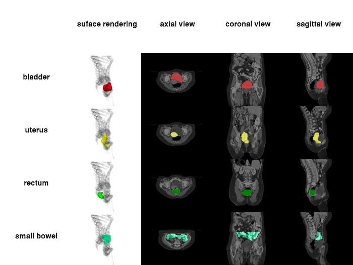
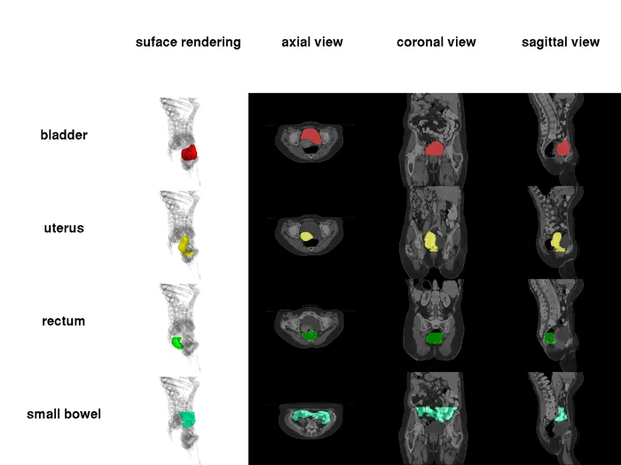
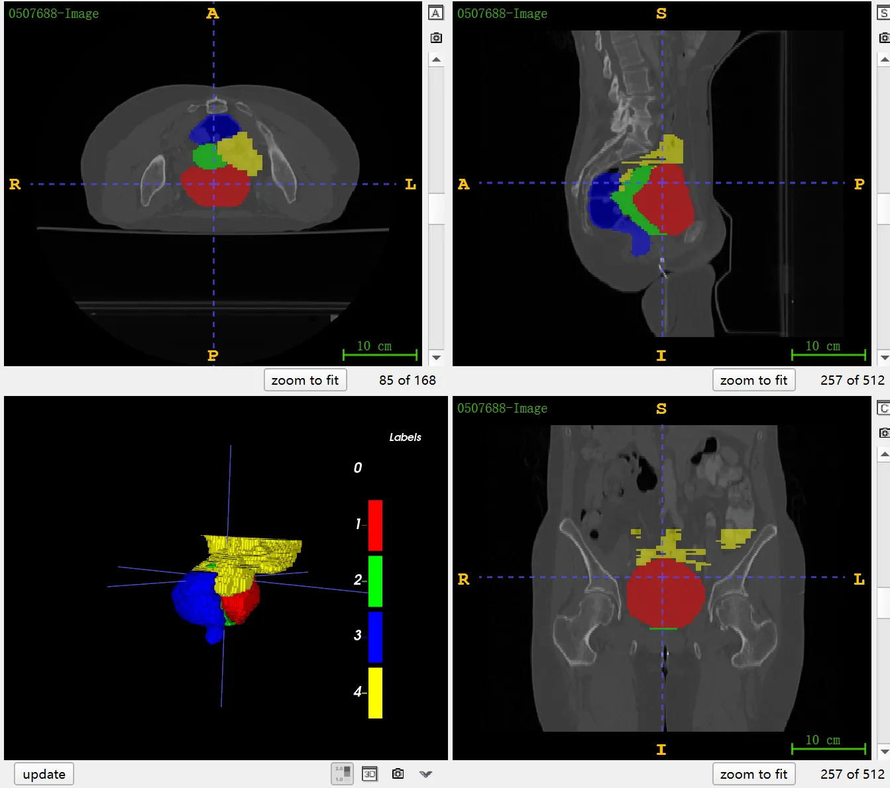

# BTCV Cervix

<div align="center">
    <a href="https://github.com/openmedlab/"></a>
</div>
<p style="text-align:center;font-size:10px;"><em></em></p>

## Dataset Information

BTCV Cervix is a CT segmentation dataset for cervical cancer patients for radiation therapy planning, annotating four types of organs: bladder, uterus, rectum, and small intestine. These patients are at different stages of the disease but are all suitable for radiation therapy. The name BTCV comes from the Workshop "Multi-Atlas Labeling Beyond The Cranial Vault" held at MICCAI 2015. It includes different versions of datasets such as the 2013 version, the Abdomen version, and the Cervix version. Typically, BTCV refers to the Abdomen version, which we have already introduced in previous articles. This article supplements the introduction of the Cervix dataset. The dataset includes 30 annotated training cases and 20 unannotated test cases. A preparation procedure of drinking water to fill the bladder is used before scanning, which involves patients being asked to drink 300 ml of water one hour before treatment to ensure the bladder is full during the CT scan. Most patients are scanned in the prone position with an abdominal board, but some patients (with specific numbers) are scanned in the supine position for practical reasons. All patients have markers implanted around the cervix, which are not used for patient positioning or assisting patient setup. Uterine contours are provided for all scans. For a few scans, the contours of other organs are missing.

Cervical cancer is a malignant tumor that occurs in the cervix of the female reproductive system, commonly caused by infection with human papillomavirus (HPV). In the treatment of cervical cancer, radiation therapy is a common method, especially for patients with mid-to-late stage cervical cancer. To perform effective radiation therapy, CT (computed tomography) scans are widely used for treatment planning and precise radiation dose calculations. Accurate image segmentation of key organs in cervical cancer patients is crucial, as it helps to more clearly define the boundaries of the tumor and is essential for assessing the potential impact of radiation therapy on these adjacent organs. For example, precise segmentation and contouring of the bladder and rectum can help avoid excessive radiation doses to these sensitive areas, thereby reducing patient discomfort and potential complications. Therefore, CT scanning plays an irreplaceable role in the treatment planning of cervical cancer, not only providing the precise anatomical information needed for treatment but also ensuring the safety and effectiveness of radiation therapy by assisting in accurate organ segmentation.

## Dataset Meta Information

| Dimensions | Modality | Task Type | Anatomical Structures                     | Anatomical Area | Number of Categories | Data Volume | File Format |
|------------|----------|-----------|-------------------------------------------|-----------------|----------------------|-------------|-------------|
| 3D         | CT       | Segmentation | Bladder, uterus, rectum, small intestine. | abdomen       | 104                  | 1204        | .nii.gz     |


### Resolution Details

| Dataset Statistics | spacing (mm)     | size             |
|--------------------|------------------|------------------|
| min                | (0.78, 0.78, 2.5)              | (512, 512, 125)  |
| median             | (0.98, 0.98, 2.5)          | (512, 512, 180)  |
| max                | (1.27, 1.27, 2.5)              | (512, 512, 242)  |

Number of two-dimensional slices in the dataset: 5,527 (based on statistics of 30 cases in the training set)

## Label Information Statistics

| Organ        | Number of Cases | Coverage | Min Volume (cm³) | Median Volume (cm³) | Max Volume (cm³) |
|--------------|-----------------|----------|------------------|---------------------|------------------|
| bladder      | 30              | 100%     | 64               | 287                 | 665              |
| uterus       | 30              | 100%     | 62               | 197                 | 503              |
| rectum       | 30              | 100%     | 29               | 87                  | 227              |
| small bowel  | 28              | 93%      | 203              | 559                 | 1676             |

## Visualization

<div align="center">
    <a href="https://github.com/openmedlab/"></a>
</div>
<p style="text-align:center;font-size:10px;"><em> Official Website Visualization.</em></p>

<div align="center">
    <a href="https://github.com/openmedlab/"></a>
</div>
<p style="text-align:center;font-size:10px;"><em> ITK-SNAP Visualization. Red: bladder, green: uterus, blue: rectum, yellow: small intestine.</em></p>


## File Structure

The BTCV-Cervix dataset includes two main parts: the `training` set and the `test` set. The `Training` folder contains data for model training and is further divided into two subfolders: img and label. The img folder contains multiple image files, each representing a CT scan of a patient. The label folder contains the corresponding label files, which indicate the location of different structures in the images. The `Testing` folder contains data to test model performance and includes only one subfolder, img, which contains image files of the test set. The label files for the test set are not made public, and they are used to evaluate the performance of the model.

``` 
BTCV-Cervix/
├── RawData/
│   ├── Training/
│   │   ├── img/
│   │   │   ├── 0507688-Image.nii.gz
│   │   │   ├── 0759564-Image.nii.gz
│   │   │   ├── 0763890-Image.nii.gz
│   │   │   ├── ... 
│   │   ├── label/
│   │   │   ├── 0507688-Mask.nii.gz
│   │   │   ├── 0759564-Mask.nii.gz
│   │   │   ├── 0763890-Mask.nii.gz
│   │   │   ├── ... 
│   ├── Testing/
│   │   ├── img/
│   │   │   ├── 1258230-Image.nii.gz
│   │   │   ├── 1614236-Image.nii.gz
│   │   │   ├── 1689606-Image.nii.gz
│   │   │   ├── ... 
```

## Authors and Institutions

Bennett Landman (Vanderbilt University, USA)

Zhoubing Xu (Vanderbilt University, USA)

Juan Eugenio Iglesias (Basque Center on Cognition, Brain and Language, Spain)

Martin Styner (University of North Carolina at Chapel Hill, USA)

Thomas Robin Langerak (Erasmus Medical Center Rotterdam, Netherlands)

Arno Klein (Sage Bionetworks, USA)


## Source Information

Official Website: https://www.synapse.org/#!Synapse:syn3193805/wiki/217790

Download Link: https://www.synapse.org/#!Synapse:syn3378972

Article Address: TBD

Publication Date: 2015-04

## Citation

``` 
@inproceedings{landman2015miccai,
  title={Miccai multi-atlas labeling beyond the cranial vault--workshop and challenge},
  author={Landman, Bennett and Xu, Zhoubing and Igelsias, J and Styner, Martin and Langerak, T and Klein, Arno},
  booktitle={Proc. MICCAI Multi-Atlas Labeling Beyond Cranial Vault—Workshop Challenge},
  volume={5},
  pages={12},
  year={2015}
}
```

Original introduction article is [here](https://zhuanlan.zhihu.com/p/668309597).