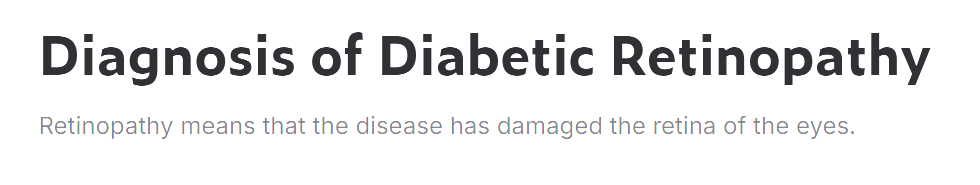
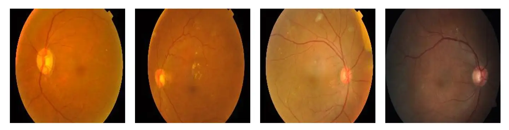
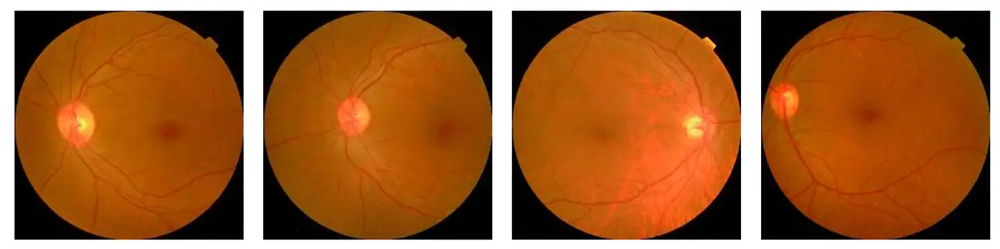

# BiDR

<div align="center">
    <a href="https://github.com/openmedlab/"></a>
</div>
<p style="text-align:center;font-size:10px;"><em></em></p>

## Dataset Information

The BiDR (Binary Diabetic Retinopathy) dataset is designed for the classification of Diabetic Retinopathy (DR). Each image in the dataset has been meticulously evaluated by medical professionals to determine the presence or absence of diabetic retinopathy. This dataset is significant for the early detection and grading of diabetic retinopathy. As the prevalence of diabetes continues to increase globally, there is an urgent need for efficient and accurate tools to assist medical professionals in screening and diagnosing this blinding disease. The BiDR dataset provides a valuable resource by offering a large number of precisely annotated retinal images, facilitating the development and testing of automated systems capable of performing these tasks with high accuracy and consistency. These systems have the potential to greatly improve early intervention strategies, thereby preventing vision loss and enabling personalized treatment plans for patients with diabetic retinopathy.

The labels in the dataset are binary, with `0` indicating the presence of diabetic retinopathy and `1` indicating its absence. The dataset comprises a total of 2838 entries, including 2076 images for training, 531 files for validation, and 231 files for testing.

## Dataset Meta Information

| Dimensions | Modality            | Task Type        | Anatomical Area | Number of Categories | Data Volume | File Format |
|------------|---------------------|------------------|-----------------|----------------------|-------------|-------------|
| 2D         | fundus photography  | Classification   | Head and Neck   | 2                    | 2838        | JPG         |


### Resolution Details

| Dataset Statistics   | size        |
|----------------------|-------------|
| min                  | (224, 224)  |
| median               | (224, 224)  |
| max                  | (224, 224)  |

## Label Information Statistics

| Classification         | No Diabetic Retinopathy | Diabetic Retinopathy  |
|------------------------|-------------------------|-----------------------|
| Number of Images       | 1430                    | 1408                  |
| Percentage             | 50.38%                  | 49.62%                |
| Average Volume (cm³)   | (224, 224)              | (224, 224)            |
| Median Volume (cm³)    | (224, 224)              | (224, 224)            |
| Total Volume (cm³)     | (224, 224)              | (224, 224)            |

## Visualization

<div align="center">
    <a href="https://github.com/openmedlab/"></a>
</div>
<p style="text-align:center;font-size:10px;"><em>Diabetic Retinopathy.</em></p>

<div align="center">
    <a href="https://github.com/openmedlab/"></a>
</div>
<p style="text-align:center;font-size:10px;"><em>No Diabetic Retinopathy.</em></p>

## File Structure

``` 
BIDR/
│
├── train/
│   ├── DR/
│   │   └── <JPG image file>
│   └── No_DR/
│       └── <JPG image file>
│
├── valid/
│   ├── DR/
│   │   └── <JPG image file>
│   └── No_DR/
│       └── <JPG image file>
│
└── test/
    ├── DR/
    │   └── <JPG image file>
    └── No_DR/
        └── <JPG image file>
```

## Authors and Institutions

Parisa Karimi Darabi (K.N. Tuss University of Technology, Tehran)

## Source Information

Official Website: https://www.kaggle.com/datasets/pkdarabi/diagnosis-of-diabetic-retinopathy?resource=download-directory

Download Link: https://www.kaggle.com/datasets/pkdarabi/diagnosis-of-diabetic-retinopathy?resource=download-directory

Article Address: https://www.researchgate.net/publication/382264856_Diagnosis_of_Diabetic_Retinopathy

Publication Date: 2023-11

## Citation

``` 
@dataset{dataset,
author = {Darabi, Parisa},
year = {2024},
month = {07},
pages = {},
title = {Diagnosis of Diabetic Retinopathy},
doi = {10.13140/RG.2.2.13037.19688}
}
```

Original introduction article is [here](https://zhuanlan.zhihu.com/p/716554270).