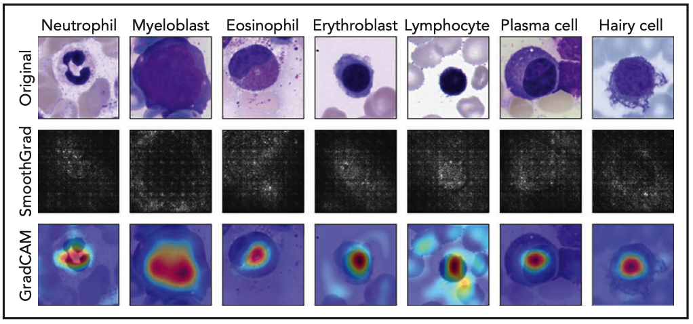
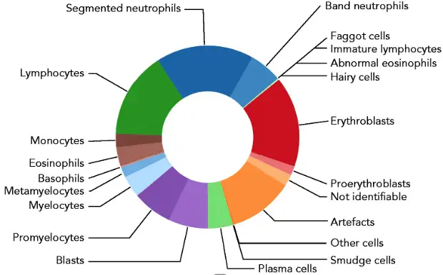
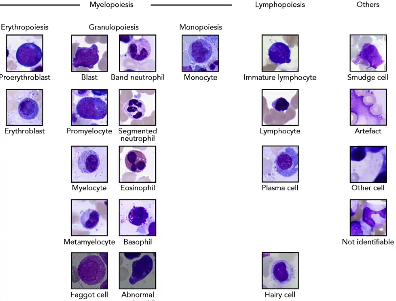

# Bone Marrow Cytomorphology

<div align="center">
    <a href="https://github.com/openmedlab/"></a>
</div>
<p style="text-align:center;font-size:10px;"><em></em></p>

## Dataset Information

The Bone Marrow Cytomorphology MLL Helmholtz Fraunhofer dataset is a dataset focused on bone marrow cytomorphology. It contains over 170,000 anonymized, expert-annotated cell images from bone marrow smears of 945 patients, stained using May-Grünwald-Giemsa/Pappenheim. This dataset is not only the largest expert-annotated image pool of bone marrow cytomorphology currently available in the literature, but also its high quality and detailed classification of cell types make it an ideal choice for training leukocyte morphological classifiers. These classifiers can identify a range of diagnostically relevant cell types with high precision and recall.

Clinically, bone marrow cytomorphology examination is crucial for diagnosing various diseases, such as anemia, fever, and bleeding. By examining the morphology and quantity of cells in the bone marrow under a microscope, doctors can identify various blood diseases, such as leukemia, aplastic anemia, and multiple myeloma, and monitor changes in the disease during treatment, thus evaluating treatment effectiveness and prognosis. Classifying cells into 21 categories aids in more precise diagnosis and treatment because different types of cells play various roles in hematologic diseases. Their proportion and morphological changes can reflect the nature and progression of the disease. For example, an increased proportion of blast cells may suggest leukemia, while anomalies in megakaryocytes may be related to thrombocytopenic purpura or aplastic anemia.

## Dataset Meta Information

| Dimensions | Modality | Task Type                    | Anatomical Structures | Anatomical Area | Number of Categories | Data Volume | File Format |
|------------|----------|------------------------------|-----------------------|-----------------|----------------------|-------------|-------------|
| 2D         | Pathology Image      | Classification               | Blood Cells           | Marrow          | 21                   | 171,375	         | JPG         |


### Resolution Details

| Dataset Statistics | size       |
|--------------------|------------|
| min                | [250,250]  |
| median             | [250,250]  |
| max                | [250,250]  |

## Label Information Statistics

| Abbreviation | Category              | Chinese Equivalent   | Count |
|--------------|-----------------------|----------------------|-------|
| ABE          | Abnormal eosinophil   | 异常嗜酸细胞          | 8     |
| ART          | Artefact              | 伪影                 | 19630 |
| BAS          | Basophil              | 嗜碱细胞             | 441   |
| BLA          | Blast                 | 原始细胞             | 11973 |
| EBO          | Erythroblast          | 早红细胞             | 27395 |
| EOS          | Eosinophil            | 嗜酸细胞             | 5883  |
| FGC          | Faggott cell          | 费戈特细胞           | 47    |
| HAC          | Hairy cell            | 毛细胞               | 409   |
| KSC          | Smudge cell           | 污渍细胞             | 42    |
| LYI          | Immature lymphocyte   | 未成熟淋巴细胞       | 65    |
| LYT          | Lymphocyte            | 淋巴细胞             | 26242 |
| MMZ          | Metamyelocyte         | 中幼粒细胞           | 3055  |
| MON          | Monocyte              | 单核细胞             | 4040  |
| MYB          | Myelocyte             | 骨髓细胞             | 6557  |
| NGB          | Band neutrophil       | 带状中性粒细胞       | 9968  |
| NGS          | Segmented neutrophil  | 分叶中性粒细胞       | 29424 |
| NIF          | Not identifiable      | 无法识别             | 3538  |
| OTH          | Other cell            | 其他细胞             | 294   |
| PEB          | Proerythroblast       | 原始红细胞           | 2740  |
| PLM          | Plasma cell           | 浆细胞               | 7629  |
| PMO          | Promyelocyte          | 早幼粒细胞           | 11994 |

<div align="center">
    <a href="https://github.com/openmedlab/"></a>
</div>
<p style="text-align:center;font-size:10px;"><em>Proportion of each category.</em></p>

## Visualization

<div align="center">
    <a href="https://github.com/openmedlab/"></a>
</div>
<p style="text-align:center;font-size:10px;"><em>Example of each category.</em></p>

## File Structure

Images of different categories of bone marrow cells in the dataset are organized into subfolders, each containing a series of numbered image files.

``` 
Bone-Marrow-Cytomorphology
├── ABE
│ ├── ABE_00001.jpg
│ ├── ABE_00002.jpg
│ ├── ...
│ └── ABE_00008.jpg
├── ART
│   ├── 0001-1000
│   │   ├── ART_00001.jpg
│   │   ├── ART_00002.jpg
│   │   ├── ...
│   │   └── ART_01000.jpg
│   ├── 1001-2000
│   │   ├── ART_01001.jpg
│   │   ├── ART_01002.jpg
│   │   ├── ...
│   │   └── ART_02000.jpg
│   │   ├── ...
│   └── 19001-19630
│       ├── ART_19001.jpg
│       ├── ART_19002.jpg
│       ├── ...
│       └── ART_19630.jpg
├── ...
└── PMO
    ├── 0001-1000
    │   ├── PMO_00001.jpg
    │   ├── PMO_00002.jpg
    │   ├── ...
    │   └── PMO_01000.jpg
    ├── 1001-2000
    │   ├── PMO_01001.jpg
    │   ├── PMO_01002.jpg
    │   ├── ...
    │   └── PMO_02000.jpg
    │   ├── ...
    └── 11001-11994
        ├── PMO_11001.jpg
        ├── PMO_11002.jpg
        ├── ...
        └── PMO_11994.jpg
```

## Authors and Institutions

Christian Matek（Institute of Computational Biology, Helmholtz Zentrum München, German; Department of Internal Medicine III, University Hospital Munich, Ludwig-Maximilians-Universität München, German; Institute of AI for Health, Helmholtz Zentrum München, German）

Sebastian Krappe（Image Processing and Medical Engineering Department, Fraunhofer Institute for Integrated Circuits IIS, German; Department of Computer Science, University of Koblenz-Landau, German）

Christian Munzenmayer（Image Processing and Medical Engineering Department, Fraunhofer Institute for Integrated Circuits IIS, German）

Torsten Haferlach（MLL Munich Leukemia Laboratory, German）

Carsten Marr（Institute of Computational Biology, Helmholtz Zentrum München, German; Institute of AI for Health, Helmholtz Zentrum München, German）

## Source Information

Official Website: https://wiki.cancerimagingarchive.net/pages/viewpage.action?pageId=101941770

Download Link: https://wiki.cancerimagingarchive.net/pages/viewpage.action?pageId=101941770

Article Address: https://ashpublications.org/blood/article/138/20/1917/477932/Highly-accurate-differentiation-of-bone-marrow

Publication Date: 2021-11-08

## Citation

``` 
@article{matek2021highly,
  title={Highly accurate differentiation of bone marrow cell morphologies using deep neural networks on a large image data set},
  author={Matek, Christian and Krappe, Sebastian and M{\"u}nzenmayer, Christian and Haferlach, Torsten and Marr, Carsten},
  journal={Blood, The Journal of the American Society of Hematology},
  volume={138},
  number={20},
  pages={1917--1927},
  year={2021},
  publisher={American Society of Hematology Washington, DC}
}
```

Original introduction article is [here](https://zhuanlan.zhihu.com/p/686273273).