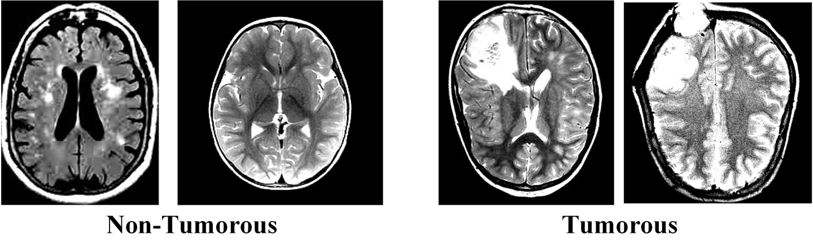

# Br35H

<div align="center">
    <a href="https://github.com/openmedlab/"></a>
</div>
<p style="text-align:center;font-size:10px;"><em></em></p>

## Dataset Information

Brain tumors are considered one of the aggressive diseases affecting both children and adults. They account for 85% to 90% of all primary central nervous system (CNS) tumors. Approximately 11,700 people are diagnosed with brain tumors each year. The 5-year survival rate for individuals with cancerous brain or CNS tumors is about 34% for men and 36% for women. 

The **Br35H** dataset provides 3,000 brain MRI images categorized into two classes: **Non-Tumorous** and **Tumorous**. The application of automated classification techniques using machine learning (ML) and artificial intelligence (AI) has consistently demonstrated higher accuracy compared to manual classification. Therefore, implementing detection and classification systems using deep learning algorithms, such as convolutional neural networks (CNN), artificial neural networks (ANN), and transfer learning (TL), will significantly benefit doctors worldwide.

## Dataset Meta Information

| Dimensions | Modality | Task Type      | Anatomical Structures | Anatomical Area | Number of Categories | Data Volume | File Format |
|------------|----------|----------------|-----------------------|-----------------|----------------------|-------------|-------------|
| 2D         | MRI      | Classification | Brain                 | Brain Tumor     | 2                    | 3000        | JPG         |

### Resolution Details

| Dataset Statistics | size          |
|--------------------|---------------|
| min                | (173, 189)    |
| median             | (346, 320)    |
| max                | (1427, 1200)  |

## Label Information Statistics

The statistical results are based on the actual data collected by the author:

| Category     | Number  | 
|--------------|---------| 
| Non-Tumorous | 1500    | 
| Tumorous     | 1500    |

## Visualization

<div align="center">
    <a href="https://github.com/openmedlab/"></a>
</div>
<p style="text-align:center;font-size:10px;"><em>Local Visualization.</em></p>

## File Structure

The dataset contains 3 folders: yes, no and pred, which contain 3060 brain MRI images.

| Folder | Description                                                   |
|--------|---------------------------------------------------------------|
| Yes    | The folder "Yes" contains 1500 Brain MRI images that are tumorous. |
| No     | The folder "No" contains 1500 Brain MRI images that are non-tumorous. |

## Authors and Institutions

Merlin

## Source Information

Official Website: https://www.heywhale.com/mw/dataset/61d3e5682d30dc001701f728

Download Link: https://www.heywhale.com/mw/dataset/61d3e5682d30dc001701f728

Article Address: https://www.heywhale.com/mw/dataset/61d3e5682d30dc001701f728

Publication Date: 2022

## Citation

``` 
@misc{merlin9970023542,
    title = { Br35H ：脑肿瘤检测 2020 }
    author = { Merlin },
    howpublished = { \url{https://www.heywhale.com/mw/dataset/61d3e5682d30dc001701f728} }
    year = { 2022 }
}
```

Original introduction article is [here](https://zhuanlan.zhihu.com/p/945500512).