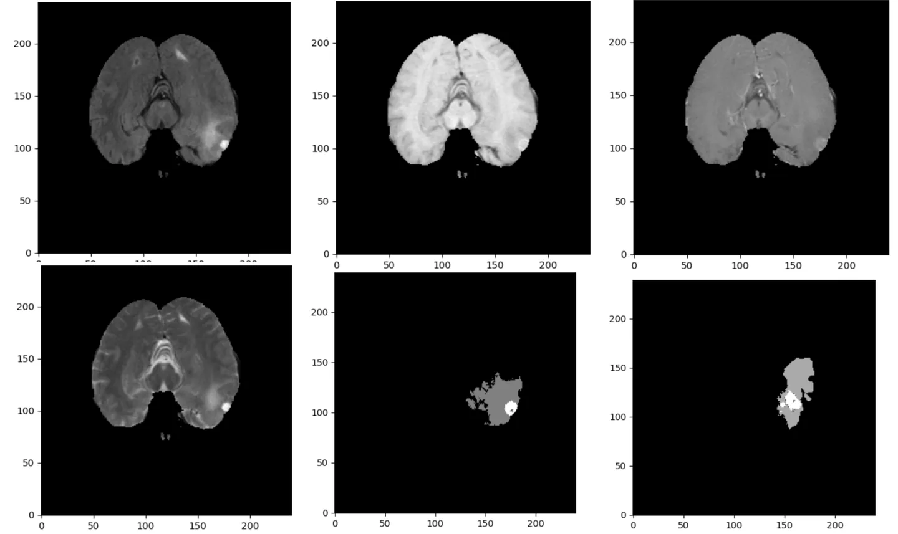

# BraTS-TCGA-GBM

<div align="center">
    <a href="https://github.com/openmedlab/"></a>
</div>
<p style="text-align:center;font-size:10px;"><em></em></p>

## Dataset Information

The BraTS-TCGA-GBM dataset is for the segmentation of Glioblastoma Multiforme (GBM) and consists of multimodal (such as T1, T1-Gd, T2, T2-FLAIR) Magnetic Resonance Imaging (MRI) volumetric data (in NIfTI format). It is composed of data from 102 patients, totaling 607 images, including four modalities as well as labels segmented by the GLISTRboost method and manually checked labels.

The BraTS-TCGA-GBM dataset provides preoperative MRI scan data for patients with Glioblastoma Multiforme (GBM). The data include tumor segmentation labels that are computer-assisted and manually corrected by experts, imaged using various modalities (such as T1, T1-Gd, T2, T2-FLAIR). These scans and their labels performed excellently in the international multimodal brain tumor segmentation challenge (BRATS 2015). In addition to imaging data, the dataset also offers a range of detailed radiomic features such as intensity, volume, morphology, and texture parameters, aimed at facilitating clinical research and computational analysis. These data are publicly available in the Cancer Imaging Archive (TCIA), enabling researchers to correlate radiomic features with molecular markers and clinical outcomes.

## Dataset Meta Information

You can write down meta information about the dataset, take TotalSegmentator for example, it could be:

| Dimensions | Modality | Task Type | Anatomical Structures   | Anatomical Area | Number of Categories | Data Volume | File Format |
|------------|----------|-----------|-------------------------|-----------------|----------------------|-------------|-------------|
| 3D         | MR       | Segmentation | Glioblastoma multiforme | Brain           | 3                    | 102         | .nii.gz     |


### Resolution Details

The spacing and size of all images in the dataset have been preprocessed to be consistent.

| Dataset Statistics | spacing (mm)     | size            |
|--------------------|------------------|-----------------|
| min                | (1.0, 1.0, 1.0)              | (240, 240, 155)     |
| median             | (1.0, 1.0, 1.0)           | (240, 240, 155) |
| max                | (1.0, 1.0, 1.0)              | (240, 240, 155)) |

Number of 2D slices: 63,240.

## Label Information Statistics

| Segmentation Class | Non-Enhancing Region | Enhancing Tumor Edge | Enhancing Tumor |
|--------------------|----------------------|----------------------|-----------------|
| Case Count         | 102                  | 102                  | 102             |
| Detection Rate     | 100%                 | 100%                 | 100%            |
| Min Volume (cm³)   | 0.05                 | 9.76                 | 1.04            |
| Median Volume (cm³)| 9.29                 | 58.97                | 26.34           |
| Max Volume (cm³)   | 97.83                | 160.68               | 111.25          |


## Visualization

<div align="center">
    <a href="https://github.com/openmedlab/"></a>
</div>
<p style="text-align:center;font-size:10px;"><em> From left to right, top to bottom, the sequences are flair, t1, t1gd, t2, label, other image label.</em></p>

## File Structure

The files ending with t1, t1Gd, t2, and flair in the nii.gz format correspond to the four modalities of data, respectively. The files ending with `GlistrBoost` are the label images of the tumor segmented by that method, and the files ending with `GlistrBoost_ManuallyCorrected` are the files that have been manually corrected. It is possible that the `GlistrBoost_ManuallyCorrected` files may not be present.


``` 
Pre-operative_TCGA_GBM_NIfTI_and_Segmentations
│
├── TCGA-02-0006
│   ├── TCGA-02-0006_1996.08.23_flair.nii.gz
│   ├── TCGA-02-0006_1996.08.23_GlistrBoost_ManuallyCorrected.nii.gz
│   ├── TCGA-02-0006_1996.08.23_GlistrBoost.nii.gz
│   ├── TCGA-02-0006_1996.08.23_t1.nii.gz
│   ├── TCGA-02-0006_1996.08.23_t1Gd.nii.gz
│   ├── TCGA-02-0006_1996.08.23_t2.nii.gz
├── TCGA-02-0009
│   ├── ...
├── ...
```

## Authors and Institutions

Spyridon Bakas (Center for Biomedical Image Computing and Analytics, Department of Radiology, Perelman School of Medicine, University of Pennsylvania, USA)

Hamed Akbari (Center for Biomedical Image Computing and Analytics, Department of Radiology, Perelman School of Medicine, University of Pennsylvania, USA)

Aristeidis Sotiras (Center for Biomedical Image Computing and Analytics, Department of Radiology, Perelman School of Medicine, University of Pennsylvania, USA)

Michel Bilello (Center for Biomedical Image Computing and Analytics, Department of Radiology, Perelman School of Medicine, University of Pennsylvania, USA)

Martin Rozycki (Center for Biomedical Image Computing and Analytics, Department of Radiology, Perelman School of Medicine, University of Pennsylvania, USA)

Justin S. Kirby (Leidos Biomedical Research, Inc., USA)

John B. Freymann (Leidos Biomedical Research, Inc., USA)

Keyvan Farahani (National Cancer Institute, USA)

Christos Davatzikos (Center for Biomedical Image Computing and Analytics, Department of Radiology, Perelman School of Medicine, University of Pennsylvania, USA)


## Source Information

Official Website: https://www.cancerimagingarchive.net/analysis-result/brats-tcga-gbm/

Download Link: https://www.cancerimagingarchive.net/analysis-result/brats-tcga-gbm/

Article Address: https://www.nature.com/articles/sdata2017117

Publication Date: 2017

## Citation

``` 
@article{bakas2017advancing,
  title={Advancing the cancer genome atlas glioma MRI collections with expert segmentation labels and radiomic features},
  author={Bakas, Spyridon and Akbari, Hamed and Sotiras, Aristeidis and Bilello, Michel and Rozycki, Martin and Kirby, Justin S and Freymann, John B and Farahani, Keyvan and Davatzikos, Christos},
  journal={Scientific data},
  volume={4},
  number={1},
  pages={1--13},
  year={2017},
  publisher={Nature Publishing Group}
}
```

Original introduction article is [here](https://zhuanlan.zhihu.com/p/673254889).