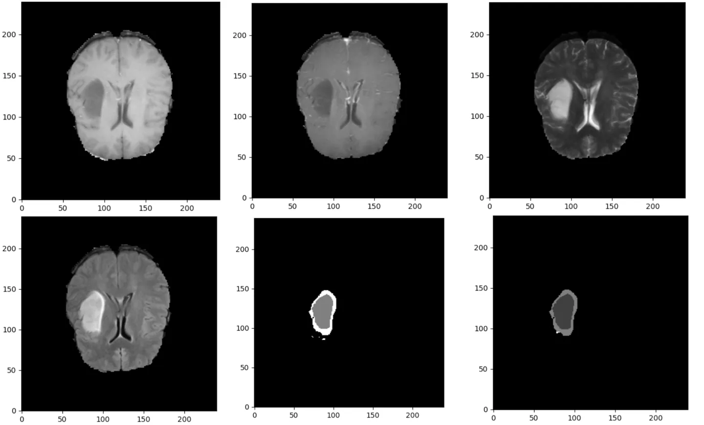

# BraTS-TCGA-LGG

<div align="center">
    <a href="https://github.com/openmedlab/"></a>
</div>
<p style="text-align:center;font-size:10px;"><em></em></p>

## Dataset Information

The BraTS-TCGA-LGG dataset is for the segmentation of low-grade gliomas (LGG) and consists of multimodal (such as T1, T1-Gd, T2, T2-FLAIR) Magnetic Resonance Imaging (MRI) volumetric data (in NIfTI format). It comprises data from 65 patients, totaling 387 images, which includes four modalities as well as labels segmented by the GLISTRboost method and labels checked manually.

This dataset contains preoperative multi-institutional MRI scans from the TCGA low-grade glioma (LGG) series and their tumor segmentation labels, which are publicly available on TCIA. The dataset also includes a wealth of radiomic features and multimodal MRI volumetric data in NIfTI format. These scans were identified through radiological assessment in the TCGA-LGG series, underwent skull stripping, and tumor segmentation labels were generated by automated methods and then manually corrected by expert neuroradiologists. The final labels are used for extracting various imaging features including intensity, volume, morphology, histogram, and texture parameters. These computer-assisted and manually revised labels facilitate quantitative research and can also serve as standard labels in computational challenges. The provided radiomic features aid in the study of TCGA's molecular characteristics, allowing researchers to correlate them with molecular markers, clinical outcomes, and more.

## Dataset Meta Information

| Dimensions | Modality | Task Type | Anatomical Structures | Anatomical Area | Number of Categories | Data Volume | File Format |
|------------|----------|-----------|-----------------------|-----------------|----------------------|-------------|-------------|
| 3D         | CT       | Segmentation | Low grade glioma      | Head            | 3                    | 65          | .nii.gz     |


### Resolution Details

The spacing and size of all images in the dataset have been preprocessed to be consistent.

| Dataset Statistics | spacing (mm)     | size            |
|--------------------|------------------|-----------------|
| min                | (1.0, 1.0, 1.0)              | (240, 240, 155)     |
| median             | (1.0, 1.0, 1.0)           | (240, 240, 155) |
| max                | (1.0, 1.0, 1.0)              | (240, 240, 155)) |

Number of 2D slices: 40,300.

## Label Information Statistics

| Segmentation Class | Non-Enhancing Region | Enhancing Tumor Edge | Enhancing Tumor |
|--------------------|----------------------|----------------------|-----------------|
| Case Count         | 65                   | 64                   | 45              |
| Detection Rate     | 100%                 | 98.46%               | 69.23%          |
| Min Volume (cm³)   | 0.14                 | 2.84                 | 0.03            |
| Median Volume (cm³)| 50.29                | 38.74                | 2.09            |
| Max Volume (cm³)   | 189.15               | 213.96               | 89.55           |


## Visualization

<div align="center">
    <a href="https://github.com/openmedlab/"></a>
</div>
<p style="text-align:center;font-size:10px;"><em> From left to right, top to bottom, the sequences are t1, t1gd, t2, flair, GlistrBoost, GlistrBoost_ManuallyCorrected.</em></p>

## File Structure

The files ending with t1, t1Gd, t2, and flair in the nii.gz format correspond to the four modalities of data, respectively. The files ending with `GlistrBoost` are the label images of the tumor segmented by that method, and the files ending with `GlistrBoost_ManuallyCorrected` are the files that have been manually corrected. It is possible that the `GlistrBoost_ManuallyCorrected` files may not be present.

``` 
Pre-operative_TCGA_LGG_NIfTI_and_Segmentations
│
├── TCGA-CS-4942
│   ├── TCGA-CS-4942_1997.02.22_flair.nii.gz
│   ├── TCGA-CS-4942_1997.02.22_GlistrBoost_ManuallyCorrected.nii.gz
│   ├── TCGA-CS-4942_1997.02.22_GlistrBoost.nii.gz
│   ├── TCGA-CS-4942_1997.02.22_t1.nii.gz
│   ├── TCGA-CS-4942_1997.02.22_t1Gd.nii.gz
│   ├── TCGA-CS-4942_1997.02.22_t2.nii.gz
├── TCGA-CS-4944
│   ├── ...
├── ...
```

## Authors and Institutions

Spyridon Bakas (Center for Biomedical Image Computing and Analytics, Department of Radiology, Perelman School of Medicine, University of Pennsylvania, USA)

Hamed Akbari (Center for Biomedical Image Computing and Analytics, Department of Radiology, Perelman School of Medicine, University of Pennsylvania, USA)

Aristeidis Sotiras (Center for Biomedical Image Computing and Analytics, Department of Radiology, Perelman School of Medicine, University of Pennsylvania, USA)

Michel Bilello (Center for Biomedical Image Computing and Analytics, Department of Radiology, Perelman School of Medicine, University of Pennsylvania, USA)

Martin Rozycki (Center for Biomedical Image Computing and Analytics, Department of Radiology, Perelman School of Medicine, University of Pennsylvania, USA)

Justin S. Kirby (Leidos Biomedical Research, Inc., USA)

John B. Freymann (Leidos Biomedical Research, Inc., USA)

Keyvan Farahani (National Cancer Institute, USA)

Christos Davatzikos (Center for Biomedical Image Computing and Analytics, Department of Radiology, Perelman School of Medicine, University of Pennsylvania, USA)


## Source Information

Official Website: https://www.cancerimagingarchive.net/analysis-result/brats-tcga-lgg/

Download Link: https://www.cancerimagingarchive.net/analysis-result/brats-tcga-lgg/

Article Address: https://www.nature.com/articles/sdata2017117

Publication Date: 2017.

## Citation

``` 
@article{bakas2017advancing,
  title={Advancing the cancer genome atlas glioma MRI collections with expert segmentation labels and radiomic features},
  author={Bakas, Spyridon and Akbari, Hamed and Sotiras, Aristeidis and Bilello, Michel and Rozycki, Martin and Kirby, Justin S and Freymann, John B and Farahani, Keyvan and Davatzikos, Christos},
  journal={Scientific data},
  volume={4},
  number={1},
  pages={1--13},
  year={2017},
  publisher={Nature Publishing Group}
}
```

Original introduction article is [here](https://zhuanlan.zhihu.com/p/673407841).
