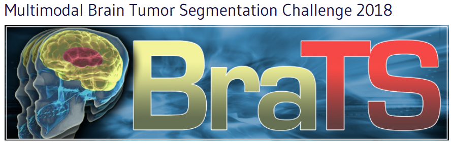
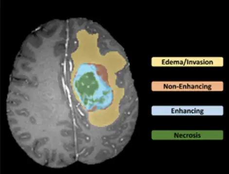
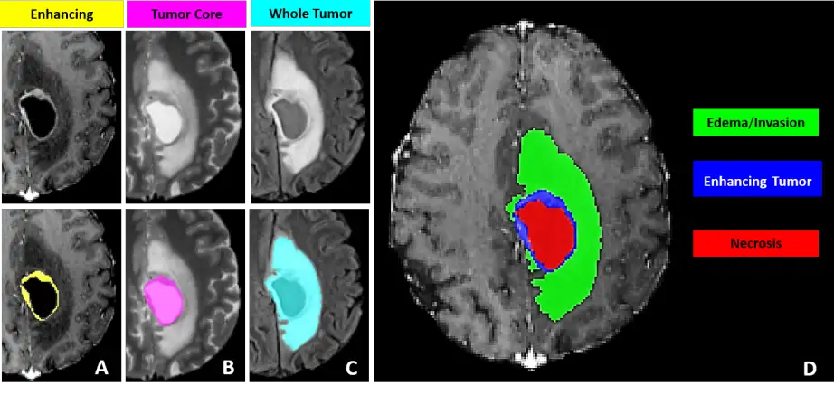

# BraTS18

<div align="center">
    <a href="https://github.com/openmedlab/"></a>
</div>
<p style="text-align:center;font-size:10px;"><em></em></p>

## Dataset Information

The BraTS18 dataset is a brain tumor segmentation dataset, primarily focused on segmenting three types of tissues associated with brain tumors: GD-enhanced tumors, peritumoral edema, and the necrotic and non-enhanced tumor core. These categories are manually annotated by experienced clinicians. In the dataset, each category includes a variety of MRI modalities, including original T1-weighted images (T1), contrast-enhanced T1-weighted images (T1Gd), T2-weighted images (T2), and T2 Fluid Attenuated Inversion Recovery (FLAIR) volumetric images. The dataset comprises 285 training cases, 66 validation cases, and 191 test cases.

The BraTS series of datasets is a classic in the field of medical image analysis, and this article primarily discusses its 2018 version. Gliomas are the most common primary brain tumors in adults. In current clinical routines and research, the assessment of brain gliomas is often based on qualitative standards (such as indicating the presence of characteristic high-intensity tissue appearances in contrast-enhanced T1-weighted MRI) or relies on basic quantitative metrics like the maximum diameter visible in axial images of the lesions. By replacing current basic assessments with highly accurate and repeatable measurements of relevant tumor substructures, image processing programs that automatically analyze brain tumor scans have the potential to significantly improve diagnosis, treatment planning, and follow-up for individual patients. This dataset provides precise tumor annotation information, laying the foundation for training quantitative analysis models for brain gliomas.

## Dataset Meta Information

| Dimensions | Modality | Task Type | Anatomical Structures | Anatomical Area | Number of Categories | Data Volume | File Format |
|------------|----------|-----------|-----------------------|-----------------|----------------------|-------------|-------------|
| 3D         | MR       | Segmentation | Glioma                | Brain           | 3                    | 285         | .nii.gz     |

Note: Since the dataset provides four modalities of data that have been registered, each example of data here includes images of the four modalities and the corresponding annotation structures. Since only the training set provides annotation information, only the data volume of the training set is listed here.

### Resolution Details

Only statistics on training set information:

| Dataset Statistics | spacing (mm)   | size         |
|--------------------|----------------|--------------|
| min                | (1.0,1.0,1.0)  | 240x240x155  |
| median             | (1.0,1.0,1.0)  | 240x240x155  |
| max                | (1.0,1.0,1.0)  | 240x240x155  |

Number of 2D slices in the dataset: 176,700

## Label Information Statistics

Only statistics on training set information:

| Anatomical Feature    | Necrotic Tumor Core | Peritumoral Edema | Enhancing Tumor |
|-----------------------|---------------------|-------------------|-----------------|
| Number of Cases       | 285                 | 284               | 258             |
| Segmentation Accuracy | 100%                | 99.65%            | 90.53%          |
| Min Volume (cm³)      | 0.05                | 2.84              | 0.03            |
| Median Volume (cm³)   | 10.82               | 46.94             | 14.61           |
| Max Volume (cm³)      | 189.15              | 213.96            | 111.25          |

## Visualization

Dataset visualization example, including enhancing tumor, peritumoral edema, and necrotic tumor core.

<div align="center">
    <a href="https://github.com/openmedlab/"></a>
</div>
<p style="text-align:center;font-size:10px;"><em></em></p>

<div align="center">
    <a href="https://github.com/openmedlab/"></a>
</div>
<p style="text-align:center;font-size:10px;"><em></em></p>

## File Structure

``` 
MICCAI_BraTS_2018_Data_Training
├── HGG
│   ├── Brats18_2013_2_1
│   │   ├── Brats18_2013_2_1_flair.nii.gz
│   │   ├── Brats18_2013_2_1_seg.nii.gz
│   │   ├── Brats18_2013_2_1_t1.nii.gz
│   │   ├── Brats18_2013_2_1_t1ce.nii.gz
│   │   ├── Brats18_2013_2_1_t2.nii.gz
│   ├── Brats18_2013_3_1
│   ├── Brats18_2013_4_1
│   ├── ...
├── LGG
│   ├── Brats18_2013_0_1
│   │   ├── Brats18_2013_0_1_flair.nii.gz
│   │   ├── Brats18_2013_0_1_seg.nii.gz
│   │   ├── Brats18_2013_0_1_t1.nii.gz
│   │   ├── Brats18_2013_0_1_t1ce.nii.gz
│   │   ├── Brats18_2013_0_1_t2.nii.gz
│   ├── Brats18_2013_1_1
│   ├── Brats18_2013_6_1
│   ├── ...
```

## Source Information

Official Website: https://www.med.upenn.edu/sbia/brats2018/data.html

Download Link: https://www.med.upenn.edu/sbia/brats2018/data.html

Article Address: https://arxiv.org/pdf/1811.02629

Publication Date: 2018

## Citation

``` 
@article{bakas2018identifying,
  title={Identifying the best machine learning algorithms for brain tumor segmentation, progression assessment, and overall survival prediction in the BRATS challenge},
  author={Bakas, Spyridon and Reyes, Mauricio and Jakab, Andras and Bauer, Stefan and Rempfler, Markus and Crimi, Alessandro and Shinohara, Russell Takeshi and Berger, Christoph and Ha, Sung Min and Rozycki, Martin and others},
  journal={arXiv preprint arXiv:1811.02629},
  year={2018}
}
```

Original introduction article is [here](https://zhuanlan.zhihu.com/p/702628143).