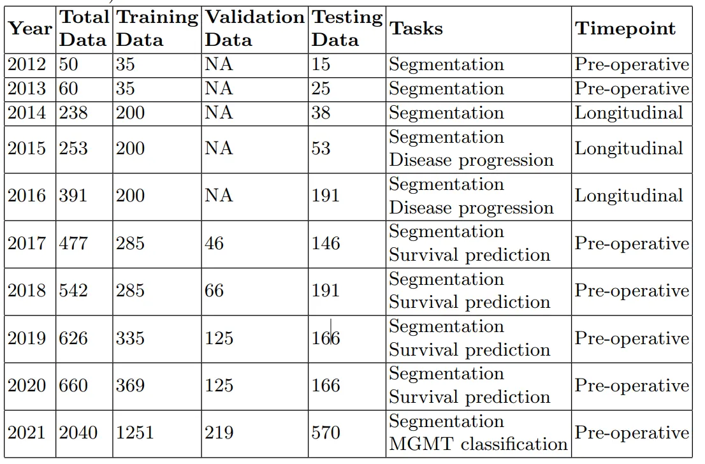
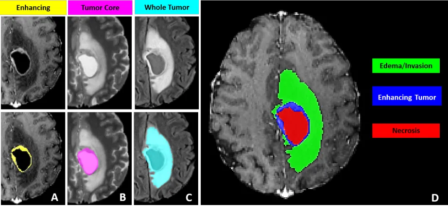

# BraTS 2021

<div align="center">
    <a href="https://github.com/openmedlab/"></a>
</div>
<p style="text-align:center;font-size:10px;"><em></em></p>

## Dataset Information

BraTS21 is a large-scale multimodal MR glioma segmentation dataset that includes 8,160 MRI scans from 2,040 patients. Each patient has MR images in four modalities: T1, T1Gd, T2, and T2-FLAIR, which were acquired under various clinical protocols and scanners across multiple medical institutions. Glioblastoma, as the primary malignant tumor of the adult central nervous system, has an average survival time of only 15 months. The annotations in BraTS21 mainly include enhancing tumor (ET), peritumoral edema/invasive tissue (ED), and necrotic tumor core (NCR). All labels and data have been preprocessed, which includes alignment to a unified anatomical template, rescaling to the same resolution (1 mm³), and skull stripping. Out of these, 1,251 cases are used as a training set with publicly available labels, while 219 cases are divided into a validation set, whose labels are not public but can be submitted to the Synapse platform for testing. Additionally, 570 cases are used as a test set, with data not publicly available and requiring docker submission for testing.

**History of the BraTS Challenge**: The BraTS Challenge began in 2012 and has evolved over time. With each annual iteration, more diverse data and a wider variety of tasks were introduced. These datasets encompass multiple public and private collections. In the years 2014-2016, the challenge data incorporated some post-operative images, but from 2017 onwards, these were excluded. By 2021, the scale of publicly annotated data reached its peak. Although subsequent editions BraTS22 and BraTS23 have been released, they only added non-public test data, and the data for training and validation of gliomas remain the same as in BraTS21. A comparison of the data across different editions of the challenge is as follows:

<div align="center">
    <a href="https://github.com/openmedlab/"></a>
</div>
<p style="text-align:center;font-size:10px;"><em></em></p>

## Dataset Meta Information

| Dimensions | Modality | Task Type | Anatomical Structures | Anatomical Area | Number of Categories | Data Volume                           | File Format |
|------------|--------|-----------|-----------------------|-----------------|----------------------|---------------------------------------|-------------|
| 3D         | mpMR       | Segmentation | Glioma                | Head            | 3                    | 1251 for training, 219 for validation | .nii.gz     |


### Resolution Details

You can also write down the resolution details such as size (x, y, z) and spacing information about the dataset.

For example:

| Dataset Statistics | spacing (mm)     | size            |
|--------------------|------------------|-----------------|
| min                | (1.0, 1.0, 1.0)              | (240, 240, 155) |
| median             | (1.0, 1.0, 1.0)           | (240, 240, 155)             |
| max                | (1.0, 1.0, 1.0)              | (240, 240, 155) |

## Label Information Statistics

| Anatomical Structure | ET (Enhancing Tumor) | ED (Peritumoral Edema) | NCR (Necrotic Core) |
|----------------------|----------------------|------------------------|---------------------|
| Cases                | 1250                 | 1208                   | 1218                |
| Coverage             | 99.92%               | 96.56%                 | 97.36%              |
| Mean Volume (cm³)    | 0.002                | 0.001                  | 0.022               |
| Median Volume (cm³)  | 52.38                | 7.86                   | 18.01               |
| Max Volume (cm³)     | 216.41               | 189.15                 | 111.25              |


## Visualization

<div align="center">
    <a href="https://github.com/openmedlab/"></a>
</div>
<p style="text-align:center;font-size:10px;"><em> BraTS21 paper visualization. Red: Necrotic Core, located in the center of the tumor; Blue: Enhancing Tumor; Green: Peritumoral Invasive Tissue.</em></p>

## File Structure

The BraTS21 dataset contains two major folders: `RSNA_ASNR_MICCAI_BraTS2021_TrainingData` and `RSNA_ASNR_MICCAI_BraTS2021_ValidationData`, which store training and validation data, respectively. Inside each folder, there are multiple subdirectories named in the format `“BraTS2021_xxxxx”`, representing different patients' MRI scan data. In addition to the four modalities of MR data, the directories in the training set also provide `_seg` tumor annotations; whereas the validation set only contains the four modalities of MR data and does not provide tumor annotations.

``` 
BraTS21
│
├── RSNA_ASNR_MICCAI_BraTS2021_TrainingData
│ ├── BraTS2021_00000
│ │ ├── BraTS2021_00000_flair.nii.gz
│ │ ├── BraTS2021_00000_t1.nii.gz
│ │ ├── BraTS2021_00000_t1ce.nii.gz
│ │ ├── BraTS2021_00000_t2.nii.gz
│ │ └── BraTS2021_00000_seg.nii.gz
│ ├── BraTS2021_00002
│ ├── ...
│
└── RSNA_ASNR_MICCAI_BraTS2021_ValidationData
├── BraTS2021_00001
│ ├── BraTS2021_00001_flair.nii.gz
│ ├── BraTS2021_00001_t1.nii.gz
│ ├── BraTS2021_00001_t1ce.nii.gz
│ └── BraTS2021_00001_t2.nii.gz
├── BraTS2021_00003
└── ...
```

## Authors and Institutions

Spyridon Bakas (University of Pennsylvania)

Keyvan Farahani (National Cancer Institute, USA)

Ujjwal Baid (University of Pennsylvania)

Bjoern Menze (University of Zurich)

Russell T. Shinohara (University of Pennsylvania)

Michel Bilello (University of Pennsylvania)

Suyash Mohan (University of Pennsylvania)

Satyam Ghodasara (University of Pennsylvania)

Timothy Bergquist (Sage Bionetworks)

Verena Chung (Sage Bionetworks)

James Eddy (Sage Bionetworks)

Evan Calabrese (University of California, San Francisco)

Errol Colak (University of Toronto)

Adam Flanders (Thomas Jefferson University Hospital)

Felipe C. Kitamura (Diagnósticos da América SA (DASA))

Luciano M. Prevedello (The Ohio State University Wexner Medical Center)

Jeffrey D. Rudie (University of California, San Francisco)


## Source Information

Official Website: https://www.synapse.org/#!Synapse:syn25829067/wiki/610863

Download Link: https://www.synapse.org/#!Synapse:syn51514105

Article Address: https://arxiv.org/abs/2107.02314, https://ieeexplore.ieee.org/document/6975210, https://www.nature.com/articles/sdata2017117

Publication Date: July, 2021.

## Citation

```
@misc{baid2021rsnaasnrmiccai,
      title={The RSNA-ASNR-MICCAI BraTS 2021 Benchmark on Brain Tumor Segmentation and Radiogenomic Classification}, 
      author={Ujjwal Baid and Satyam Ghodasara and Suyash Mohan and Michel Bilello and Evan Calabrese and Errol Colak and Keyvan Farahani and Jayashree Kalpathy-Cramer and Felipe C. Kitamura and Sarthak Pati and Luciano M. Prevedello and Jeffrey D. Rudie and Chiharu Sako and Russell T. Shinohara and Timothy Bergquist and Rong Chai and James Eddy and Julia Elliott and Walter Reade and Thomas Schaffter and Thomas Yu and Jiaxin Zheng and Ahmed W. Moawad and Luiz Otavio Coelho and Olivia McDonnell and Elka Miller and Fanny E. Moron and Mark C. Oswood and Robert Y. Shih and Loizos Siakallis and Yulia Bronstein and James R. Mason and Anthony F. Miller and Gagandeep Choudhary and Aanchal Agarwal and Cristina H. Besada and Jamal J. Derakhshan and Mariana C. Diogo and Daniel D. Do-Dai and Luciano Farage and John L. Go and Mohiuddin Hadi and Virginia B. Hill and Michael Iv and David Joyner and Christie Lincoln and Eyal Lotan and Asako Miyakoshi and Mariana Sanchez-Montano and Jaya Nath and Xuan V. Nguyen and Manal Nicolas-Jilwan and Johanna Ortiz Jimenez and Kerem Ozturk and Bojan D. Petrovic and Chintan Shah and Lubdha M. Shah and Manas Sharma and Onur Simsek and Achint K. Singh and Salil Soman and Volodymyr Statsevych and Brent D. Weinberg and Robert J. Young and Ichiro Ikuta and Amit K. Agarwal and Sword C. Cambron and Richard Silbergleit and Alexandru Dusoi and Alida A. Postma and Laurent Letourneau-Guillon and Gloria J. Guzman Perez-Carrillo and Atin Saha and Neetu Soni and Greg Zaharchuk and Vahe M. Zohrabian and Yingming Chen and Milos M. Cekic and Akm Rahman and Juan E. Small and Varun Sethi and Christos Davatzikos and John Mongan and Christopher Hess and Soonmee Cha and Javier Villanueva-Meyer and John B. Freymann and Justin S. Kirby and Benedikt Wiestler and Priscila Crivellaro and Rivka R. Colen and Aikaterini Kotrotsou and Daniel Marcus and Mikhail Milchenko and Arash Nazeri and Hassan Fathallah-Shaykh and Roland Wiest and Andras Jakab and Marc-Andre Weber and Abhishek Mahajan and Bjoern Menze and Adam E. Flanders and Spyridon Bakas},
      year={2021},
      eprint={2107.02314},
      archivePrefix={arXiv},
      primaryClass={cs.CV}
}
@ARTICLE{6975210,
  author={Menze, Bjoern H. and Jakab, Andras and Bauer, Stefan and Kalpathy-Cramer, Jayashree and Farahani, Keyvan and Kirby, Justin and Burren, Yuliya and Porz, Nicole and Slotboom, Johannes and Wiest, Roland and Lanczi, Levente and Gerstner, Elizabeth and Weber, Marc-André and Arbel, Tal and Avants, Brian B. and Ayache, Nicholas and Buendia, Patricia and Collins, D. Louis and Cordier, Nicolas and Corso, Jason J. and Criminisi, Antonio and Das, Tilak and Delingette, Hervé and Demiralp, Çağatay and Durst, Christopher R. and Dojat, Michel and Doyle, Senan and Festa, Joana and Forbes, Florence and Geremia, Ezequiel and Glocker, Ben and Golland, Polina and Guo, Xiaotao and Hamamci, Andac and Iftekharuddin, Khan M. and Jena, Raj and John, Nigel M. and Konukoglu, Ender and Lashkari, Danial and Mariz, José António and Meier, Raphael and Pereira, Sérgio and Precup, Doina and Price, Stephen J. and Raviv, Tammy Riklin and Reza, Syed M. S. and Ryan, Michael and Sarikaya, Duygu and Schwartz, Lawrence and Shin, Hoo-Chang and Shotton, Jamie and Silva, Carlos A. and Sousa, Nuno and Subbanna, Nagesh K. and Szekely, Gabor and Taylor, Thomas J. and Thomas, Owen M. and Tustison, Nicholas J. and Unal, Gozde and Vasseur, Flor and Wintermark, Max and Ye, Dong Hye and Zhao, Liang and Zhao, Binsheng and Zikic, Darko and Prastawa, Marcel and Reyes, Mauricio and Van Leemput, Koen},
  journal={IEEE Transactions on Medical Imaging}, 
  title={The Multimodal Brain Tumor Image Segmentation Benchmark (BRATS)}, 
  year={2015},
  volume={34},
  number={10},
  pages={1993-2024},
  doi={10.1109/TMI.2014.2377694}}

@article{Bakas2017,
  author = {Bakas, Spyridon and Akbari, Hamed and Sotiras, Aristeidis and Bilello, Michel and Rozycki, Martin and Kirby, Justin S. and Freymann, John B. and Farahani, Keyvan and Davatzikos, Christos},
  year = {2017},
  date = {2017/09/05},
  title = {Advancing The Cancer Genome Atlas glioma MRI collections with expert segmentation labels and radiomic features},
  journal = {Scientific Data},
  pages = {170117},
  volume = {4},
  number = {1},
  abstract = {Gliomas belong to a group of central nervous system tumors, and consist of various sub-regions. Gold standard labeling of these sub-regions in radiographic imaging is essential for both clinical and computational studies, including radiomic and radiogenomic analyses. Towards this end, we release segmentation labels and radiomic features for all pre-operative multimodal magnetic resonance imaging (MRI) (n=243) of the multi-institutional glioma collections of The Cancer Genome Atlas (TCGA), publicly available in The Cancer Imaging Archive (TCIA). Pre-operative scans were identified in both glioblastoma (TCGA-GBM, n=135) and low-grade-glioma (TCGA-LGG, n=108) collections via radiological assessment. The glioma sub-region labels were produced by an automated state-of-the-art method and manually revised by an expert board-certified neuroradiologist. An extensive panel of radiomic features was extracted based on the manually-revised labels. This set of labels and features should enable i) direct utilization of the TCGA/TCIA glioma collections towards repeatable, reproducible and comparative quantitative studies leading to new predictive, prognostic, and diagnostic assessments, as well as ii) performance evaluation of computer-aided segmentation methods, and comparison to our state-of-the-art method.},
  issn = {2052-4463},
  url = {https://doi.org/10.1038/sdata.2017.117},
  doi = {10.1038/sdata.2017.117},
}
```

Original introduction article is [here](https://zhuanlan.zhihu.com/p/658218207).