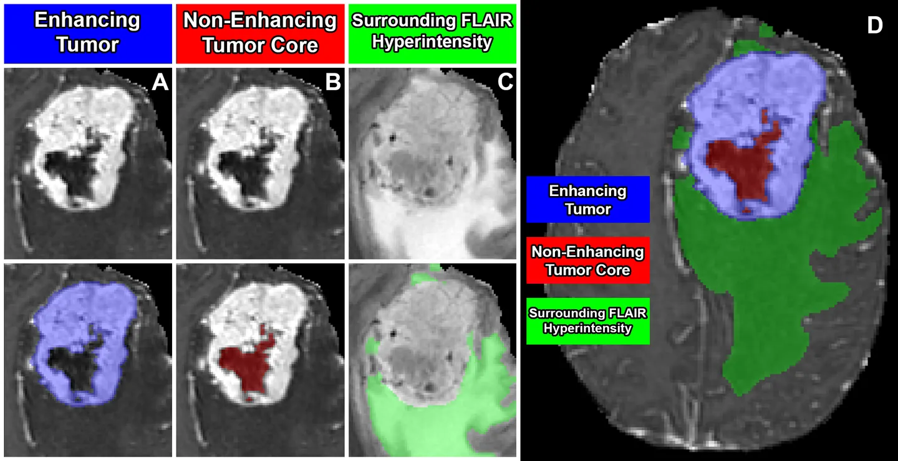

# BraTS 2023-MEN

<div align="center">
    <a href="https://github.com/openmedlab/"></a>
</div>
<p style="text-align:center;font-size:10px;"><em></em></p>

## Dataset Information

**BraTS2023-MEN** (Brain Tumor Segmentation 2023 Meningioma Challenge) is one of the five segmentation subtasks of BraTS2023. Unlike the regular BraTS challenges that segment brain gliomas, this subtask aims to segment **meningiomas** from multimodal MR images (mpMRI). The dataset released in May 2023 includes data from 6 centers totaling 1650 cases, with 1000 annotated training cases, each providing input images of four MR sequences (t1w, t1c, t2w, t2f) along with segmentation results for meningiomas. The annotations mainly include the Non-Enhancing Tumor Core (NETC), the surrounding Non-Enhancing FLAIR hyperintense signal (SNFH), and the Enhancing Tumor (ET). The validation set provides images without annotations, which can be submitted for validation on the official website, while the test set data is not publicly available.

**Meningiomas** are the most common primary intracranial tumors in adults. Most meningiomas (about 80%) are World Health Organization (WHO) grade I benign tumors and can usually be well controlled through observation, surgical resection, and/or radiation therapy. However, higher-grade meningiomas (WHO grade II and III) are associated with a significantly higher incidence and mortality rate and are prone to recurrence. Like the other BraTS23 segmentation tasks, all labels and data have been preprocessed, including alignment with a unified anatomical template, adjustment to the same resolution (1 mm³), and skull stripping.

## Dataset Meta Information

| Dimensions | Modality | Task Type | Anatomical Structures          | Anatomical Area | Number of Categories | Data Volume | File Format |
|------------|----------|-----------|--------------------------------|-----------------|----------------------|-------------|-------------|
| 3D         | mpMRI       | Segmentation | Meningioma | Head            | 3                    | 1650        | .nii.gz     |


### Resolution Details

The spacing and size of all images in the dataset have been preprocessed to be consistent.

| Dataset Statistics | spacing (mm)     | size            |
|--------------------|------------------|-----------------|
| min                | (1.0, 1.0, 1.0)              | (240, 240, 155)     |
| median             | (1.0, 1.0, 1.0)           | (240, 240, 155) |
| max                | (1.0, 1.0, 1.0)              | (240, 240, 155) |

Number of 2D slices: 620,000 (based on the calculation of 155000 × 4 from 1000 training cases).

## Label Information Statistics

| Segmentation Class | NETC (Non-Enhancing Tumor Core) | SNFH (Surrounding Non-Enhancing FLAIR hyperintense) | ET (Enhancing Tumor) |
|--------------------|---------------------------------|----------------------------------------------------|----------------------|
| Case Count         | 339                             | 536                                                | 999                  |
| Detection Rate     | 33.9%                           | 53.6%                                              | 99.9%                |
| Min Volume (cm³)   | 0                               | 0                                                  | 0                    |
| Median Volume (cm³)| 0.32                            | 17                                                 | 9                    |
| Max Volume (cm³)   | 80                              | 250                                                | 194                  |


## Visualization

<div align="center">
    <a href="https://github.com/openmedlab/"></a>
</div>
<p style="text-align:center;font-size:10px;"><em> Visualization from official website.</em></p>

## File Structure

The official file structure is as follows, containing two main directories: `ASNR-MICCAI-BraTS2023-MEN-Challenge-TrainingData` and `ASNR-MICCAI-BraTS2023-MEN-Challenge-ValidationData`, which represent the training data and validation data, respectively.

``` 
├── ASNR-MICCAI-BraTS2023-MEN-Challenge-TrainingData
│   ├── BraTS-MEN-00004-000
│   │   ├── BraTS-MEN-00004-000-seg.nii.gz
│   │   ├── BraTS-MEN-00004-000-t1c.nii.gz
│   │   ├── BraTS-MEN-00004-000-t1n.nii.gz
│   │   ├── BraTS-MEN-00004-000-t2f.nii.gz
│   │   └── BraTS-MEN-00004-000-t2w.nii.gz
│   ...
│
└── ASNR-MICCAI-BraTS2023-MEN-Challenge-ValidationData
    ├── BraTS-MEN-00000-000
    │   ├── BraTS-MEN-00000-000-t1c.nii.gz
    │   ├── BraTS-MEN-00000-000-t1n.nii.gz
    │   ├── BraTS-MEN-00000-000-t2f.nii.gz
    │   └── BraTS-MEN-00000-000-t2w.nii.gz
```

## Authors and Institutions

Evan Calabrese (Department of Radiology, Division of Neuroradiology, Duke University Medical Center, USA)

Dominic Labella (Department of Radiation Oncology, Duke University Medical Center, USA)


## Source Information

Official Website: https://www.synapse.org/#!Synapse:syn51156910/wiki/622353

Download Link: https://www.synapse.org/#!Synapse:syn51514106

Article Address: https://arxiv.org/pdf/2305.07642.pdf

Publication Date: May, 2023.

## Citation

``` 
@misc{labella2023asnrmiccai,
      title={The ASNR-MICCAI Brain Tumor Segmentation (BraTS) Challenge 2023: Intracranial Meningioma}, 
      author={Dominic LaBella and Maruf Adewole and Michelle Alonso-Basanta and Talissa Altes and Syed Muhammad Anwar and Ujjwal Baid and Timothy Bergquist and Radhika Bhalerao and Sully Chen and Verena Chung and Gian-Marco Conte and Farouk Dako and James Eddy and Ivan Ezhov and Devon Godfrey and Fathi Hilal and Ariana Familiar and Keyvan Farahani and Juan Eugenio Iglesias and Zhifan Jiang and Elaine Johanson and Anahita Fathi Kazerooni and Collin Kent and John Kirkpatrick and Florian Kofler and Koen Van Leemput and Hongwei Bran Li and Xinyang Liu and Aria Mahtabfar and Shan McBurney-Lin and Ryan McLean and Zeke Meier and Ahmed W Moawad and John Mongan and Pierre Nedelec and Maxence Pajot and Marie Piraud and Arif Rashid and Zachary Reitman and Russell Takeshi Shinohara and Yury Velichko and Chunhao Wang and Pranav Warman and Walter Wiggins and Mariam Aboian and Jake Albrecht and Udunna Anazodo and Spyridon Bakas and Adam Flanders and Anastasia Janas and Goldey Khanna and Marius George Linguraru and Bjoern Menze and Ayman Nada and Andreas M Rauschecker and Jeff Rudie and Nourel Hoda Tahon and Javier Villanueva-Meyer and Benedikt Wiestler and Evan Calabrese},
      year={2023},
      eprint={2305.07642},
      archivePrefix={arXiv},
      primaryClass={cs.CV}
}
```

Original introduction article is [here](https://zhuanlan.zhihu.com/p/662644135).