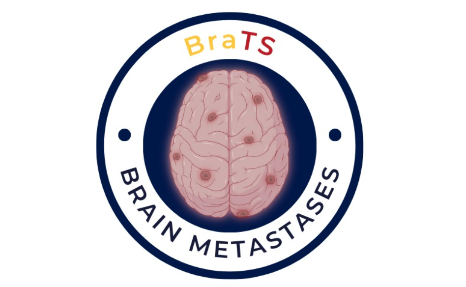
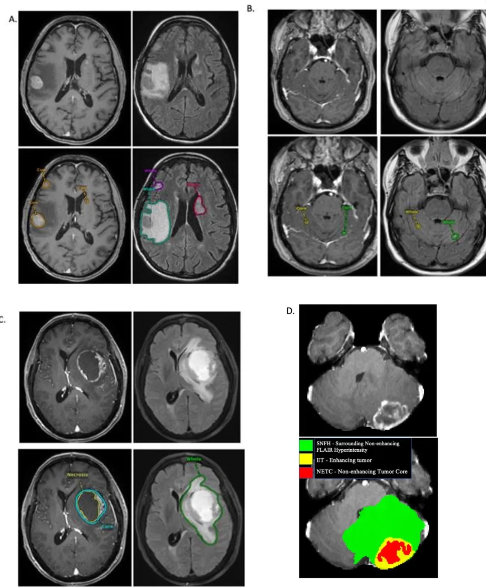

# BraTS 2023-MET

<div align="center">
    <a href="https://github.com/openmedlab/"></a>
</div>
<p style="text-align:center;font-size:10px;"><em></em></p>

## Dataset Information

BraTS2023-MET (BraTS Brain Metastases Challenge 2023) is one of the five segmentation subtasks of BraTS2023. Unlike the regular BraTS challenges that segment brain gliomas, this subtask aims to segment brain metastases from multimodal MR images (mpMRI). The dataset released in June 2023 totals 328 cases, including 238 annotated training cases, each providing input images of four MR sequences (t1w, t1c, t2w, t2f) as well as segmentation results for brain metastases. The annotations mainly include the Non-Enhancing Tumor Core (NETC), the surrounding Non-Enhancing FLAIR hyperintense signal (SNFH), and the Enhancing Tumor (ET). The validation set provides images but no annotations and can be submitted for validation on the official website, while the test set data is not publicly available.

Brain metastases are the most common form of malignant tumors in the central nervous system of adults, originating from primary tumors in other parts of the body. Segmenting brain metastases is challenging, mainly because patients often have multiple small metastases, and accurate detection and segmentation are crucial for assessing the condition and formulating treatment plans. Like the other BraTS23 segmentation tasks, all labels and data have been preprocessed, including alignment with a unified anatomical template, adjustment to the same resolution (1 mm³), and skull stripping.

## Dataset Meta Information

| Dimensions | Modality | Task Type | Anatomical Structures | Anatomical Area | Number of Categories | Data Volume | File Format |
|------------|--------|-----------|-----------------------|-----------------|----------------------|-------------|-------------|
| 3D         | mpMRI       | Segmentation | Brain metastases      | Head            | 3                    | 328         | .nii.gz     |


### Resolution Details

The spacing and size of all images in the dataset have been preprocessed to be consistent.

| Dataset Statistics | spacing (mm)     | size            |
|--------------------|------------------|-----------------|
| min                | (1.0, 1.0, 1.0)              | (240, 240, 155)     |
| median             | (1.0, 1.0, 1.0)           | (240, 240, 155) |
| max                | (1.0, 1.0, 1.0)              | (240, 240, 155) |

Number of 2D slices: 147,560 (based on the calculation of 155 × 4 from 238 training cases).

## Label Information Statistics

| Segmentation Class | NETC (Non-Enhancing Tumor Core) | SNFH (Surrounding Non-Enhancing FLAIR hyperintense) | ET (Enhancing Tumor) |
|--------------------|---------------------------------|----------------------------------------------------|----------------------|
| Case Count         | 162                             | 232                                                | 238                  |
| Detection Rate     | 68%                             | 97%                                                | 100%                 |
| Min Volume (cm³)   | 0                               | 0                                                  | 0.04                 |
| Median Volume (cm³)| 1.46                            | 25.33                                              | 4.58                 |
| Max Volume (cm³)   | 41                              | 280                                                | 63                   |


## Visualization

<div align="center">
    <a href="https://github.com/openmedlab/"></a>
</div>
<p style="text-align:center;font-size:10px;"><em> Images are from the paper. A: Displays the enhancing tumor and surrounding edema in a T1Gd scan. B: Small lesions are identified within the cerebellar hemisphere, with the enhancing tumor and surrounding area also annotated. C: Shows a large necrotic tumor in the left frontal lobe and its segmentation. D: ITK-SNAP image displays the enhancing tumor, surrounding non-enhancing FLAIR hyperintense regions, and the non-enhancing tumor core. </em></p>

## File Structure

The official file structure is as follows, containing two main directories: `ASNR-MICCAI-BraTS2023-MET-Challenge-TrainingData` and `ASNR-MICCAI-BraTS2023-MET-Challenge-ValidationData`, which represent the training data and validation data, respectively.

``` 
├── ASNR-MICCAI-BraTS2023-MET-Challenge-TrainingData
│   ├── BraTS-MET-00002-000
│   │   ├── BraTS-MET-00002-000-seg.nii.gz
│   │   ├── BraTS-MET-00002-000-t1c.nii.gz
│   │   ├── BraTS-MET-00002-000-t1n.nii.gz
│   │   ├── BraTS-MET-00002-000-t2f.nii.gz
│   │   └── BraTS-MET-00002-000-t2w.nii.gz
│   ...
│
└── ASNR-MICCAI-BraTS2023-MET-Challenge-ValidationData
    ├── BraTS-MET-00013-000
    │   ├── BraTS-MET-00013-000-t1c.nii.gz
    │   ├── BraTS-MET-00013-000-t1n.nii.gz
    │   ├── BraTS-MET-00013-000-t2f.nii.gz
    │   └── BraTS-MET-00013-000-t2w.nii.gz
```

## Authors and Institutions

Mariam Aboian (Department of Radiology and Biomedical Imaging, Yale University, USA)

Jeffrey Rudie (Scripps Clinic and University of California, San Diego, USA)

Spyridon Bakas (University of Pennsylvania, USA)

Ahmed Moawad (Department of Radiology, Catholic Mercy Medical Center, USA)

Anastasia Janas (Department of Radiology and Biomedical Imaging, Yale University, USA)

Ujjwal Baid (University of Pennsylvania, USA)

Kiril Krantchev (Charité Medical School, Berlin, Germany)


## Source Information

Official Website: https://www.synapse.org/#!Synapse:syn51156910/wiki/622553

Download Link: https://www.synapse.org/#!Synapse:syn51514107

Article Address: https://arxiv.org/abs/2306.00838

Publication Date: June, 2023.

## Citation

``` 
@misc{moawad2023brain,
      title={The Brain Tumor Segmentation (BraTS-METS) Challenge 2023: Brain Metastasis Segmentation on Pre-treatment MRI}, 
      author={Ahmed W. Moawad and Anastasia Janas and Ujjwal Baid and Divya Ramakrishnan and Leon Jekel and Kiril Krantchev and Harrison Moy and Rachit Saluja and Klara Osenberg and Klara Wilms and Manpreet Kaur and Arman Avesta and Gabriel Cassinelli Pedersen and Nazanin Maleki and Mahdi Salimi and Sarah Merkaj and Marc von Reppert and Niklas Tillmans and Jan Lost and Khaled Bousabarah and Wolfgang Holler and MingDe Lin and Malte Westerhoff and Ryan Maresca and Katherine E. Link and Nourel hoda Tahon and Daniel Marcus and Aristeidis Sotiras and Pamela LaMontagne and Strajit Chakrabarty and Oleg Teytelboym and Ayda Youssef and Ayaman Nada and Yuri S. Velichko and Nicolo Gennaro and Connectome Students and Group of Annotators and Justin Cramer and Derek R. Johnson and Benjamin Y. M. Kwan and Boyan Petrovic and Satya N. Patro and Lei Wu and Tiffany So and Gerry Thompson and Anthony Kam and Gloria Guzman Perez-Carrillo and Neil Lall and Group of Approvers and Jake Albrecht and Udunna Anazodo and Marius George Lingaru and Bjoern H Menze and Benedikt Wiestler and Maruf Adewole and Syed Muhammad Anwar and Dominic Labella and Hongwei Bran Li and Juan Eugenio Iglesias and Keyvan Farahani and James Eddy and Timothy Bergquist and Verena Chung and Russel Takeshi Shinohara and Farouk Dako and Walter Wiggins and Zachary Reitman and Chunhao Wang and Xinyang Liu and Zhifan Jiang and Koen Van Leemput and Marie Piraud and Ivan Ezhov and Elaine Johanson and Zeke Meier and Ariana Familiar and Anahita Fathi Kazerooni and Florian Kofler and Evan Calabrese and Sanjay Aneja and Veronica Chiang and Ichiro Ikuta and Umber Shafique and Fatima Memon and Gian Marco Conte and Spyridon Bakas and Jeffrey Rudie and Mariam Aboian},
      year={2023},
      eprint={2306.00838},
      archivePrefix={arXiv},
      primaryClass={q-bio.OT}
}
```

Original introduction article is [here](https://zhuanlan.zhihu.com/p/662538981).