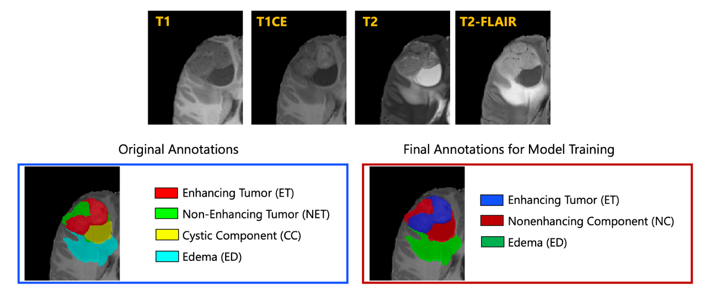

# BraTS 2023-PED

<div align="center">
    <a href="https://github.com/openmedlab/"></a>
</div>
<p style="text-align:center;font-size:10px;"><em></em></p>

## Dataset Information

BraTS2023-PED (BraTS Pediatrics Tumor Challenge) is one of the five segmentation subtasks of BraTS2023. Unlike the regular BraTS challenges that segment adult brain gliomas, this subtask aims to segment pediatric brain gliomas from multimodal MR images (mpMRI). The dataset released in May 2023 includes data from 3 centers totaling 228 cases, with 99 cases in the publicly annotated training set, each providing input images of four MR sequences (t1w, t1c, t2w, t2f) along with segmentation results. The annotations mainly include the non-enhancing component (NEC), edema (Edema), and enhancing tumor (ET). The validation set provides images but no annotations, which can be submitted for validation on the official website, while the test set data is not publicly available.

Brain and central nervous system tumors in children are the most common cause of disease-related death in children. Although pediatric tumors may have some similarities with adult tumors, their imaging and clinical presentations are different. Like the other BraTS23 segmentation tasks, all labels and data have been preprocessed, including alignment with a unified anatomical template, adjustment to the same resolution (1 mm³), and skull stripping.

## Dataset Meta Information

| Dimensions | Modality | Task Type | Anatomical Structures | Anatomical Area | Number of Categories | Data Volume | File Format |
|------------|--------|-----------|-----------------------|-----------------|----------------------|-------------|-------------|
| 3D         | mpMRI       | Segmentation | Glioma in children    | Head            | 3                    | 228         | .nii.gz     |


### Resolution Details

The spacing and size of all images in the dataset have been preprocessed to be consistent.

| Dataset Statistics | spacing (mm)     | size            |
|--------------------|------------------|-----------------|
| min                | (1.0, 1.0, 1.0)              | (240, 240, 155)     |
| median             | (1.0, 1.0, 1.0)           | (240, 240, 155) |
| max                | (1.0, 1.0, 1.0)              | (240, 240, 155)) |

Number of 2D slices: 61,380 (based on the calculation of 15,345 × 4 from 99 training cases).

## Label Information Statistics

| Segmentation Class | NC (Non-Enhancing Core) | ED (Edema) | ET (Enhancing Tumor) |
|--------------------|-------------------------|------------|----------------------|
| Case Count         | 99                      | 57         | 88                   |
| Detection Rate     | 100%                    | 57.58%     | 88.89%               |
| Min Volume (cm³)   | 1                       | 0          | 0                    |
| Median Volume (cm³)| 30                      | 1          | 6                    |
| Max Volume (cm³)   | 125                     | 132        | 64                   |


## Visualization

<div align="center">
    <a href="https://github.com/openmedlab/"></a>
</div>
<p style="text-align:center;font-size:10px;"><em> Visualization in paper.</em></p>

## File Structure

The official file structure is as follows, containing two main directories: `ASNR-MICCAI-BraTS2023-PED-Challenge-TrainingData` and `ASNR-MICCAI-BraTS2023-PED-Challenge-ValidationData`, which represent the training data and validation data, respectively.

``` 
├── ASNR-MICCAI-BraTS2023-PED-Challenge-TrainingData
│   ├── BraTS-PED-00002-000
│   │   ├── BraTS-PED-00002-000-seg.nii.gz
│   │   ├── BraTS-PED-00002-000-t1c.nii.gz
│   │   ├── BraTS-PED-00002-000-t1n.nii.gz
│   │   ├── BraTS-PED-00002-000-t2f.nii.gz
│   │   └── BraTS-PED-00002-000-t2w.nii.gz
│   ...
│
└── ASNR-MICCAI-BraTS2023-PED-Challenge-ValidationData
    ├── BraTS-PED-00030-000
    │   ├── BraTS-PED-00030-000-t1c.nii.gz
    │   ├── BraTS-PED-00030-000-t1n.nii.gz
    │   ├── BraTS-PED-00030-000-t2f.nii.gz
    │   └── BraTS-PED-00030-000-t2w.nii.gz
```

## Authors and Institutions

Introduce authors and their institutions of this dataset.


## Source Information

Official Website: https://www.synapse.org/#!Synapse:syn51156910/wiki/622461

Download Link: https://www.synapse.org/#!Synapse:syn51514108

Article Address: https://arxiv.org/abs/2305.17033

Publication Date: May, 2023.

## Citation

``` 
@misc{kazerooni2023brain,
      title={The Brain Tumor Segmentation (BraTS) Challenge 2023: Focus on Pediatrics (CBTN-CONNECT-DIPGR-ASNR-MICCAI BraTS-PEDs)}, 
      author={Anahita Fathi Kazerooni and Nastaran Khalili and Xinyang Liu and Debanjan Haldar and Zhifan Jiang and Syed Muhammed Anwar and Jake Albrecht and Maruf Adewole and Udunna Anazodo and Hannah Anderson and Sina Bagheri and Ujjwal Baid and Timothy Bergquist and Austin J. Borja and Evan Calabrese and Verena Chung and Gian-Marco Conte and Farouk Dako and James Eddy and Ivan Ezhov and Ariana Familiar and Keyvan Farahani and Shuvanjan Haldar and Juan Eugenio Iglesias and Anastasia Janas and Elaine Johansen and Blaise V Jones and Florian Kofler and Dominic LaBella and Hollie Anne Lai and Koen Van Leemput and Hongwei Bran Li and Nazanin Maleki and Aaron S McAllister and Zeke Meier and Bjoern Menze and Ahmed W Moawad and Khanak K Nandolia and Julija Pavaine and Marie Piraud and Tina Poussaint and Sanjay P Prabhu and Zachary Reitman and Andres Rodriguez and Jeffrey D Rudie and Ibraheem Salman Shaikh and Lubdha M. Shah and Nakul Sheth and Russel Taki Shinohara and Wenxin Tu and Karthik Viswanathan and Chunhao Wang and Jeffrey B Ware and Benedikt Wiestler and Walter Wiggins and Anna Zapaishchykova and Mariam Aboian and Miriam Bornhorst and Peter de Blank and Michelle Deutsch and Maryam Fouladi and Lindsey Hoffman and Benjamin Kann and Margot Lazow and Leonie Mikael and Ali Nabavizadeh and Roger Packer and Adam Resnick and Brian Rood and Arastoo Vossough and Spyridon Bakas and Marius George Linguraru},
      year={2023},
      eprint={2305.17033},
      archivePrefix={arXiv},
      primaryClass={eess.IV}
}
```

Original introduction article is [here](https://zhuanlan.zhihu.com/p/662772013).