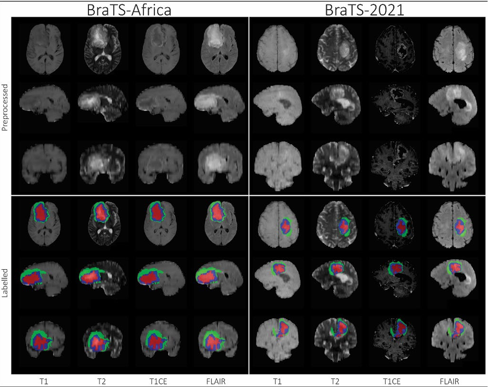
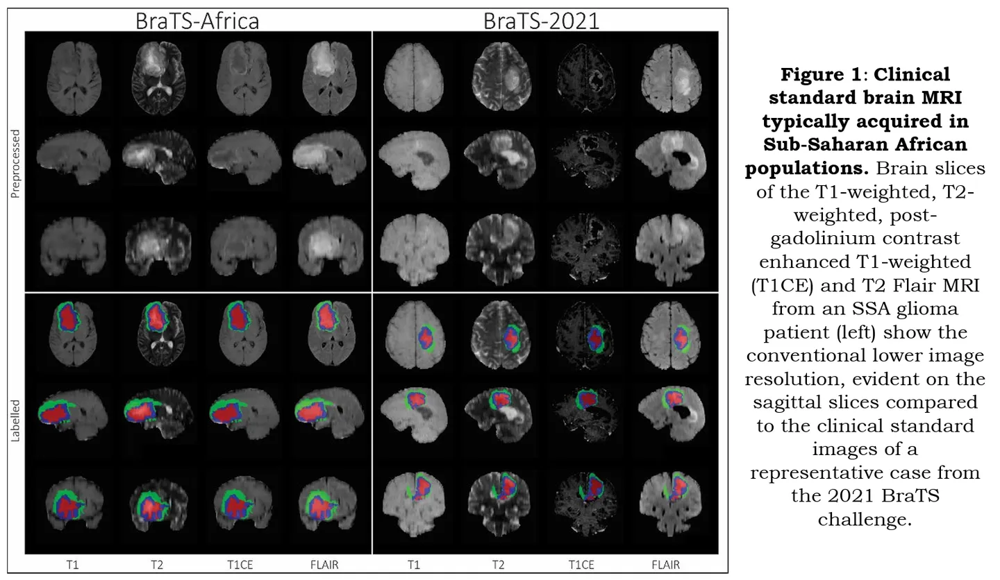

# BraTS 2023-SSA

<div align="center">
    <a href="https://github.com/openmedlab/"></a>
</div>
<p style="text-align:center;font-size:10px;"><em></em></p>

## Dataset Information

**The BraTS2023-SSA** (Brain Tumor Segmentation 2023 Sub-Saharan Africa Challenge) is one of the five segmentation subtasks of BraTS2023, focusing on the segmentation of gliomas in patients from the **Sub-Saharan Africa region**. The dataset includes 60 annotated training samples, 15 unannotated validation samples, and 30 test samples. Each case provides input images of four MR sequences (t1w, t1c, t2w, t2f) along with the segmentation results of gliomas, where the annotations mainly include the non-enhanced tumor core (NC), edema (Oedema), and the enhanced tumor (ET). The validation set provides images without annotations and can be submitted for validation on the official website, while the test set data is not publicly available.


Glioblastoma is one of the deadliest types of cancer, with about 80% of patients dying within two years of diagnosis. Although research over the past 30 years has reduced the mortality rate in the United States by 7%, this progress has not benefited low and middle-income countries, especially in the Sub-Saharan Africa region, where the mortality rate has, on average, increased by about 25%. This region often uses low-quality MRI technology, resulting in images with poor contrast and resolution. Diseases are usually discovered in the late stage, and gliomas in this region have some unique characteristics, such as a high rate of gliosis. This makes the brain glioma images in the Sub-Saharan Africa region significantly different from the images used in the regular BraTS competitions, posing higher demands on the adaptability and diagnostic accuracy of algorithms. Like other BraTS2023 segmentation tasks, all data has been pre-processed, including alignment, resolution adjustment (1 mm³), and skull stripping.

## Dataset Meta Information

| Dimensions | Modality | Task Type | Anatomical Structures         | Anatomical Area | Number of Categories | Data Volume | File Format |
|------------|--------|-----------|-------------------------------|-----------------|----------------------|-------------|-------------|
| 3D         | mpMRI       | Segmentation | Glioma | Head            | 3                    | 105         | .nii.gz     |


### Resolution Details

The spacing and size of all images in the dataset have been preprocessed to be consistent.

| Dataset Statistics | spacing (mm)     | size            |
|--------------------|------------------|-----------------|
| min                | (1.0, 1.0, 1.0)              | (240, 240, 155)     |
| median             | (1.0, 1.0, 1.0)           | (240, 240, 155) |
| max                | (1.0, 1.0, 1.0)              | (240, 240, 155)) |

Number of 2D slices: 37,200 (based on the calculation of 9,300 × 4 from 60 training cases).

## Label Information Statistics

| Segmentation Class | NC (Non-Enhancing Tumor Core) | Oedema | ET (Enhancing Tumor) |
|--------------------|-------------------------------|--------|----------------------|
| Case Count         | 55                            | 60     | 60                   |
| Detection Rate     | 91.67%                        | 100%   | 100%                 |
| Min Volume (cm³)   | 0                             | 0.5    | 0.5                  |
| Median Volume (cm³)| 9                             | 94     | 28                   |
| Max Volume (cm³)   | 122                           | 280    | 122                  |

## Visualization

<div align="center">
    <a href="https://github.com/openmedlab/"></a>
</div>
<p style="text-align:center;font-size:10px;"><em> Visualization 1: Compared with BraTS21 images, the resolution is relatively lower.</em></p>

<div align="center">
    <a href="https://github.com/openmedlab/"></a>
</div>
<p style="text-align:center;font-size:10px;"><em> Visualization 2: Red: Necrotic tumor core, Blue: Enhancing tumor, Green: Edema.</em></p>


## File Structure

The official file structure is as follows, containing two main directories: ASNR-MICCAI-BraTS2023-SSA-Challenge-TrainingData and ASNR-MICCAI-BraTS2023-SSA-Challenge-ValidationData, representing training data and validation data, respectively.

``` 
├── ASNR-MICCAI-BraTS2023-MEN-Challenge-TrainingData
│   ├── BraTS-SSA-00002-000
│   │   ├── BraTS-SSA-00002-000-seg.nii.gz
│   │   ├── BraTS-SSA-00002-000-t1c.nii.gz
│   │   ├── BraTS-SSA-00002-000-t1n.nii.gz
│   │   ├── BraTS-SSA-00002-000-t2f.nii.gz
│   │   └── BraTS-SSA-00002-000-t2w.nii.gz
│   ...
│
└── ASNR-MICCAI-BraTS2023-SSA-Challenge-ValidationData
    ├── BraTS-SSA-00126-000
    │   ├── BraTS-SSA-00126-000-t1c.nii.gz
    │   ├── BraTS-SSA-00126-000-t1n.nii.gz
    │   ├── BraTS-SSA-00126-000-t2f.nii.gz
    │   └── BraTS-SSA-00126-000-t2w.nii.gz
```

## Authors and Institutions

Udunna Anazodo (Montreal Neurological Institute, McGill University, Canada; Crestview Radiology Ltd, Nigeria)

Maruf Adewole (Medical Artificial Intelligence Laboratory, Crestview Radiology Ltd, Nigeria)


## Source Information

Official Website: https://www.synapse.org/#!Synapse:syn51156910/wiki/622556

Download Link: https://www.synapse.org/#!Synapse:syn51514109

Article Address: https://arxiv.org/abs/2305.19369

Publication Date: May, 2023.

## Citation

``` 
@misc{adewole2023brain,
      title={The Brain Tumor Segmentation (BraTS) Challenge 2023: Glioma Segmentation in Sub-Saharan Africa Patient Population (BraTS-Africa)}, 
      author={Maruf Adewole and Jeffrey D. Rudie and Anu Gbadamosi and Oluyemisi Toyobo and Confidence Raymond and Dong Zhang and Olubukola Omidiji and Rachel Akinola and Mohammad Abba Suwaid and Adaobi Emegoakor and Nancy Ojo and Kenneth Aguh and Chinasa Kalaiwo and Gabriel Babatunde and Afolabi Ogunleye and Yewande Gbadamosi and Kator Iorpagher and Evan Calabrese and Mariam Aboian and Marius Linguraru and Jake Albrecht and Benedikt Wiestler and Florian Kofler and Anastasia Janas and Dominic LaBella and Anahita Fathi Kzerooni and Hongwei Bran Li and Juan Eugenio Iglesias and Keyvan Farahani and James Eddy and Timothy Bergquist and Verena Chung and Russell Takeshi Shinohara and Walter Wiggins and Zachary Reitman and Chunhao Wang and Xinyang Liu and Zhifan Jiang and Ariana Familiar and Koen Van Leemput and Christina Bukas and Maire Piraud and Gian-Marco Conte and Elaine Johansson and Zeke Meier and Bjoern H Menze and Ujjwal Baid and Spyridon Bakas and Farouk Dako and Abiodun Fatade and Udunna C Anazodo},
      year={2023},
      eprint={2305.19369},
      archivePrefix={arXiv},
      primaryClass={eess.IV}
}
```

Original introduction article is [here](https://zhuanlan.zhihu.com/p/662538981).