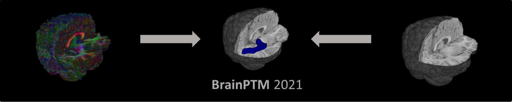
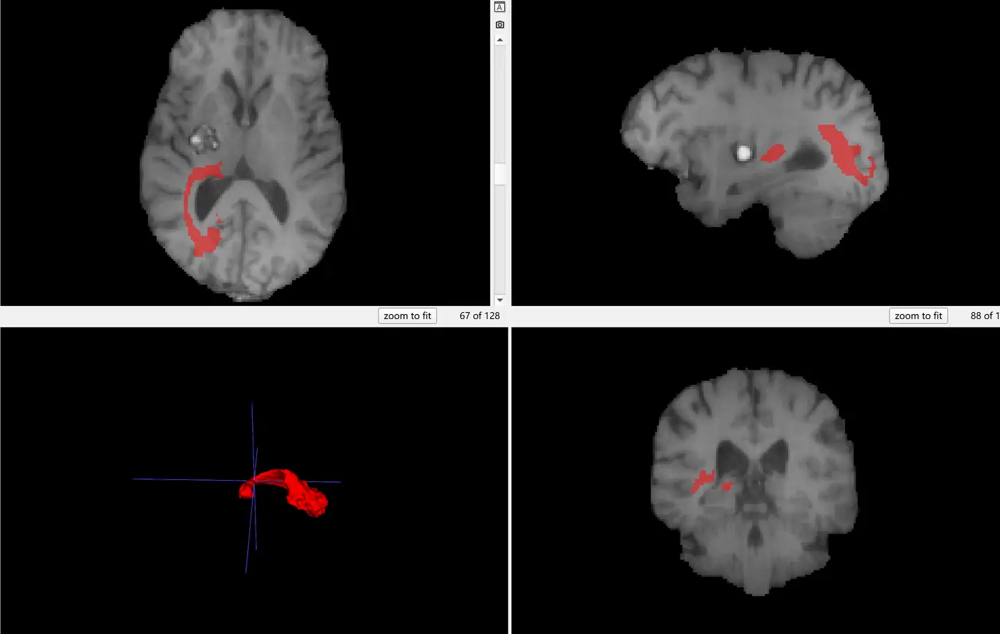
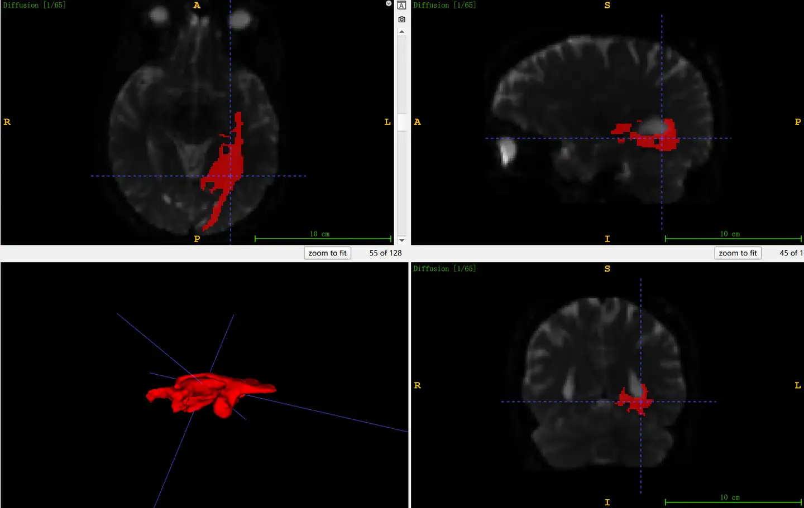

# BrainPTM

<div align="center">
    <a href="https://github.com/openmedlab/"></a>
</div>
<p style="text-align:center;font-size:10px;"><em></em></p>

## Dataset Information

The BrainPTM dataset is a brain white matter tract mapping dataset. This dataset provides annotated results of white matter tracts from brain MR scans collected from 75 patients scheduled for brain tumor resection. The pathologies include oligodendroglioma, astrocytoma, glioblastoma, and cavernous angioma. Each patient underwent T1-weighted imaging and diffusion-weighted imaging. The dataset is divided into a training set and a test set, with the training set consisting of 60 cases including semi-automatically annotated white matter tract masks by experts, and the test set consisting of 15 cases without annotations.

Accurate mapping of white matter tracts is crucial for the success of neurosurgical planning and navigation. Traditional methods for white matter tract mapping require specific neuroanatomical knowledge and are time-consuming. Automating and accelerating this process would significantly reduce the time required for neurosurgical planning and may improve the accuracy of tract mapping, which is vital for brain surgery. Advances in multimodal deep neural networks suggest that these networks could aid in white matter tract mapping. The dataset provides a foundation for developing fully automated models for white matter tract tracing.

## Dataset Meta Information

| Dimensions | Modality      | Task Type      | Anatomical Structures | Anatomical Area | Number of Categories | Data Volume | File Format |
|------------|---------------|----------------|-----------------------|-----------------|----------------------|-------------|-------------|
| 3D         | MR-T1，MR-DWI  | Segmentation   | White matter bundles  | Brain           | 1                    | 75          | .nii.gz     |


### Resolution Details

| Dataset Statistics | spacing (mm)        | size             |
|--------------------|---------------------|------------------|
| min                | (1.25, 1.25, 1.25)  | (128, 144, 128)  |
| median             | (1.25, 1.25, 1.25)  | (128, 144, 128)  |
| max                | (1.26, 1.30, 1.30)  | (128, 144, 128)  |

Number of 2D slices in the dataset: 7680.

## Label Information Statistics

Only count the training set.

| Anatomical Structure | White matter tracts |
|----------------------|---------------------|
| Number of Patients   | 60                  |
| Coverage Percentage  | 100%                |
| Minimum Volume (cm³) | 9.04                |
| Median Volume (cm³)  | 14.68               |
| Maximum Volume (cm³) | 26.32               |


## Visualization

<div align="center">
    <a href="https://github.com/openmedlab/"></a>
</div>
<p style="text-align:center;font-size:10px;"><em>Brain T1 images and corresponding white matter tract annotations.</em></p>

<div align="center">
    <a href="https://github.com/openmedlab/"></a>
</div>
<p style="text-align:center;font-size:10px;"><em>Brain diffusion-weighted imaging images and corresponding white matter tract annotations.</em></p>

## File Structure

``` 
BrainPTM2021
├── sheba75_data_test
│   ├── case_61
│   │   ├── brain_mask.nii.gz
│   │   ├── Diffusion.bvals
│   │   ├── Diffusion.bvecs
│   │   ├── Diffusion.nii.gz
│   │   ├── T1.nii.gz
│   │   └── ...  
│   └── ...
├── sheba75_data_train
│   └── ...  
├── sheba75_streamlines_train
│   ├── case_1
│   │   ├── OR_left.trk
│   │   └── OR_right.trk
│   └── ...  
├── sheba75_tracts_test_dummy
│   ├── case_61
│   │   ├── CST_left.nii.gz
│   │   ├── CST_right.nii.gz
│   │   ├── OR_left.nii.gz
│   │   └── OR_right.nii.gz
│   │   └── ...  
│   └── ...
├── sheba75_tracts_train
│   ├── case_1
│   │   ├── OR_left.nii.gz
│   │   └── OR_right.nii.gz
│   └── ...  
```

## Authors and Institutions

Itzik Avital (School of Electrical Engineering, Tel Aviv University, Israel)

Ilya Nelkenbaum (School of Electrical Engineering, Tel Aviv University, Israel)

Galia Tsarfaty (Department of Diagnostic Imaging, Sheba Medical Center, Sackler Faculty of Medicine, Tel Aviv University, Israel)

Eli Konen (Department of Diagnostic Imaging, Sheba Medical Center, Sackler Faculty of Medicine, Tel Aviv University, Israel)

Nahum Kiryati (School of Electrical Engineering, Tel Aviv University, Israel)

Arnaldo Mayer (Department of Diagnostic Imaging, Sheba Medical Center, Sackler Faculty of Medicine, Tel Aviv University, Israel)

## Source Information

Official Website: https://brainptm-2021.grand-challenge.org/

Download Link: https://brainptm-2021.grand-challenge.org/

Article Address: https://ieeexplore.ieee.org/document/8906050

Publication Date: 2021

## Citation

``` 
@article{avital2019neural,
  title={Neural Segmentation of Seeding ROIs (sROIs) for Pre-Surgical Brain Tractography},
  author={Avital, Itzik and Nelkenbaum, Ilya and Tsarfaty, Galia and Konen, Eli and Kiryati, Nahum and Mayer, Arnaldo},
  journal={IEEE transactions on medical imaging},
  volume={39},
  number={5},
  pages={1655--1667},
  year={2019},
  publisher={IEEE}
},
@inproceedings{nelkenbaum2020automatic,
  title={Automatic Segmentation of White Matter Tracts Using Multiple Brain MRI Sequences},
  author={Nelkenbaum, Ilya and Tsarfaty, Galia and Kiryati, Nahum and Konen, Eli and Mayer, Arnaldo},
  booktitle={2020 IEEE 17th International Symposium on Biomedical Imaging (ISBI)},
  pages={368--371},
  year={2020},
  organization={IEEE}
}
```

Original introduction article is [here](https://zhuanlan.zhihu.com/p/715464986).