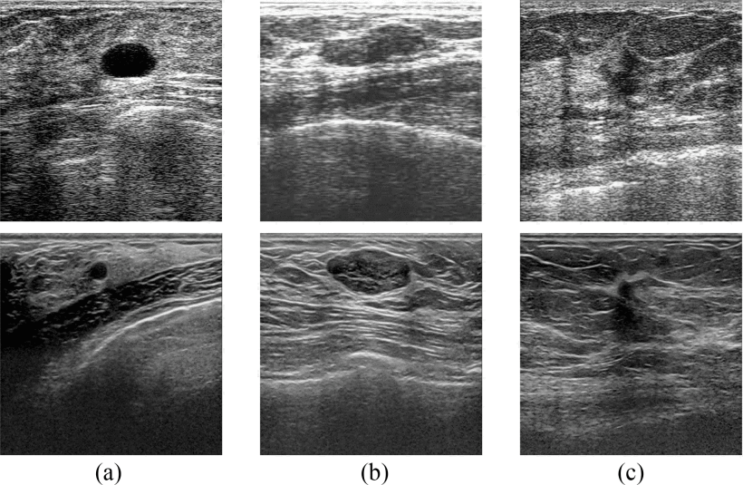
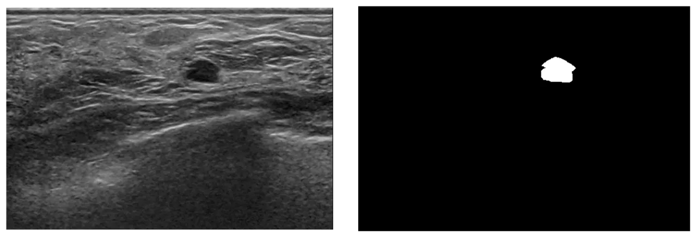

# Breast Ultrasound Dataset B

<div align="center">
    <a href="https://github.com/openmedlab/"></a>
</div>
<p style="text-align:center;font-size:10px;"><em></em></p>

## Dataset Information

The Breast Ultrasound Dataset B is a collection specifically aimed at the analysis of breast ultrasound images, comprising a total of 163 images with detailed annotations. Among these images, 53 have been diagnosed as malignant, indicating the presence of breast cancer, while the remaining 110 have been identified as benign, showing non-cancerous breast conditions. The composition of this dataset provides researchers with a unique resource for developing and testing breast cancer detection algorithms. In particular, for the automated identification and classification of breast lesions using deep learning and computer vision techniques, the Breast Ultrasound Dataset B offers a range of challenging cases. As these images are derived from real patient cases, they offer researchers the opportunity to gain a deeper understanding of the characteristics of breast lesions, as well as supporting the validation and improvement of various image processing and machine learning techniques. The availability of the Breast Ultrasound Dataset B is of significant importance in advancing research in the field of automated breast cancer detection, especially in the context of a relative lack of public datasets.

## Dataset Meta Information

| Dimensions | Modality    | Task Type | Anatomical Structures          | Anatomical Area | Number of Categories | Data Volume | File Format |
|------------|-------------|-----------|--------------------------------|-----------------|-------------------|-------------|-------------|
| 2D         | Ultra Sound | Segmentation | Breast lesions | Chest           | 1                 | 163         | PNG         |


### Resolution Details

| Dataset Statistics | size         |
|--------------------|--------------|
| min                | (344, 233)   |
| median             | (501, 400)   |
| max                | (753, 617)   |

## Label Information Statistics

| Segmentation Class | Breast lesions |
|--------------------|----------------|
| Case Count         | 163            |
| Detection Rate     | 100%           |
| Min Volume (cm³)    | 500            |
| Median Volume (cm³) | 6798           |
| Max Volume (cm³)    | 76171         |

## Visualization

<div align="center">
    <a href="https://github.com/openmedlab/"></a>
</div>
<p style="text-align:center;font-size:10px;"><em> Paper visualization.</em></p>

<div align="center">
    <a href="https://github.com/openmedlab/"></a>
</div>
<p style="text-align:center;font-size:10px;"><em> Image and annotation example.</em></p>

## File Structure

The file structure of the Breast Ultrasound Dataset B dataset is as follows. There are two main folders: 'GT' and 'original'. The 'GT' folder contains the segmentation annotations, and the 'original' folder contains the original images. All files end with the .png extension.

``` 
Dataset_B         
├── DatasetB.xlsx 
├── GT            
│   ├── 000001.png
│   ├── 000002.png
│   ├── 000003.png
│   └──  ...
└── original      
    ├── 000001.png
    ├── 000002.png
    ├── 000003.png  
    └── ...
```

## Authors and Institutions

Moi Hoon Yap (School of Computing, Mathematics and Digital Technology, Manchester Metropolitan University, Manchester, UK)

Gerard Pons (Catalan Open University, Barcelona, Spain)

Joan Martí (Department of Computer Science, University of Girona, Girona, Spain)

Sergi Ganau (Radiology Department, UDIAT Diagnostic Centre, Parc Tauli Corporation, Sabadell, Spain)

Melcior Sentís (Radiology Department, UDIAT Diagnostic Centre, Parc Tauli Corporation, Sabadell, Spain)

Reyer Zwiggelaar (Department of Computer Science, Aberystwyth University, Aberystwyth, UK)

Adrian K. Davison (Imaging Sciences Centre, Faculty of Biology, Medicine and Health, University of Manchester, Manchester, UK)

Robert Martí (Department of Computer Science, University of Girona, Girona, Spain)


## Source Information

Official Website: http://www2.docm.mmu.ac.uk/STAFF/M.Yap/dataset.php

Download Link: http://www2.docm.mmu.ac.uk/STAFF/M.Yap/dataset.php

Article Address: https://ieeexplore.ieee.org/stamp/stamp.jsp?arnumber=8003418

Publication Date: 06.19.2018.

## Citation

``` 
@article{yap2017automated,
  title={Automated breast ultrasound lesions detection using convolutional neural networks},
  author={Yap, Moi Hoon and Pons, Gerard and Marti, Joan and Ganau, Sergi and Sentis, Melcior and Zwiggelaar, Reyer and Davison, Adrian K and Marti, Robert},
  journal={IEEE journal of biomedical and health informatics},
  volume={22},
  number={4},
  pages={1218--1226},
  year={2017},
  publisher={IEEE}
}
```

Original introduction article is [here](https://zhuanlan.zhihu.com/p/671225310).