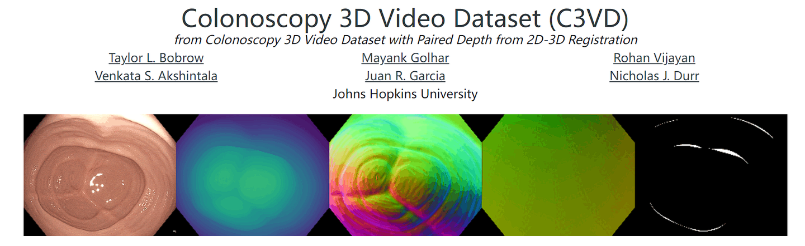
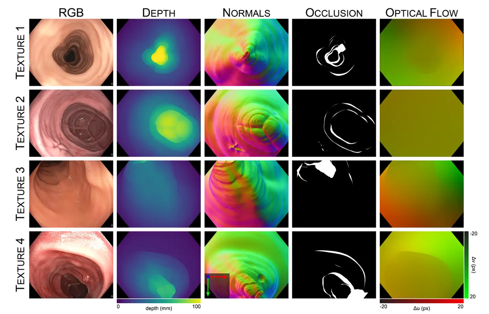

# C3VD Colonoscopy 3D Reconstruction Dataset

<div align="center">
    <a href="https://github.com/openmedlab/"></a>
</div>
<p style="text-align:center;font-size:10px;"><em></em></p>

## Dataset Information

The C3VD (Colonoscopy3DVideoDataset) dataset, developed by Johns Hopkins University, consists of 3D video data from colonoscopies using high-definition clinical colonoscopes and high-fidelity colon models. It serves as a testing benchmark for colonoscopy. The dataset includes 10,015 annotated images, 22 registered videos, and accompanying true depth, surface normals, optical flow, occlusions, six-degree-of-freedom poses, coverage maps, and 3D models. In this work, the authors initially used GANs to generate depth maps of colonoscopy videos, then jointly optimized the camera pose, depth maps, and model rendering results to obtain high-fidelity depth maps, normals, optical flow, and other data, making it the most informative endoscopic dataset available.

The C3VD dataset is of significant importance for the application of 3D computer vision techniques in colonoscopy examinations. It provides an experimental benchmark for evaluating and comparing various computer vision methods, especially in depth estimation, surface reconstruction, and missing area detection. This dataset, through innovative multimodal 2D-3D registration technology, overcomes these challenges, greatly advancing scientific research and technological progress in the field, potentially enhancing the accuracy and efficiency of colonoscopy examinations.

## Dataset Meta Information

| Dimensions  | Modality     | Task Type         | Anatomical Structures | Number of Categories | Data Volume | File Format    |
|-------------|--------------|-------------------|-----------------------|----------------------|-------------|----------------|
| 2D          | Endoscopy    | 3D Reconstruction | Colon                 | 22                   | 10015       | png, tiff, txt |


### Resolution Details

| Dataset Statistics | size         |
|--------------------|--------------|
| min                | 1350 * 1080  |
| median             | 1350 * 1080  |
| max                | 1350 * 1080  |

## Label Information Statistics

| Section of Colon      | Number of Images |
|-----------------------|------------------|
| Cecum                 | 276              |
| Cecum                 | 765              |
| Cecum                 | 370              |
| Cecum                 | 1,142            |
| Cecum                 | 595              |
| Cecum                 | 730              |
| Cecum                 | 465              |
| Cecum                 | 425              |
| Descending Colon      | 148              |
| Sigmoid Colon         | 700              |
| Sigmoid Colon         | 514              |
| Sigmoid Colon         | 613              |
| Sigmoid Colon         | 536              |
| Transcending Colon    | 61               |
| Transcending Colon    | 700              |
| Transcending Colon    | 194              |
| Transcending Colon    | 103              |
| Transcending Colon    | 235              |
| Transcending Colon    | 250              |
| Transcending Colon    | 214              |
| Transcending Colon    | 382              |
| Transcending Colon    | 597              |

## Visualization


<div align="center">
    <a href="https://github.com/openmedlab/"></a>
</div>
<p style="text-align:center;font-size:10px;"><em> ITK-SNAP Visualization.</em></p>

## File Structure

``` 
Dataset
│
├── cecum_t1_a
│   ├── 0000_color.png
│   ├── 0000_depth.tiff
│   ├── 0000_normals.tiff
│   ├── 0000_occlusion.png
│   └── ...
├── cecum_t1_b
│   ├── 0000_color.png
│   ├── 0000_depth.tiff
│   ├── 0000_normals.tiff
│   ├── 0000_occlusion.png
│   └── ...
└── ...
```

## Authors and Institutions

Taylor L. Bobrow (Johns Hopkins University)

Mayank Golhar (Johns Hopkins University)

Rohan Vijayan (Johns Hopkins University)

Venkata S. Akshintala (Johns Hopkins University)

Juan R. Garcia (Johns Hopkins University)

Nicholas J. Durr (Johns Hopkins University)

## Source Information

Official Website: https://durrlab.github.io/C3VD/

Download Link: https://durrlab.github.io/C3VD/

Article Address: https://www.sciencedirect.com/science/article/abs/pii/S1361841523002165

Publication Date: 2023-08

## Citation

``` 
 @article{bobrow2023,
  title={Colonoscopy 3D video dataset with paired depth from 2D-3D registration},
  author={Bobrow, Taylor L and Golhar, Mayank and Vijayan, Rohan and Akshintala, Venkata S and Garcia, Juan R and Durr, Nicholas J},
  journal={Medical Image Analysis},
  pages={102956},
  year={2023},
  publisher={Elsevier},
}
```

Original introduction article is [here](https://zhuanlan.zhihu.com/p/691693267).
