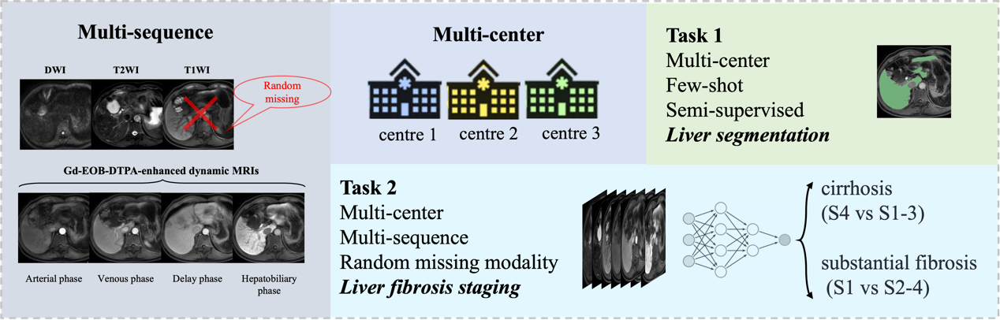

# MICCAI 2024 CARE-LiQA

<div align="center">
    <a href="https://github.com/openmedlab/"></a>
</div>
<p style="text-align:center;font-size:10px;"><em></em></p>

## Competition Vision

Liver fibrosis, caused by chronic viral or metabolic liver diseases, represents a significant global health challenge. Accurate liver segmentation (LiSeg) and fibrosis staging (LiFS) are crucial for assessing the severity of the disease and promoting accurate diagnosis. This challenge focuses on accomplishing two tasks: automated unimodal liver segmentation and multiphase liver fibrosis staging from multi-center liver MRI scans. Our goal is to advance the diagnosis of liver fibrosis and aim to provide a comprehensive benchmark for liver imaging diagnostics.

<div align="center">
    <a href="https://github.com/openmedlab/"></a>
</div>
<p style="text-align:center;font-size:10px;"><em></em></p>

## Competition Content

Task 1: The LiSeg task aims to predict liver segmentation but only a limited number of real annotations are available, including MR images during the Hepatobiliary Phase (HBP) containing key information about the liver.

Task 2: The LiFS task aims to accurately stage liver fibrosis. The severity of liver fibrosis can be divided into four stages (S1-S4). The outcomes of two clinically meaningful binary classification tasks are assessed, namely staging cirrhosis (S1-3 versus S4) and identifying significant fibrosis (S1 versus S2-4).

It's noteworthy that both LiSeg and LiFS encounter the issue of domain shift in multicenter data. Participants are encouraged to effectively integrate complementary information from multiphase and multiparametric MRI to achieve more accurate and universal results. Additionally, automatic LiFS may face challenges including random missing sequences in some patients and misalignment among multiphase MRIs.

To address these tasks, participants are also encouraged to utilize external data, such as the LLD-MMRI2023 dataset, and pretrained models.

## Dataset Information

- Scanners: Philips Ingenia 3.0T, Siemens Skyra 3.0T, Siemens Aera 1.5T.
- Dataset Overview: The competition cohort consists of 440 patients diagnosed with liver fibrosis who underwent multiphase MRI scans. All subjects were scanned at clinical centers using three different MRI scanner vendors. The dataset will include multiphase and multicenter data, featuring T2-weighted imaging, diffusion-weighted imaging, and dynamic MRI enhanced with gadolinium ethoxybenzyl diethylenetriamine pentaacetic acid (Gd-EOB-DTPA). The Gd-EOB-DTPA-enhanced dynamic MRI includes non-contrast phase (T1WI), arterial phase, venous phase, delayed phase, and hepatobiliary phase.
- Contrast-Enhanced Dynamic Scanning: The contrast-enhanced scans are performed based on the injection of Gd-EOB-DTPA contrast agent. The arterial phase is captured 25 seconds after the injection of the contrast agent. Subsequently, the portal venous phase is reached 1 minute later. After another 3 minutes, the delayed phase is obtained, and finally, the hepatobiliary phase is reached 20 minutes later.
- Data Format: All data are provided in Nifty format. Each sample may randomly lack modalities (except for the hepatobiliary phase), and the sequences have not been pre-aligned through spatial registration.

### Training Set

For the LiSeg task, the training set includes 30 segmented samples annotated by experienced clinicians, along with 220 unannotated samples from two different MRI suppliers and three different centers.

For the LiFS task, all 250 training samples, the same as those for LiSeg, are provided with true annotations for liver fibrosis staging.

| Vendor | Center | Num. Studies | Num. Annotations |
|--------|--------|--------------|------------------|
| A      | A      | 100          | 10               |
| B      | B1     | 100          | 10               |
| B      | B2     | 50           | 10               |


### Validation Set

| Vendor | Center | Num. Studies | Num. Annotations |
|--------|--------|--------------|------------------|
| A      | A      | 10           | 10               |
| B      | B1     | 10           | 10               |
| B      | B2     | 10           | 10               |

### Test Set

These 160 test cases include 120 new cases from the vendors provided in the training set and an additional 40 cases from a third vendor that was not previously seen, which are used to test the model's generalization ability.

| Vendor    | Center | Num. studies |
|-----------|--------|--------------|
| A         | A      | 40           |
| B         | B1     | 40           |
| B         | B2     | 40           |
| C (new)   | C      | 40           |

## Authors and Institutions

Xiahai Zhuang (School of Data Science, Fudan University, China)

Jiyao Liu(Institute of Science and Technology for Brain-Inspired Intelligence, Fudan University, China)

Yuanye Liu (School of Data Science, Fudan University, China)

## Source Information

Official Website: http://zmic.org.cn/care_2024/track3/

Download Link: Download the User Agreement Terms and Data Access Agreement form from the official website, fill it out and send it to the organizer to obtain the data download link.

Article Address: TBD

Publication Date: 2024-05-10

## Citation

``` 
TBD
```

Original introduction article is [here](https://zhuanlan.zhihu.com/p/706731023).