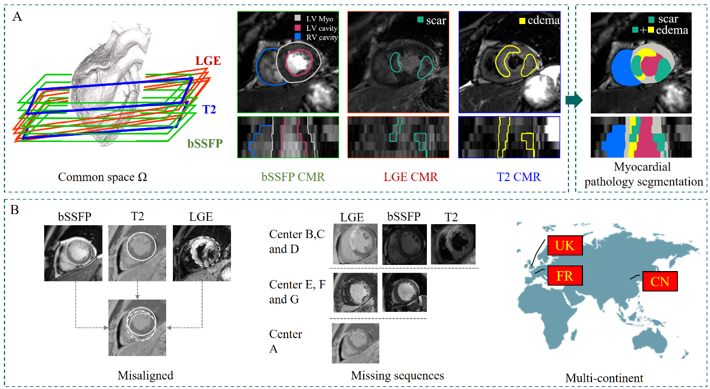

# MICCAI 2024 CARE MyoPS++

<div align="center">
    <a href="https://github.com/openmedlab/"></a>
</div>
<p style="text-align:center;font-size:10px;"><em></em></p>

## Competition Vision

The diagnosis and treatment of myocardial infarction (MI) rely on the accurate identification of myocardial regions, including scars and edema. Although cardiac magnetic resonance imaging (CMR) provides rich information about the lesion, manual segmentation of myocardial lesions remains a time-consuming and technically demanding process, highly dependent on the experience and professional judgment of radiologists.

This competition is dedicated to developing automated algorithms for segmenting myocardial lesions, to accurately segment myocardial scars and edema from multi-sequence cardiac magnetic resonance images (MS-CMR), as shown in Figure 1A. Through this challenge, we aim to establish a comprehensive benchmark in the field of myocardial lesion segmentation, thereby accelerating the development and application of diagnostic tools for myocardial lesion identification in clinical practice. Further improve the diagnosis and treatment management of patients with myocardial infarction, enhancing the effectiveness of personalized treatment."

<div align="center">
    <a href="https://github.com/openmedlab/"></a>
</div>
<p style="text-align:center;font-size:10px;"><em></em></p>

## Competition Content

This track seeks innovative solutions to address the challenges of segmenting myocardial lesions using real-world MS-CMR data, including challenges such as multi-center data, missing sequences, and misalignment of multiple sequence CMR images (as shown in Figure 1B). This track will provide research teams with an open platform to validate and test their methods. For fair comparison, the test dataset will remain hidden. Participants are only required to submit their Docker models to our platform for testing. We will judge the effectiveness of the models based on four metrics: Dice Similarity Coefficient (DSC), Precision (Pre), Sensitivity (SEN), and Hausdorff Distance (HD). We will also evaluate the papers submitted by participants.

## Dataset Information

The MyoPS 2024 Challenge dataset covers 250 patients from 7 centers in China, France, and the United Kingdom. Among these, 145 patients have three types of cardiac magnetic resonance (CMR) sequences: late gadolinium enhancement (LGE), T2-weighted (T2), and balanced steady-state free precession (bSSFP); 24 patients have two sequences: LGE and bSSFP; and 81 patients have only one sequence: LGE. The dataset is annotated with gold standards for scars (2221), edema (1220), left ventricle (500), right ventricle (600), and healthy myocardium (200). All data have been ethically approved and anonymized to ensure compliance with privacy and ethical standards."

## Dataset Meta Information

The following is the specific data distribution of the seven centers.

| Center | Number of Patients | Imaging Type      | Label Type                                                 |
|--------|--------------------|-------------------|------------------------------------------------------------|
| A      | 81                 | LGE               | Scars, cannot assess myocardial edema                      |
| B      | 50                 | LGE, T2 and bSSFP | Scars, edema, myocardial assessment, myocardial function   |
| C      | 45                 | LGE, T2 and bSSFP | Scars, edema, myocardial assessment, myocardial function   |
| D      | 50                 | LGE, T2 and bSSFP | Scars, edema, myocardial assessment, myocardial function   |
| E      | 07                 | LGE and bSSFP     | Scars, cannot assess myocardial edema, myocardial function |
| F      | 09                 | LGE and bSSFP     | Scars, cannot assess myocardial edema, myocardial function |
| G      | 08                 | LGE and bSSFP     | Scars, cannot assess myocardial edema, myocardial function |


## File Structure

We designate the data from centers A, B, C, E, F, and G as the training set, encompassing data from a total of 225,200 patients. The validation and test sets each consist of 25 cases, all derived from center D.

Each patient's cardiac magnetic resonance (CMR) sequences and gold standard labels will be provided in NIfTI format, as follows:

``` 
[Patient Identifier]_LGE.nii.gz
[Patient Identifier]_T2.nii.gz
[Patient Identifier]_C0.nii.gz
[Patient Identifier]_gd.nii.gz (gold standard)
```

## Authors and Institutions

Xiahai Zhuang, Sihan Wang, Yang Zhang (School of Data Science, Fudan University, Shanghai, China)

Wangbin Ding(School of Medical Imaging, Fujian Medical University, Fuzhou, China)

## Source Information

Official Website: http://zmic.org.cn/care_2024/track4/

Download Link: Download the User Agreement Terms and Data Access Agreement form from the official website, fill it out and send it to the organizer to obtain the data download link.

Article Address: TBD

Publication Date: 2024-05-10

## Citation

``` 
TBD
```

Original introduction article is [here](https://zhuanlan.zhihu.com/p/706723217).