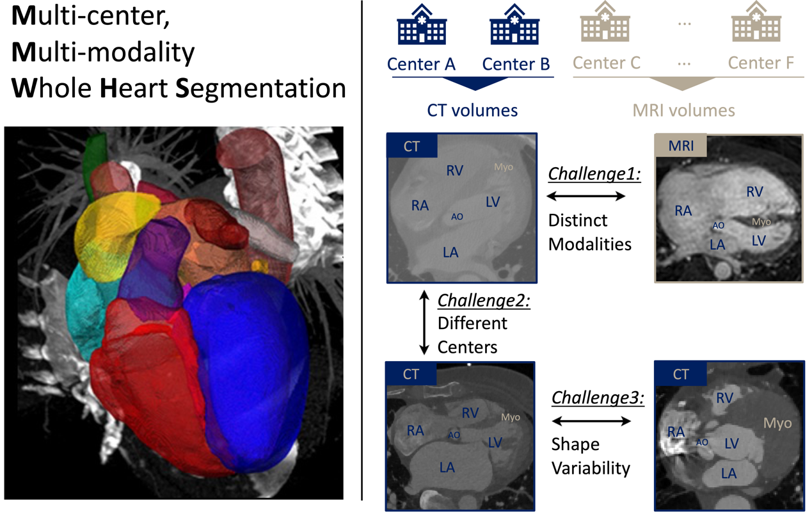

# MICCAI 2024 CARE WHS++

<div align="center">
    <a href="https://github.com/openmedlab/"></a>
</div>
<p style="text-align:center;font-size:10px;"><em></em></p>

## Competition Vision

Cardiovascular diseases have become a major global health threat, and whole heart segmentation (WHS) technologies are crucial for clinical applications, providing essential tools for anatomical and functional modeling of the heart by accurately extracting cardiac substructures. Variations in cardiac shape during the cardiac cycle, differences in multi-center multimodal imaging, and inconsistencies in image quality pose challenges to automated whole heart segmentation. This track is dedicated to advancing the development of algorithms that can automatically and accurately segment the left ventricular blood pool (LV), right ventricular blood pool (RV), left atrial blood pool (LA), right atrial blood pool (RA), left ventricular myocardium (Myo), ascending aorta (AO) or the entire aorta, and pulmonary artery (PA) from CT/CTA and MRI multimodal cardiac images. We aim to establish new technical benchmarks, advance whole heart segmentation technologies, and promote progress in the diagnosis and treatment of cardiovascular diseases.

<div align="center">
    <a href="https://github.com/openmedlab/"></a>
</div>
<p style="text-align:center;font-size:10px;"><em></em></p>

## Competition Content

This track is dedicated to advancing the development of precise and robust segmentation algorithms for seven key substructures in multimodal cardiac imaging—the left ventricular blood pool (LV), right ventricular blood pool (RV), left atrial blood pool (LA), right atrial blood pool (RA), left ventricular myocardium (Myo), ascending aorta (AO), and aorta and pulmonary artery (PA). We will provide research teams with an open platform to validate and test their methods. To ensure the fairness of the competition, the test dataset will remain confidential and not be disclosed. Participants are required to encapsulate their algorithms in Docker containers and submit them to our platform for testing. We will measure model performance using three quantitative indicators: Dice Similarity Coefficient (DSC), Hausdorff Distance (HD), and Average Surface Distance (ASD). Additionally, we will also evaluate the participants' scholarly papers.

## Dataset Information

The WHS++ track provides a dataset covering 206 cases of whole-heart medical imaging from six centers in different countries, including 104 CT/CTA and 102 MRI cases.

The CT/CTA data were acquired using a 64-slice Philips CT scanner, dual-source Siemens CT scanner, and GE CT scanner at centers A and B. The MRI data, based on various Steady-State Free Precession (SSFP) sequences, were collected using Siemens Avanto 1.5T and Philips Achieva 1.5T scanners at centers C, D, E, and F.

This dataset includes gold standard annotations for the left ventricular blood pool (500), right ventricular blood pool (600), left atrial blood pool (420), right atrial blood pool (550), left ventricular myocardium (205), ascending aorta or entire aorta (820), and pulmonary artery (850). All data have been ethically approved and anonymized to meet privacy protection and ethical standards.

## File Structure

We have divided data from centers A, B, C, and D, as well as all data from center E, totaling 86 cases, into the training set. Part of the data from centers A, B, C, and D, totaling 50 cases, has been designated as the validation set. Part of the data from centers A, B, C, and D, along with all data from center F, totaling 70 cases, has been allocated to the test set.

Below is the specific data distribution across the six centers:

| Modality | Center | Total Cases | Training Set | Validation Set | Test Set |
|----------|--------|-------------|--------------|----------------|----------|
| CT       | A      | 60          | 20           | 20             | 20       |
| CT       | B      | 54          | 20           | 10             | 14       |
| MRI      | C&D    | 60          | 20           | 20             | 20       |
| MRI      | E      | 26          | 26           | /              | /        |
| MRI      | F      | 16          | /            | /              | 16       |

The images and gold standard labels for each case will be provided in NIfTI format as follows:

``` 
[Case Identifier]_image.nii.gz
[Case Identifier]_label.nii.gz (gold standard)
```

## Authors and Institutions

Xiahai Zhuang, Sihan Wang, Yang Zhang (School of Data Science, Fudan University, Shanghai, China)

Wangbin Ding(School of Medical Imaging, Fujian Medical University, Fuzhou, China)

## Source Information

Official Website: http://zmic.org.cn/care_2024/track5/

Download Link: Download the User Agreement Terms and Data Access Agreement form from the official website, fill it out and send it to the organizer to obtain the data download link.

Article Address: TBD

Publication Date: 2024-05-10

## Citation

``` 
TBD
```

Original introduction article is [here](https://zhuanlan.zhihu.com/p/706726022).