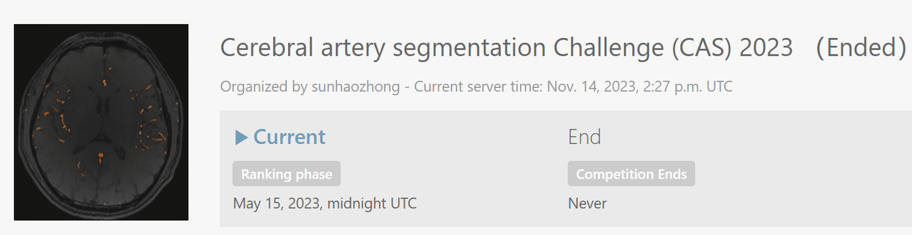
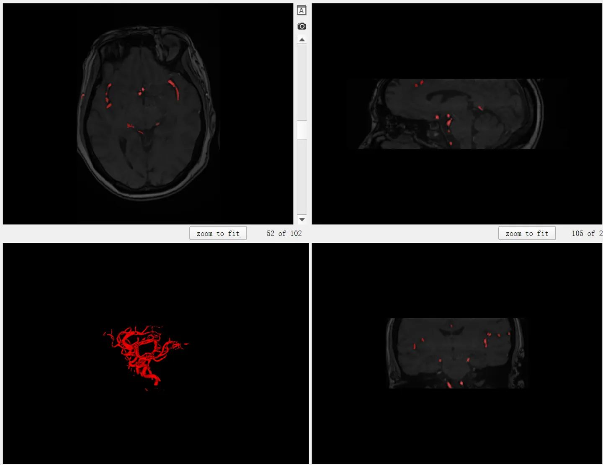

# CAS 2023

<div align="center">
    <a href="https://github.com/openmedlab/"></a>
</div>
<p style="text-align:center;font-size:10px;"><em></em></p>

## Dataset Information

The CAS2023 dataset is an MR modality segmentation dataset featured in this year's MICCAI 2023 Challenge. The officials provided a training set of 100 cases, with only cerebral arteries annotated. The context of the dataset is cerebrovascular diseases, which are one of the highest concerns in brain health, with both the cerebral vessels themselves and the brain hemorrhages from strokes being fine and complex structures that are difficult to accurately segment by current artificial intelligence systems and even by doctors. This dataset is obtained via Magnetic Resonance Angiography (MRA). MRA is commonly used to display the cerebral arterial tree to assist in diagnosis. Accurate segmentation of MRA cerebral arteries is crucial for quantitative analysis, such as estimating the degree of luminal stenosis. However, manual segmentation is challenging for experts due to the complexity of the cerebral artery network, individual variability, and weak signals from small vessels. Time-of-Flight (TOF) MRA is a widely used non-invasive imaging technique that can delineate the cerebral vasculature tree without the need for contrast agents. However, the lack of large-scale, open-access TOF-MRA data with well-labeled cerebral arteries limits the development and validation of reliable automatic cerebral artery segmentation algorithms. Therefore, validating cerebral vascular segmentation algorithms on TOF-MR has certain clinical significance.

## Dataset Meta Information

| Dimensions | Modality | Task Type | Anatomical Structures         | Anatomical Area | Number of Categories | Data Volume | File Format |
|------------|--------|-----------|-------------------------------|-----------------|--------------------|-------------|-------------|
| 3D         | TOF-MR       | Segmentation | cerebral artery | Brain           | 1                  | 100         | .nii.gz     |


### Resolution Details

| Dataset Statistics | spacing (mm)     | size            |
|--------------------|------------------|-----------------|
| min                | 	(1.00, 1.00, 1.00)              | (208, 320, 96)     |
| median             | 	(1.00, 1.00, 1.00)           | (640, 640, 150) |
| max                | 	(1.00, 1.00, 1.00)              | (784, 784, 255) |

Number of two-dimensional slices in the dataset: 14,349 (based on statistics from 100 training cases).

## Label Information Statistics

| Metric        | Tumor |
|---------------|--|
| Case Count    | 100 |
| Coverage      | 100% |
| Min Volume (cm³) | 17 |
| Median Volume (cm³) | 170 |
| Max Volume (cm³) | 331 |

## Visualization

<div align="center">
    <a href="https://github.com/openmedlab/"></a>
</div>
<p style="text-align:center;font-size:10px;"><em></em></p>

## File Structure

It follows the default nnUNet format: 

``` 
Dataset
│
├── imagesTr
│   └── ...
├── labelsTr
│   └── ...
├── dataset.json

```

## Authors and Institutions

Huijun Chen (Tsinghua University)

Xihai Zhao (Tsinghua University)

Haozhong Sun (Tsinghua University)

Jiaqi Dou (Tsinghua University)

Chenlin Du (Tsinghua University)

Runyu Yang (Tsinghua University)

Xiaoqi Lin (Tsinghua University)

Han Jiang (Tsinghua University)

Shuwan Yu (Tsinghua University)

Jiachen Liu (Tsinghua University)

Zixuan Han (Tsinghua University)

Chun Yuan (University of Washington)

Niranjan Balu (University of Washington)s


## Source Information

Official Website: https://codalab.lisn.upsaclay.fr/competitions/9804

Download Link: https://codalab.lisn.upsaclay.fr/competitions/9804#participate-get_starting_kit

Article Address: TBD

Publication Date: April, 2023.

## Citation

``` 
TBD
```

Original introduction article is [here](https://zhuanlan.zhihu.com/p/666863773).