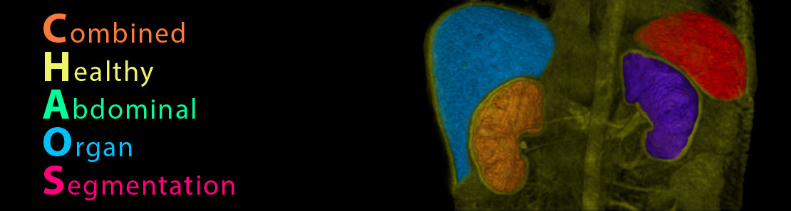
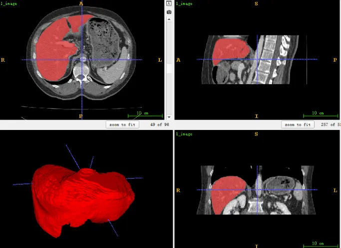
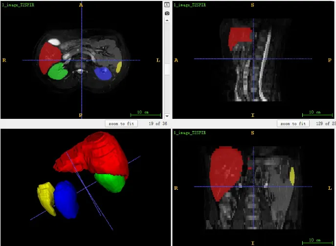

# CHAOS

<div align="center">
    <a href="https://github.com/openmedlab/"></a>
</div>
<p style="text-align:center;font-size:10px;"><em></em></p>

## Dataset Information

The **C**ombined (CT-MR) **H**ealthy **A**bdominal **O**rgan **S**egmentation (CHAOS) is one of the classic benchmarks for abdominal medical image segmentation, with the unique feature of providing paired multimodal CT and MR data along with corresponding annotations. The CHAOS dataset was released during the ISBI 2019 Challenge, consisting of 40 cases of paired CT and MR data, of which only 20 cases were provided with annotations as a training set, and the remaining 20 cases were announced by the officials not to be released with annotations. Unfortunately, even though the data is paired, the annotations on CT and MR are not the same; CT only provides annotations for the liver, while MR provides annotations for four different organs.

## Dataset Meta Information

| Dimensions | Modality | Task Type | Anatomical Structures                     | Anatomical Area | Number of Categories | Data Volume                         | File Format |
|------------|----------|-----------|-------------------------------------------|-----------------|----------------------|-------------------------------------|-------------|
| 3D         | CT, MR   | Segmentation | Liver, left kidney, right kidney, spleen. | abdomen       | 4                    | 20 for training, 20 for validation. | dicom     |

It's worth mentioning that the 20 paired cases in the training set actually include four modalities: CT, MR T1-weighted in-phase, MR T1-weighted out-phase, and MR T2-weighted.

Number of slices in the training set (all data): 11,496 (including CT and two types of MR).

### Resolution Details

| Dataset Statistics | spacing (mm)     | size            |
|--------------------|------------------|-----------------|
| min                | (0.56, 0.56,1.00)              | (512, 512, 81)     |
| median             | (0.69, 0.69, 1.60)           | (512, 512, 111) |
| max                | (0.79, 0.79, 2.0)              | (512, 512, 266) |

## Label Information Statistics

| Anatomical Structure | Liver        | Right Kidney  | Left Kidney  | Spleen       |
|----------------------|--------------|---------------|--------------|--------------|
| Number of Cases      | 20           | 20            | 20           | 20           |
| Coverage             | 100%         | 100%          | 100%         | 100%         |
| Minimum Volume (cm³) | 7            | 81            | 75           | 47           |
| Median Volume (cm³)  | 341          | 734           | 898          | 801          |
| Maximum Volume (cm³) | 1367         | 1471          | 1711         | 1093         |

## Visualization

<div align="center">
    <a href="https://github.com/openmedlab/"></a>
</div>
<p style="text-align:center;font-size:10px;"><em> ITK-SNAP CT Visualization.</em></p>

<div align="center">
    <a href="https://github.com/openmedlab/"></a>
</div>
<p style="text-align:center;font-size:10px;"><em> ITK-SNAP MR Visualization.</em></p>

## File Structure

The official file structure is as follows, with the directory structure representing Train/Test -> Modality -> Patient ID -> DICOM slices.

``` 
CHAOS_Train_Sets
│
├── ct
│   ├── 11
│   ├── 12
│   └── ...
├── t1w
├── ...

CHAOS_Test_Sets
│
├── ct
│   ├── 11
│   ├── 12
│   └── ...
├── t1w
├── ...
```

## Authors and Institutions

Assoc. Prof. Dr. M. Alper SELVER (Dokuz Eylül Üniversitesi Elektrik-Elektronik Müh)

Dr. Ali Emre Kavur (Dokuz Eylül Üniversitesi Elektrik-Elektronik Müh)


## Source Information

Official Website: https://chaos.grand-challenge.org/Combined_Healthy_Abdominal_Organ_Segmentation/

Download Link: https://zenodo.org/record/3431873#.Yl_9itpBxaQ

Article Address: https://linkinghub.elsevier.com/retrieve/pii/S1361841520303145

Publication Date: 2019-04.

## Citation

``` 
@article{CHAOS2021,
  title = {{CHAOS Challenge - combined (CT-MR) healthy abdominal organ segmentation}},
  journal = {Medical Image Analysis},
  publisher= {Elsevier BV},
  volume = {69},
  pages = {101950},
  year = {2021},
  month = Apr,
  issn = {1361-8415},
  doi = {https://doi.org/10.1016/j.media.2020.101950},
  url = {http://www.sciencedirect.com/science/article/pii/S1361841520303145},
  author = {A. Emre Kavur and N. Sinem Gezer and Mustafa Barış and Sinem Aslan and Pierre-Henri Conze and Vladimir Groza and Duc Duy Pham and Soumick Chatterjee and Philipp Ernst and Savaş Özkan and Bora Baydar and Dmitry Lachinov and Shuo Han and Josef Pauli and Fabian Isensee and Matthias Perkonigg and Rachana Sathish and Ronnie Rajan and Debdoot Sheet and Gurbandurdy Dovletov and Oliver Speck and Andreas Nürnberger and Klaus H. Maier-Hein and Gözde {Bozdağı Akar} and Gözde Ünal and Oğuz Dicle and M. Alper Selver},
  keywords = {Segmentation, Challenge, Abdomen, Cross-modality},
}
@dataset{CHAOSdata2019,
  author       = {Ali Emre Kavur and M. Alper Selver and Oğuz Dicle and Mustafa Barış and  N. Sinem Gezer},
  title        = {{CHAOS - Combined (CT-MR) Healthy Abdominal Organ Segmentation Challenge Data}},
  month        = Apr,
  year         = 2019,
  publisher    = {Zenodo},
  version      = {v1.03},
  doi          = {10.5281/zenodo.3362844},
  url          = {https://doi.org/10.5281/zenodo.3362844}
}
@article{kavur2019,
  title = {Comparison of semi-automatic and deep learning based automatic methods for liver segmentation in living liver transplant donors},
  author = {Kavur, A. Emre and Gezer, Naciye Sinem  and Barış, Mustafa and Şahin, Yusuf and Özkan, Savaş and Baydar,Bora and Yüksel, Ulaş and Kılıkçıer, Çağlar and Olut, Şahin and Bozdağı Akar, Gözde and Ünal, Gözde and Dicle, Oğuz and Selver, M. Alper},
  journal = {Diagnostic and Interventional Radiology},
  volume = {26},
  pages = {11-21},
  year = {2020},
  month = Jan,
  doi = {10.5152/dir.2019.19},
  url = {https://doi.org/10.5152/dir.2019.19025}
}
```

Original introduction article is [here](https://zhuanlan.zhihu.com/p/656644901).