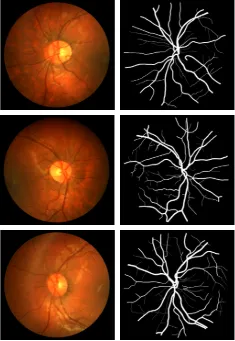

# CHASE

<div align="center">
    <a href="https://github.com/openmedlab/"></a>
</div>
<p style="text-align:center;font-size:10px;"><em></em></p>


## Dataset Information

The CHASE (also known as CHASE_DB1) dataset is a publicly available dataset for retinal image analysis released by the Department of Computer Science at the University of Reading, UK. This dataset consists of 28 retinal images obtained from the left and right eyes of 28 subjects (14 healthy individuals and 14 patients with diabetic retinopathy), totaling 56 images. Each image has a resolution of 999x960 pixels. The primary purpose of the CHASEDB1 dataset is to provide researchers with a platform for developing and evaluating retinal vessel segmentation algorithms. Each retinal image in the dataset is accompanied by corresponding vessel segmentation annotations, which have been manually marked by professional medical personnel. Researchers can use this dataset to develop and test various vessel segmentation algorithms, to better understand and analyze the vascular structure in retinal images, and to provide support for the diagnosis and treatment of eye diseases such as diabetic retinopathy.

## Dataset Meta Information

| Dimensions | Modality | Task Type | Anatomical Structures | Anatomical Area | Number of Categories | Data Volume | File Format |
|------------|----------|-----------|-----------------------|-----------------|----------------------|-------------|-------------|
| 2D         | Retinal Image       | Segmentation | Fundus blood vessels  | Eye             | 1                    | 28          | .jpg / .png     |


### Resolution Details

| Dataset Statistics | size        |
|--------------------|-------------|
| min                | (960, 999)  |
| median             | (960, 999)  |
| max                | (960, 999)  |

## Label Information Statistics

| Category          | Retinal Vessel |
|-------------------|----------------|
| Number of Images  | 28             |
| Availability      | 100%           |
| Small Vessel Count| 1358672        |
| Medium Vessel Count| 1353322       |
| Large Vessel Count| 2286564        |

## Visualization

<div align="center">
    <a href="https://github.com/openmedlab/"></a>
</div>
<p style="text-align:center;font-size:10px;"><em> The first column is the original image, and the second column is the blood vessel segmentation mask.</em></p>

## File Structure

``` 
CHASE Dataset
├── Image_01L_1stHO.png
├── Image_01L_2ndHO.png
├── Image_01L.jpg
├── Image_01R_1stHO.png
├── Image_01R_2ndHO.png
└── ...
```

## Authors and Institutions

Christopher G.Owen (Department of Population Health Sciences and Education, St George's College, University of London)


## Source Information

Official Website: https://blogs.kingston.ac.uk/retinal/chasedb1/

Download Link: https://blogs.kingston.ac.uk/retinal/chasedb1/

Article Address: https://www.ahajournals.org/doi/10.1161/ATVBAHA.111.225219

Publication Date: 2011.6

## Citation

``` 
@article{doi:10.1161/ATVBAHA.111.225219,
author = {Christopher G. Owen  and Alicja R. Rudnicka  and Claire M. Nightingale  and Robert Mullen  and Sarah A. Barman  and Naveed Sattar  and Derek G. Cook  and Peter H. Whincup },
title = {Retinal Arteriolar Tortuosity and Cardiovascular Risk Factors in a Multi-Ethnic Population Study of 10-Year-Old Children; the Child Heart and Health Study in England (CHASE)},
journal = {Arteriosclerosis, Thrombosis, and Vascular Biology},
volume = {31},
number = {8},
pages = {1933-1938},
year = {2011},
doi = {10.1161/ATVBAHA.111.225219},
}
```

Original introduction article is [here](https://zhuanlan.zhihu.com/p/663775177).