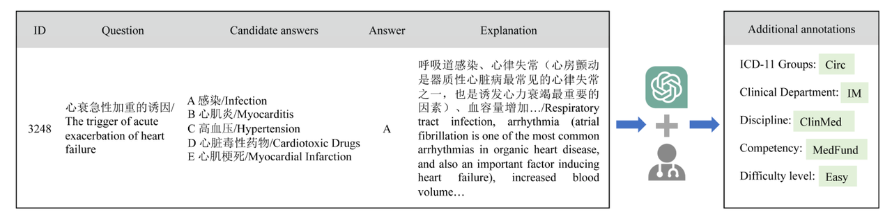
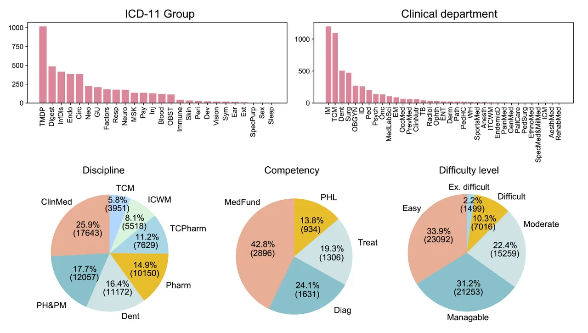
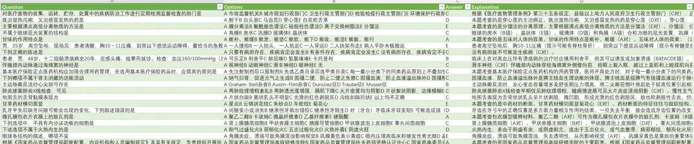
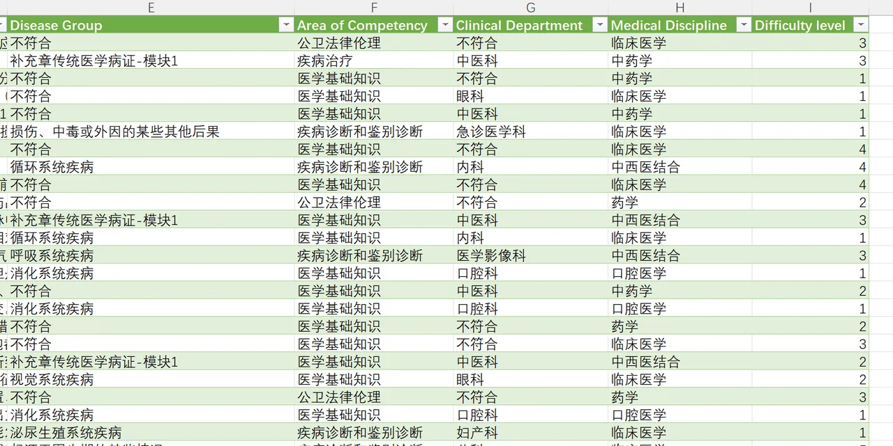

# CMExam

<div align="center">
    <a href="https://github.com/openmedlab/"></a>
</div>
<p style="text-align:center;font-size:10px;"><em></em></p>

## Dataset Information

Examination questions are a significant source of data for evaluating NLP models, but the current medical exam datasets have some limitations, mainly due to unfair and insufficient sources of data; and inadequate option information, lacking explanations related to the options. CMExam is a Chinese medical exam dataset announced at NIPS23, derived from the Chinese National Medical Licensing Examination. It contains over 60,000 multiple-choice questions and five additional annotations for each question, including disease groups, clinical departments, medical disciplines, competency areas, and question difficulty levels. This original information and explanations for the questions can provide a richer context than traditional Med QA datasets, thereby improving the interpretability of model-generated answers and analyses.

The introduction of the CMExam dataset sets a good precedent. For the academic community, if the absolute quantity of high-quality Chinese corpora does not meet the needs of large-scale training, constructing sufficiently detailed and rich benchmarks can both guide the development of models and provide a foundation and reference for data collection, which is of considerable significance. For smaller research groups or individuals with limited resources, providing a sufficiently good benchmark for a specific subfield and continuously producing specialized models in subdirections (possibly based on open-source foundational models) will also be an effective development strategy.

## Dataset Meta Information

| Task Type | Language | Train | Val | Test | File Format | Size |
|-----------|----------|-------|----|------|-------------|------|
| QA        | Chinese  | 54497 | 6811   | 6811  | csv         | 49.29MB |


## Dataset Information Statistics

In addition to questions, options, and answers, there are five metadata fields: disease groups, clinical departments, medical disciplines, medical competencies, and difficulty levels. The difficulty level is divided into five levels based on human performance, while the other four are classifications from various sources, ranging from 4 to 36 categories.

| Annotation Content | References                                                        | Unique values |
|--------------------|-------------------------------------------------------------------|---------------|
| Disease Groups     | The 11th revision of ICD-11                                       | 27            |
| Clinical Departments| The Directory of Medical Institution Diagnostic and Therapeutic Categories (DMIDTC) | 36 |
| Medical Disciplines| List of Graduate Education Disciplinary Majors (2022)             | 7             |
| Medical Competencies | Medical Professionals                                            | 4             |
| Difficulty Level   | Human Performance                                                 | 5             |

Table 2: Additional annotations of CMExam.

The statistical proportions of specific categories are as follows:

<div align="center">
    <a href="https://github.com/openmedlab/"></a>
</div>
<p style="text-align:center;font-size:10px;"><em></em></p>

It can be observed that within the group categories, the most numerous is Traditional Medicine Disease Patterns (TMDP), while the least is related to sleep; in the department classifications, Internal Medicine (IM) has the most, while rehabilitation medicine has the least. For other aspects, presented in pie chart form, for example, difficulty level, questions of easy and medium difficulty make up a larger proportion of the dataset, with the more difficult questions accounting for only 12.5%.

## Dataset Example

The first four fields are Question, Options, Answer, and Explanation.

<div align="center">
    <a href="https://github.com/openmedlab/"></a>
</div>
<p style="text-align:center;font-size:10px;"><em></em></p>

The last five fields are disease grouping, knowledge domain, and other specific classifications; in addition to these meta-information, there is also a difficulty level.

<div align="center">
    <a href="https://github.com/openmedlab/"></a>
</div>
<p style="text-align:center;font-size:10px;"><em></em></p>

## File Structure

The data set file structure is as follows. The main body is 3 csv. Please see the data example for the specific content.

``` 
data
|__ train.csv
|__ val.csv
|__ test_with_annotations.csv
```

## Authors and Institutions

Junling Liu (Alibaba Group)

Peilin Zhou (Hong Kong University of Science and Technology)

Yining Hua (Harvard University)

Dading Chong (Peking University)

Zhongyu Tian (Second Affiliated Hospital of Zhejiang University School of Medicine)

Andrew Liu (Peking University)

Helin Wang (Johns Hopkins University)

Chenyu You (Yale University)

Zhenhua Guo (Tianyi Traffic Technology)

Lei Zhu (Ant Group)

Michael Lingzhi Li (Harvard Business School)

## Source Information

Official Website: https://github.com/williamliujl/CMExam/

Download Link: https://github.com/williamliujl/CMExam/

Article Address: https://arxiv.org/abs/2306.03030

Publication Date: 2023-10

## Citation

``` 
@article{liu2023benchmarking,
  title={Benchmarking Large Language Models on CMExam--A Comprehensive Chinese Medical Exam Dataset},
  author={Liu, Junling and Zhou, Peilin and Hua, Yining and Chong, Dading and Tian, Zhongyu and Liu, Andrew and Wang, Helin and You, Chenyu and Guo, Zhenhua and Zhu, Lei and others},
  journal={arXiv preprint arXiv:2306.03030},
  year={2023}
}
```

Original introduction article is [here](https://zhuanlan.zhihu.com/p/684486350).