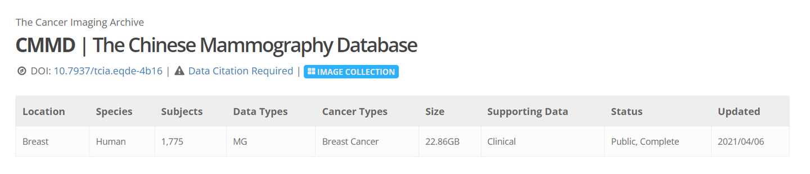
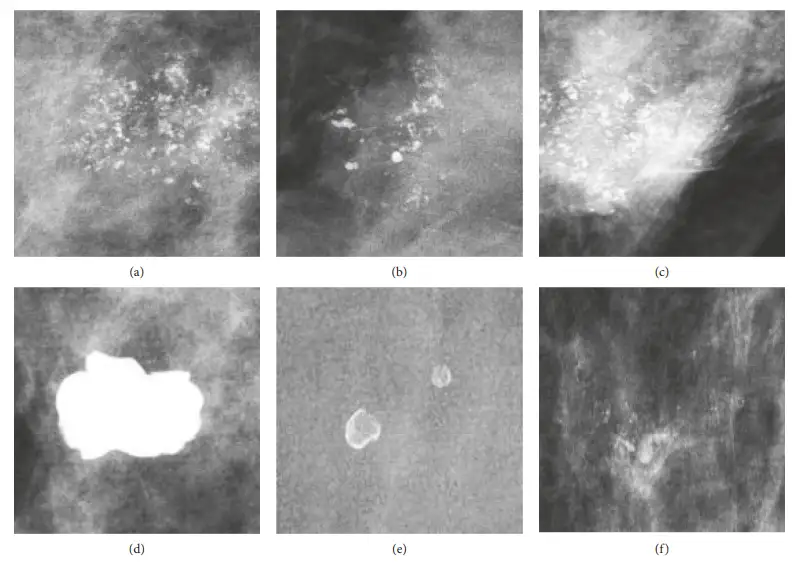

# CMMD

<div align="center">
    <a href="https://github.com/openmedlab/"></a>
</div>
<p style="text-align:center;font-size:10px;"><em></em></p>

## Dataset Information

CMMD is a database of mammograms from China, analyzing 1,775 patients who underwent breast X-ray examinations for benign or malignant breast diseases between July 2012 and January 2016. This database includes 3,728 mammographic examinations confirmed by biopsy as benign or malignant tumors. For 749 of these patients (1,498 breast X-rays), molecular subtypes of the patients are also included. The imaging data was acquired on a GE Senographe DS mammography system. Note that the dataset information provided is based on the actual data acquired.

Breast cancer is the second most common cancer among women worldwide. Early detection of breast cancer has been proven to increase survival rates, significantly extending the lives of patients. Mammography is a low-cost, non-invasive imaging tool widely used for the early diagnosis of breast diseases due to its high sensitivity. The recent proliferation of artificial intelligence in computer-aided diagnosis has created opportunities for advancement in the following areas: (1) computer-aided detection, which locates suspicious lesions such as lumps and microcalcifications, leaving classification to radiologists; (2) computer-aided diagnosis, for characterizing suspicious lesion areas and/or estimating their probability of malignancy; and (3) by applying computational methods to mine potential relationships between image representations and molecular subtypes, including potential relations between luminal A, luminal B, HER2 positive, and triple-negative, leading to results based on predictive image biomarkers.

## Dataset Meta Information

| Dimensions | Modality | Task Type      | Anatomical Structures | Anatomical Area | Number of Categories | Data Volume | File Format |
|------------|----------|----------------|-----------------------|-----------------|----------------------|-------------|-------------|
| 2D         | X-ray    | Classification | Breast                | Chest           | 2                    | 5334        | PNG         |


### Resolution Details

| Dataset Statistics | size         |
|--------------------|--------------|
| min                | (2294, 1914) |
| median             | (2294, 1914) |
| max                | (2294, 1914) |

## Label Information Statistics

| Category                     | size  |
|------------------------------|-------|
| 0 (Begin breast disease)     | 1232  |
| 1 (Malignant breast disease) | 4102  |

## Visualization

<div align="center">
    <a href="https://github.com/openmedlab/"></a>
</div>
<p style="text-align:center;font-size:10px;"><em>Examples of malignant and benign lesions. Images (a) – (c) display malignant lesions, including ductal carcinoma in situ, invasive ductal carcinoma, and mixed types. Images (d) – (f) show benign lesions, including benign lesions after follow-up, inflammation, and fibrocystic breast disease.</em></p>

## File Structure

The dataset file structure is as follows:

``` 
CMMD
├── image
│   ├── train
│   │   ├── xxx.jpg
│   │   ├── xxx.jpg
│   │   ├── xxx.jpg
│   │   ├── xxx.jpg
│   │   └── ...
│   └── val
│   │   ├── xxx.jpg
│   │   ├── xxx.jpg
│   │   ├── xxx.jpg
│   │   ├── xxx.jpg
│   │   └── ...
    ├── train.txt
    └── val.txt
```

## Authors and Institutions

Hongmin Cai (School of Computer Science and Engineering, South China University of Technology)

Qinjian Huang (School of Computer Science and Engineering, South China University of Technology)

Wentao Rong (School of Computer Science and Engineering, South China University of Technology)

## Source Information

Official Website: https://www.cancerimagingarchive.net/collection/cmmd/

Download Link: https://www.cancerimagingarchive.net/collection/cmmd/

Article Address: https://doi.org/10.7937/tcia.eqde-4b16

Publication Date: 2021

## Citation

``` 
@article{nir2018automatic,
  title={Automatic grading of prostate cancer in digitized histopathology images: Learning from multiple experts},
  author={Nir, Guy and Hor, Soheil and Karimi, Davood and Fazli, Ladan and Skinnider, Brian F and Tavassoli, Peyman and Turbin, Dmitry and Villamil, Carlos F and Wang, Gang and Wilson, R Storey and others},
  journal={Medical image analysis},
  volume={50},
  pages={167--180},
  year={2018},
  publisher={Elsevier}
}
```

Original introduction article is [here](https://zhuanlan.zhihu.com/p/710032763).